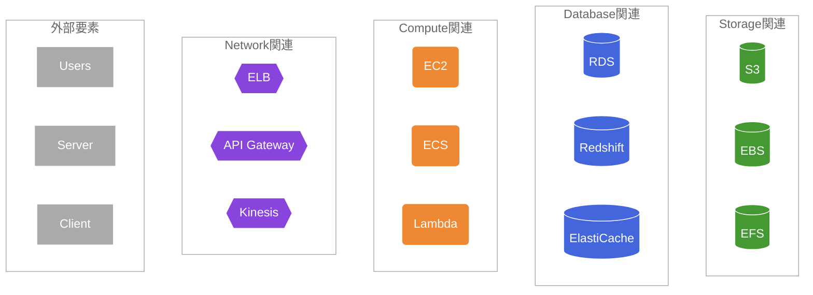
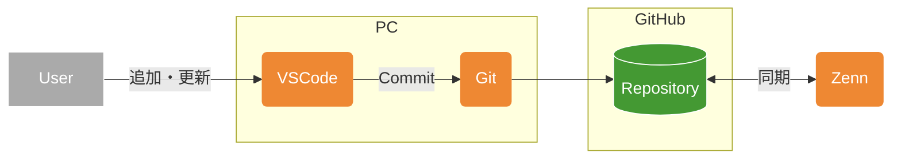

# なぜ作成したのか
投稿を行うにあたり、図示することが増えそうなので図示のルールを決めてみようという試み
何事もイメージができないと手が進まない

# 参考にした情報
こちらのQiita記事。非常にありがたい。
一旦ベースをそのままお借りします。
[テキストから図が生成できるMermaidでAWS構成図をつくる](https://qiita.com/b-mente/items/b17275090176d63d1d69)

## Group 
|Group|Mermaid記法のスタイル|
|---|---|
|Cloud|`fill:none,color:#345,stroke:#345`|
|Region|`fill:none,color:#59d,stroke:#59d,stroke-dasharray:3`|
|VPC|`fill:none,color:#0a0,stroke:#0a0`|
|Availability Zone|`fill:none,color:#59d,stroke:#59d,stroke-width:1px,stroke-dasharray:8`|
|Private subnet|`fill:#efe,color:#092,stroke:none`|
|Public subnet|`fill:#def,color:#07b,stroke:none`|

### 表記サンプル


### サンプル表記ソース 

```
flowchart

%%---グループの設定---

%%Public subnetのグループ
subgraph GS1[Public subnet]
end

%%Private subnetのグループ
subgraph GS2[Private subnet]
end

%%Availability Zoneのグループ
subgraph GA[Availability Zone]
end

%%VPCのグループ
subgraph GV[VPC]
end

%%Regionのグループ
subgraph GR[Region]
end

%%AWS Cloudのグループ
subgraph GC[Cloud]
end

%%---スタイルの設定---

%%Cloudのスタイル
classDef SGC fill:none,color:#345,stroke:#345
class GC SGC

%%Regionのスタイル
classDef SGR fill:none,color:#59d,stroke:#59d,stroke-dasharray:3
class GR SGR

%%VPCのスタイル
classDef SGV fill:none,color:#0a0,stroke:#0a0
class GV SGV

%%Availability Zoneのスタイル
classDef SGA fill:none,color:#59d,stroke:#59d,stroke-width:1px,stroke-dasharray:8
class GA SGA

%%Private subnetのスタイル
classDef SGPrS fill:#def,color:#07b,stroke:none
class GS2 SGPrS

%%Public subnetのスタイル
classDef SGPuS fill:#efe,color:#092,stroke:none
class GS1 SGPuS


```


## Service
|Service|Mermaid記法のスタイル|Mermaid記法のNode|
|---|---|---|
|物理要素|`fill:#aaa,color:#fff,stroke:#fff`|`[ ]`|
|Network関連|`fill:#84d,color:#fff,stroke:non`|`{{ }}`|
|Compute関連|`fill:#e83,color:#fff,stroke:none`|`( )`|
|DB関連|`fill:#46d,color:#fff,stroke:#fff`|`[( )]`|
|Storage関連|`fill:#493,color:#fff,stroke:#fff`|`[( )]`|

### 表記サンプル



### 表記サンプルソース

```
flowchart

%%---グループの設定---

%%Storage関連のグループ
subgraph GST[Storage関連]
  ST1[(S3)]
  ST2[(EBS)]
  ST3[(EFS)]
end

%%Database関連のグループ
subgraph GDB[Database関連]
  DB1[(RDS)]
  DB2[(Redshift)]
  DB3[(ElastiCache)]
end

%%Compute関連のグループ
subgraph GCP[Compute関連]
  CP1(EC2)
  CP2(ECS)
  CP3(Lambda)
end

%%Network関連のグループ
subgraph GNW[Network関連]
  NW1{{ELB}}
  NW2{{API Gateway}}
  NW3{{Kinesis}}
end

%%外部要素のグループ
subgraph GOU[外部要素]
  OU1[Users]
  OU2[Server]
  OU3[Client]
end

%%---スタイルの設定---

%%外部要素のスタイル
classDef SOU fill:#aaa,color:#fff,stroke:#fff
class OU1,OU2,OU3 SOU

%%Network関連のスタイル
classDef SNW fill:#84d,color:#fff,stroke:none
class NW1,NW2,NW3 SNW

%%Compute関連のスタイル
classDef SCP fill:#e83,color:#fff,stroke:none
class CP1,CP2,CP3 SCP

%%DB関連のスタイル
classDef SDB fill:#46d,color:#fff,stroke:#fff
class DB1,DB2,DB3 SDB

%%Storage関連のスタイル
classDef SST fill:#493,color:#fff,stroke:#fff
class ST1,ST2,ST3 SST

%%グループのスタイル
classDef SG fill:none,color:#666,stroke:#aaa
class GST,GDB,GCP,GNW,GOU SG

```


# Zenn-GitHub-Git-VSCode環境を図示してみる

この文章を作成している環境の概要図



ひとまずこの記法をベースにしてみることにする。