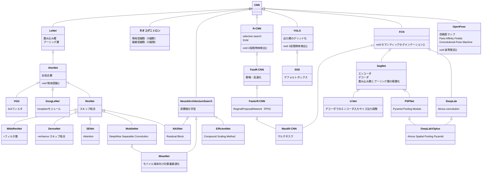
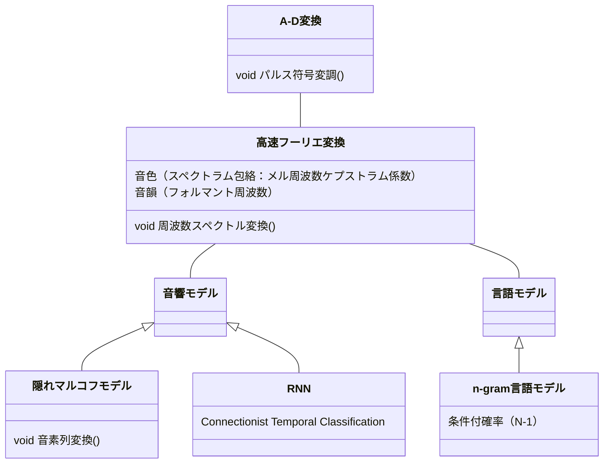
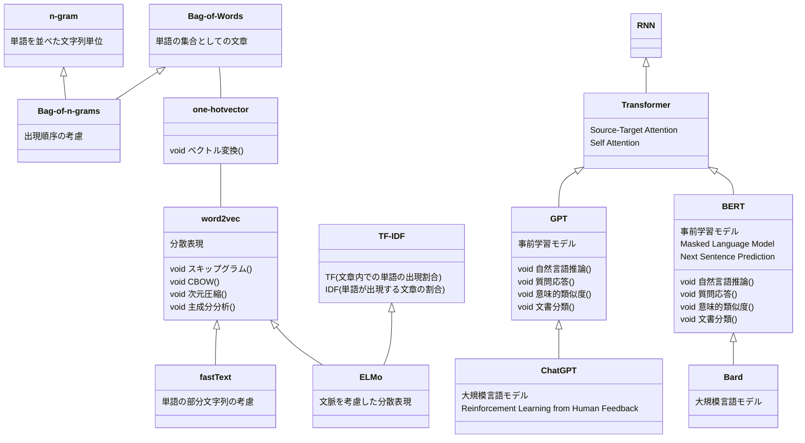
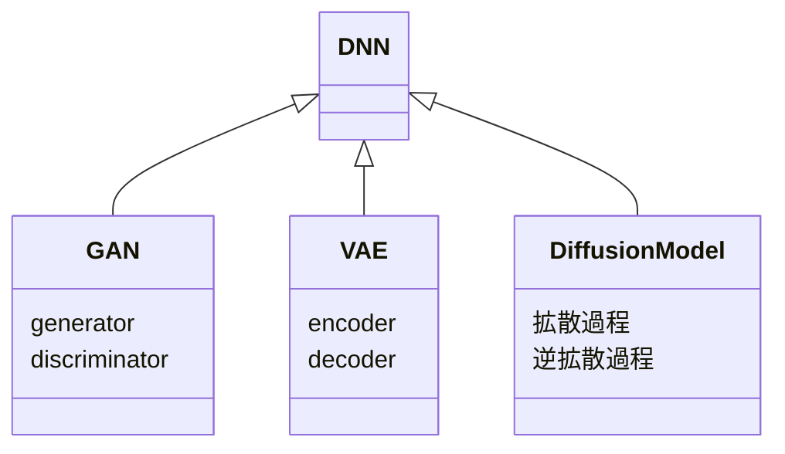

# なにこれ
- 「[ディープラーニングG検定公式テキスト（第三版）](https://www.jdla.org/news/20240514001/)」をもとに、理解の薄い5章、6章あたりをまとめてみる。
- 技術の発展の経緯と関係性をまとめるのにクラス図を用いてみる

# クラス図にあてはめた要素技術の関連
## 画像認識

## 音声認識

## 自然言語処理

解析、学習、推論の観点が混線しそう

## データ生成

# この先
この辺を源流として、発展モデル、マルチモーダルモデルを組み合わせで理解していけるといいな

# 参考
ちゃんと理解するにはこの資料を読み込みたい
[深層学習による自然言語処理入門: word2vecからBERT, GPT-3まで](https://www.docswell.com/s/ydnjp/K3YMDZ-2021-07-21-152903)