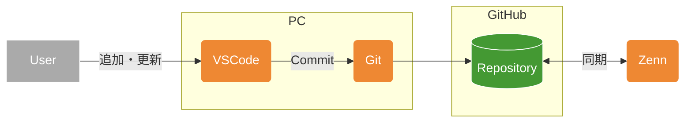

# なぜ作成したのか
投稿環境としてのVScode環境を快適にしたい
何も知らないのでちょっとずつ

# Zenn-GitHub-Git-VSCode環境

この文章を作成している環境の概要図

# VSCodeでなにする？
- Markdown書式の文書を作成・編集する

# 課題感
- デフォルトの言語が英語
  - 慣れるまでは日本語ベースで操作したい 
- 既定のエディタ機能ではメモ帳と同等
  - プレビュー機能がなく、環境に反映しないと記述の妥当性が判断できない
    - Notionやesaなどのエディタでは記述と並行してプレビューが確認できるので、同等のプレビュー機能が欲しい

  - 編集サポート機能がないので、表や描画ごイチから実装が必要
    - 表や図の挿入についてはテンプレートや入力ガイドがあると助かる
    - 箇条書きの次行連続入力のような細かい制御があるとなおよい

# 対策
## デフォルトの言語が英語
- プラグインの導入
  - [Japanese Language Pack for Visual Studio Code](https://marketplace.visualstudio.com/items?itemName=MS-CEINTL.vscode-language-pack-ja)

## プレビュー機能がなく、環境に反映しないと記述の妥当性が判断できない
- プラグインの導入
  - [Markdown Preview Enhanced](https://marketplace.visualstudio.com/items?itemName=shd101wyy.markdown-preview-enhanced)
    - 入力に並行してプレビュー画面を表示 
  - [Markdown Preview Mermaid Support](https://marketplace.visualstudio.com/items?itemName=bierner.markdown-mermaid)
    - Mermeid図の描写を強化

## 編集サポート機能がないので、表や描画にイチから実装が必要
- プラグインの導入
  - [Markdown All in One](https://marketplace.visualstudio.com/items?itemName=yzhang.markdown-all-in-one)

現在は使い始めたばかりなので、一旦試用期間として様子見してみる

