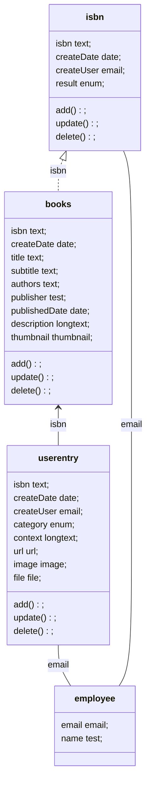

# なぜ作成したのか
- 町の本屋さんの縮小や消滅を目にしてさみしい気持ちになり、代償行為としてアプリを作ってみる

# 当面の目標
- ISBNコードから書籍情報を取得する
- 取得できない／情報が不足する場合は手動で編集できるようにする
- 書籍データに対して、利用者がコメントをくっつけられるようにする
- ダッシュボードを作成し、最近1週間に追加された書籍、コメントをサマリできるようにする

# 構造

# データソース
- Spreadsheet : isbn
  - sheet : isbn
    - columnA : isbn
    - columnB : createDate
    - columnC : createUser
    - columnD : result
  - sheet : books
    - columnA : isbn(ref)
    - columnB : title
    - columnC : subtitle
    - columnD : authors
    - columnE : publisher
    - columnF : publishedDate
    - columnG : description
    - columnH : thumbnail
    - columnI : createDate
    - columnJ : genre
  - sheet : userentry
    - columnA : id
    - columnB : createDate
    - columnC : category
    - columnD : context
    - columnE : image
    - columnF : url
    - columnG : file
    - columnH : createUser(ref)
    - columnI : book(ref)
- Spreadsheet : organization
  - sheet : employee
    - columnA : email
    - columnB : name

# ISBN書籍検索
- **方式**
  - 事例を基にAppsheetのAutomationからGAS呼び出しを行ったが、あまりうまくいかない
    - タイムラグのせい？？ 
    - ISBNありきだと、検索できないやつの扱いがどうにもならなくなるかも？
  - Spreadsheet付随GASで実装することにする
    - 行追加トリガーの実装が簡易
    - 時間間隔トリガーでも取りこぼし検索も実装しやすい
  - GoogleBooksAPIを使用する
    - 以前の [検討記事](https://zenn.dev/banboobloom/articles/2025012600001) 参照
  - 処理にタイムラグがあるので、検索受付テーブル（isbn）と書籍テーブル（books）は別に設ける。
    - 書籍テーブルは、検索受付テーブルのレコードの存在を前提にしない
    - 処理結果は検索受付テーブルにresultとして返却し、取得できなかったことをしい別できるようにする
      - 取得できなかった物は手動で登録してね、という気持ち
  - 取得した情報も欠落や間違いが含まれるため、修正を受け付ける仕様にする
- **処理フロー**
  - 利用者がISBNコードを入力する
  - Sheetの変更トリガーでGASを起動し、書籍情報を取得する
    - 取得できた場合はbookテーブルにレコードを追加し、isbnテーブルのresult列にsuccessをセットする
      - 利用者はbooksに追加された情報を確認し、情報に欠損、誤りがある場合は直接編集する
    - 取得できない場合は、isbnテーブルのresult列にerrorをセットする
      - 利用者は手動でbooksに書籍情報を登録する
  - 処理エラーによる未処理データ救済のため、時間起動トリガーを5分ごとに起動し、resultが空欄のレコードに対して書籍情報取得を行う
- **実装**
  - chatGPT o1に処理要件を入力し、生成してもらう。
    - このくらいなら、ほぼ修正なしで動くものができる
      - Google Books APIの呼び出しで、Locationの指定がないことでAPIエラーになったくらい
  
# Appsheet

特に手は入れず、DataからViewを作成する。
Dashboard向けに各DataにSliceを作成する。

- **isbn**
  - isbnコード入力用画面
  - モバイルの場合はバーコード読み取り可能にする 
- **books**
  - 書籍情報一覧画面
  - 書籍に対してコメントを作成する
- **dashboard**
  - 最近一週間に登録された書籍（chart）
  - 最近一週間に登録されたコメント(table)

# 所感
- アプリ自体は特に詰まることなく完成。
- とりあえず自分が使用することを想定して作成した。このままだと単なる自分用本棚でしかない。
- 社員に展開して情報を共有していくとしたら、どんな機能で、どんなメリットを提供できるだろう？