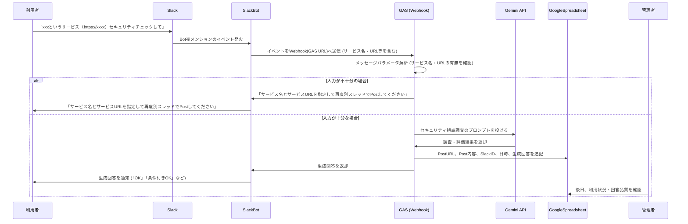

# なぜ作成したのか
- ハルシネーションは怖いが、無頓着にSaaSトライアルに突っ込んでもらうのも嫌なので、Slackbotくんに簡易セキュリティチェックを行ってもらおうという試み

---

# プロンプト

- 気軽に投げた文面

> 社内のSaaSトライアルを促進するため、簡易的なSaaSセキュリティチェックを行ってくれるSlackBotを作成します。
> 以下の技術スタックを使用する想定です。
> Slack
> GAS
> Gemini API
> GoogleSpreadsheet
> 
> ステークホルダーは以下です。
> 利用者：SaaSトライアルを予定している一般従業員
> 管理者：SaaSのセキュリティチェックを監視する情シスメンバー
> 
> ユースケースは以下です。
> 利用者はSaaSのトライアルを開始前に、Slackで指定のSlackBotにメンションで「ｘｘｘというサービス（https://xxxx.xxxx）のセキュリティチェックして」というようなPostを行う
> SlackはGASを呼び出し、メッセージを渡す
> GASはメッセージをGeminiAPIを使用して回答を生成を行う
> 回答は以下の観点で公開情報を調査し、最終的に社内利用に対して「OK」「機密情報を扱わなければOK」「機密情報、社外秘情報を扱わなければOK」「条件付きOK」「NG」のいずれかで評価、評価根拠を簡潔にまとめたものとします。
> ・サービスの運営会社の本社所在国が地政学的にリスクがないか
> ・サービス利用に関するデータが保管される国が地政学的にリスクがないか
> ・サービス運営会社の外部認証、セキュリティポリシーに問題がないか、ISO認証等で外部評価を受けているか
> ・サービスの認証認可の仕組みが実装され、最小限のアクセス権限の原則に沿った運用が可能か
> ・サービスの利用データを外部共有する機能が提供される場合、共有先を制限することが可能か
> ・生成AIを使用しているか
> ・生成AIを使用している場合、サービス利用に関するデータが学習に利用されないか
> ・生成AIによる生成物の商用利用に法的な制限や問題はないか

> 回答するに十分な情報がInputされていない場合は「サービス名とサービスURLを指定して、再度別スレッドでPostしてください」とSlackから利用者へ返信する
> GASは生成した内容をSlackに返却する
> 同時にGASは利用者のPostURL、Post内容、利用者のSlackID、Postされた日時、生成した内容をSpreadSheetに追加する
> Slackは利用者に生成された内容を返信する
> 管理者は事後SpreadSheetを確認し、SlackBotの利用状況、回答品質を確認できるようにする
> 
> まず、これらの実装を行うためのシーケンス図をMarkdown書式で作成してください。
> 
> 次に各要素に関する実装コード、必要な設定をまとめて下さい。

---


## シーケンス図 (Mermaid記法)



---

## 実装・設定の概要

### 1. Slack 側の設定

1. **Slack App を作成**  
   - [Slack API](https://api.slack.com/) で新しいアプリを作成します。  
   - Botユーザーをアプリに追加しておきます。

2. **Event Subscriptions の設定**  
   - Slackのイベントを取得するため、`Event Subscriptions` を有効化します。  
   - Request URL に後述の「GAS のWebhook URL」を指定し、`Mention` イベント (ユーザーがBotに対してメンションした際のイベント) を購読できるように設定します。  
   - `Subscribe to bot events` として `app_mention` を追加。

3. **OAuth & Permissions の設定**  
   - Botに必要なScopes (例: `channels:history`, `chat:write`, など) を付与します。
   - Slackのワークスペースにアプリをインストールし、Token (Bot User OAuth Token) を取得します。

> **ポイント**  
> - この時点で、Slack内でBotがユーザーに対してメッセージ送信（`chat.postMessage` など）ができるようになっている必要があります。

### 2. GAS (Google Apps Script) 側の実装

GAS でWebhookを受け、Slackからのメンションイベントを処理し、Gemini APIを呼び出す流れを実装します。

#### 2.1 スクリプト プロジェクトの作成
- Google Apps Scriptのプロジェクトを新規作成。
- スクリプトIDを後でSlackのWebhookとして設定。

#### 2.2 Webhook受信のためのdoPost関数

```javascript
/**
 * Slackからのイベントコールバックを受け取るエンドポイント
 * 注意：GASを公開してエンドポイントURLを取得し、Slack側に登録する
 */
function doPost(e) {
  // Slackからの生データを受け取る
  // e.postData.contents は JSON 形式
  // SlackのEvent Subscriptionでは challenge レスポンスが必要な場合があるため対応
  const jsonString = e.postData.contents;
  const payload = JSON.parse(jsonString);
  
  // SlackのイベントAPIからの challenge確認
  if (payload.type === 'url_verification') {
    return ContentService.createTextOutput(payload.challenge);
  }
  
  // イベントデータの取り出し
  const event = payload.event;
  
  // Bot宛メンションのチェック (app_mention)
  if (event && event.type === 'app_mention') {
    const text = event.text;       // ユーザーが入力したメッセージ
    const userId = event.user;     // ユーザーID
    const channelId = event.channel;
    const threadTs = event.ts;     // スレッドタイムスタンプ
    const postUrl = `https://your_workspace.slack.com/archives/${channelId}/p${threadTs.replace('.', '')}`;
    
    // 1) サービス名・URL等の抽出 (簡易例)
    const serviceInfo = extractServiceInfo(text);
    if (!serviceInfo.name || !serviceInfo.url) {
      // サービス名・URLがなければリプライして終了
      const responseText = "サービス名とサービスURLを指定して、再度別スレッドでPostしてください。";
      postMessageToSlack(channelId, responseText, threadTs);
      return ContentService.createTextOutput(JSON.stringify({status: 'OK'}));
    }
    
    // 2) Gemini API呼び出し
    const geminiResult = callGeminiAPI(text);  // 後述の関数で実装
    
    // 3) スプレッドシートへの記録
    recordToSpreadsheet({
      postUrl: postUrl,
      text: text,
      userId: userId,
      timestamp: new Date().toISOString(),
      result: geminiResult,
    });
    
    // 4) Slackへ結果を返信
    postMessageToSlack(channelId, geminiResult, threadTs);
  }
  
  // ステータス返信
  return ContentService.createTextOutput(JSON.stringify({status: 'OK'}));
}

/**
 * サービス名とURLを抽出 (超簡易実装例)
 */
function extractServiceInfo(messageText) {
  // 正規表現や自然言語処理で取り出すなど、用途に応じて実装
  const urlRegex = /(https?:\/\/[^\s]+)/;
  const urlMatch = messageText.match(urlRegex);
  const url = urlMatch ? urlMatch[0] : "";
  
  // 「xxxというサービス」あたりを簡易抽出
  // 例: 「xxxというサービス(https://xxx.xxx)のセキュリティチェックして」などから名前をなんとか抜く
  // ここは要件次第で実装
  let name = "";
  const nameMatch = messageText.match(/「?(.+?)というサービス/);
  if (nameMatch && nameMatch.length > 1) {
    name = nameMatch[1];
  }
  
  return { name, url };
}
```

#### 2.3 Gemini API呼び出し関数の例

```javascript
/**
 * Gemini APIを利用して外部のセキュリティ情報を取得/評価する
 * 実際はAPIキーなどが必要。ここでは疑似的にHTTPリクエストを送る例。
 */
function callGeminiAPI(text) {
  // APIエンドポイントやAPIキーは本番環境に合わせて設定
  const endpoint = "https://api.gemini.example/v1/security-check"; // 仮URL
  const apiKey = "YOUR_GEMINI_API_KEY";                            // 仮キー
  
  // textをもとに、セキュリティ観点を指示するプロンプトを生成
  // 実際には「運営会社所在地」「データ保管国」「認証方式」「外部認証」「生成AI利用有無」などを整理し、リクエストボディを組み立てる
  const prompt = `
  次のサービスについて公開情報からセキュリティチェックを行い、以下のいずれかで評価: 
  「OK」「機密情報を扱わなければOK」「機密情報、社外秘情報を扱わなければOK」「条件付きOK」「NG」 
  さらに評価根拠を簡潔に述べてください。
  対象: ${text}
  `;

  // 疑似リクエスト例
  const payload = {
    prompt: prompt,
    // 必要に応じ追加情報
  };
  
  const options = {
    method: "post",
    headers: {
      "Authorization": `Bearer ${apiKey}`,
      "Content-Type": "application/json",
    },
    payload: JSON.stringify(payload),
    muteHttpExceptions: true,
  };

  // 実行
  try {
    const response = UrlFetchApp.fetch(endpoint, options);
    const json = JSON.parse(response.getContentText());
    // レスポンスの中に評価結果や根拠が含まれる想定
    return json.result; // 例: 「OK。根拠: ISO27001取得済み…」など
  } catch (e) {
    // エラー時のfallback
    return "Gemini APIの呼び出しに失敗しました。";
  }
}
```

#### 2.4 スプレッドシートへの記録

```javascript
/**
 * スプレッドシートに記録
 * スプレッドシートを事前に用意し、シートIDを指定しておく
 */
function recordToSpreadsheet(dataObj) {
  // Spreadsheet ID / シート名 は環境に合わせて
  const ss = SpreadsheetApp.openById("YOUR_SPREADSHEET_ID");
  const sheet = ss.getSheetByName("SlackBotLogs");
  
  // A列から順番に入れていく例
  const newRow = [
    dataObj.postUrl,
    dataObj.text,
    dataObj.userId,
    dataObj.timestamp,
    dataObj.result
  ];
  
  sheet.appendRow(newRow);
}
```

#### 2.5 Slackへメッセージ返信関数

```javascript
/**
 * Slackへメッセージを返信する
 * chat.postMessage を利用
 */
function postMessageToSlack(channel, text, threadTs) {
  const slackToken = "YOUR_SLACK_BOT_USER_OAUTH_TOKEN";
  const url = "https://slack.com/api/chat.postMessage";
  
  const payload = {
    channel: channel,
    text: text,
    thread_ts: threadTs // 同じスレッドで返信
  };
  
  const options = {
    method: "post",
    headers: {
      "Authorization": `Bearer ${slackToken}`,
      "Content-Type": "application/json"
    },
    payload: JSON.stringify(payload),
    muteHttpExceptions: true
  };
  
  UrlFetchApp.fetch(url, options);
}
```

#### 2.6 GASのデプロイ設定

- GASのエディタで「デプロイ」→「新しいデプロイ」→「種類を選択: ウェブアプリ」を選択
- 「実行するアプリケーションを選択」で「自分(または対象プロジェクト)として実行」
- 「アクセスできるユーザー」を「全員（匿名ユーザーを含む）」に設定
- デプロイ後に発行されるWebアプリURLを、Slackの `Event Subscriptions` -> `Request URL` に設定  
  (例: `https://script.google.com/macros/s/xxx/exec`)

---

### 3. Gemini API 側の実装・設定

- **エンドポイントURL** と **APIキー** を発行しておく。  
- 実際には、該当SaaSの公開情報（運営会社所在地や外部認証の有無など）を自動的に取得する仕組みがGemini側にある想定。  
- 必要に応じて認証方式・通信方式（HTTPS）を確認し、GASからのリクエストを受け付け可能にしておく。  
- 本手順の例では `callGeminiAPI()` 関数で `UrlFetchApp.fetch` によりJSONレスポンスを受け取っています。実際に返却されるJSONの形に合わせてパース処理を実装してください。

---

### 4. Google スプレッドシート 側の準備

- 新規スプレッドシートを作成し、「SlackBotLogs」のような名前のシートを用意。
- 1行目にヘッダを入れておく例：
  ```
  A1: PostURL | B1: PostContent | C1: SlackUserID | D1: DateTime | E1: GeneratedResult
  ```
- スクリプト内の `recordToSpreadsheet` 関数で `YOUR_SPREADSHEET_ID` を実際のスプレッドシートIDに差し替えてください。  
  - スプレッドシートID は、URLに含まれる `https://docs.google.com/spreadsheets/d/[スプレッドシートのID]/edit` の箇所です。

---

### 5. 管理者が行うモニタリング方法

- 作成したスプレッドシートを管理者が閲覧・編集権限を所持している必要があります。
- SlackBotの利用状況を確認したい場合は、スプレッドシートでログを参照します。
  - 必要に応じて、GASのTime-drivenトリガーなどを使って定期的に管理者宛に集計情報をメール送信するなどの拡張も可能です。

---

## まとめ

1. **Slack App** を作成し、Botユーザーやイベント購読・OAuth設定を行う。  
2. **GAS** 上でWebhookエンドポイントを公開し、`doPost` 内でSlackからのメンションイベントを処理する。  
3. **Gemini API** にテキスト（サービス名・URL等）を送信してセキュリティ評価の結果を取得。  
4. **スプレッドシート** にログ（ユーザー投稿内容、URL、回答等）を記録しつつ、Slackへ回答を返す。  
5. 管理者はスプレッドシートを確認することで、Botの使用状況や回答品質のレビューが可能。

上記の流れとコード例をベースに、実運用に適した形で関数の分割や認証・エラー処理を適切に追加実装していってください。

# 所感
- 週明けに実装してみよう