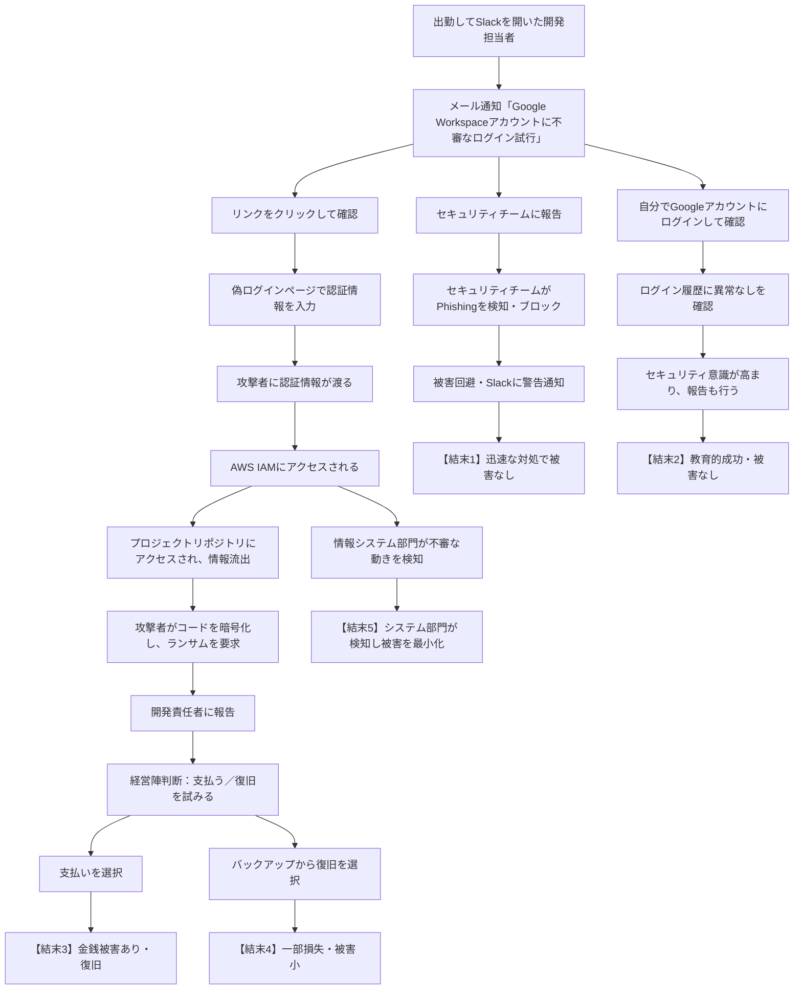

# なぜ作成したのか
- 他人のやらかし話は好きだけど、じっさいに社員がやらかすと嫌だなあと日々思っているので、やらかし話をゲームブック風にたどってもらうのはどうだろうという思いつき

---

# 質問（to ChatGPT）
> 企業の情シス担当者です。
> セキュリティ向上のため、フィッシングを題材としたゲームブックを作成し、社員にプレイしてもらおうと思います。
> ステークホルダーは以下です。
> - 攻撃者
> - 開発担当者
> - 開発責任者
> - 会計担当者
> - 経営者
> - 株主
> - クライアント
> - 情報システム部門担当者
> 
> 企業環境はクラウドネイティブなITサービス開発企業です。
> 社内環境としてGoogleWorkspace、Slack、開発環境にAWSを使用しています。
> 
> - 攻撃者の目的は対象の企業から金銭を取得することです。
>   - 手段としてはフィッシングによるクレデンシャルの取得、社内サービス、または開> 発環境への侵入、データの取得、暗号化、ランサムウェアによる脅迫です。
>   - 攻撃者は侵入に対しては準備期間に対象企業の情報をソーシャルエンジニアリング> で収集しています。
> - 開発担当者の目的は、セキュアに開発作業を遂行し、成果物を完成させることです。
> - 開発責任者の目的は、クライアントに成果物をデリバリーし、報酬を得ることです。
> - 会計担当者の目的は、会計処理を期日までに正確に実施することです。
> - 経営者の目的は、株主に対して経営状況の健全性、成長性をアピールし、資金を調達することです。
> - 株主の目的は、保持している株式の価値を最大化することです。
> - 情報システム部門担当者の目的は、業務活動をセキュアに保つことです。
> - クライアントの目的は、発注に対して期待通りに成果物が納入されることです。
> 
> 攻撃については、実際に2023年以降に実際に発生した事例を設定し、それをもとにプロットを作成してください。
> ゲームにおける選択肢は、主人公の行動です。
> 最善／次善／悪手の3パターンの選択肢を設けてください。
> まず、ゲームブックのフローチャートをMarkdown書式で作成してください。
> ストーリー上、結末を５つ用意して、早期にリスクに対処できるほど被害を小さくできる結末としてください。
> つぎに各パラグラフのストーリーテキストを作成してください。
> 最後に、ストーリーの基とした具体的な実例を提示し、「実際に起こるとこうなる」というゲームと現実の接地点を示してください・
>
> 開発担当者を主人公として、作成を開始してください。

## 🧭 1. フローチャート（Mermaid）

---

## 📝 2. ストーリーテキスト（各パラグラフ）

### パラグラフA
**出勤してSlackを開いたあなた（開発担当者）は、Gmailの通知で「Google Workspaceアカウントに対して不審なログインが試行されました」という警告を目にした。**
Slackには誰もこの件について言及しておらず、自分で対応する必要がありそうだ。

**どうする？**
- ✅ セキュリティチームに報告する（次善）
- 🔍 自分でGoogleアカウントにログインして確認する（最善）
- ⚠️ メールに記載されたリンクをクリックして確認する（悪手）

---

### パラグラフC1
あなたはメール内のリンクをクリックした。Googleのように見えるログインページが表示され、ログインを求められた。

**どうする？**
- 🚨 メールのURLを再確認せずに認証情報を入力した（悪手）
→ 認証情報が盗まれた。

---

### パラグラフC2
あなたはSlackで情報システム部門にメンションをつけて状況を報告した。すぐにメールが社内で共有され、「フィッシング攻撃の疑いあり」と注意喚起された。

→ 被害は未然に防がれた。
→ 【結末1】迅速な対応で被害なし

---

### パラグラフC3
あなたはメールのリンクを開かずに、Google Workspaceにブラウザからログインし直した。ログイン履歴には異常がなかった。

→ 同僚にも共有、セキュリティ意識向上に貢献。
→ 【結末2】教育的成功・被害なし

---

### パラグラフF1〜H1
攻撃者が取得した認証情報を使い、IAMロールを使ってAWS環境にアクセス。プロジェクトのコードベースと顧客情報が含まれるS3バケットが暗号化された。

→ 攻撃者から「0.5BTCを指定口座に振り込め」とのランサムメッセージ。

---

### パラグラフJ1〜Z3/Z4
- 経営陣は支払いを決断 → 【結末3】金銭被害あり
- バックアップから復旧に切り替え → 【結末4】一部損失で済む

---

### パラグラフM1〜Z5
情報システム部門がAWSの異常アクセスをCloudTrailで検知。アクセスキーを失効させ、影響範囲を調査・対応。

→ 被害は部分的、流出は防げた。
→ 【結末5】監視体制により被害最小化

---

## 🧾 3. モデルとなった実例

### 実例：GitHubを経由した開発環境侵入（2023年 Oktaの事例）

- 攻撃者はソーシャルエンジニアリングで開発者のGitHub認証情報をフィッシング。
- リポジトリから内部ツール・構成ファイルを取得。
- その後、Oktaやその顧客に対する二次被害が発生。
- 対応が早かったため、深刻な情報流出は回避された。

**教訓：**
- 開発者が第一の攻撃対象になる。
- GitHubやクラウド環境のアクセスキー管理が重要。
- セキュリティ意識と報告文化が被害を左右する。

---

了解しました！それでは、先ほどのプロットに基づいて、開発担当者を主人公とした**選択肢型ゲームブック本文**を作成します。  
各パラグラフに番号を振り、読者が選択肢を選びながら進められる構成にしています。

---

## 🎮 ゲームブック：  
**「あなたの認証情報が狙われている 〜クラウド開発者の一日〜」**  
主人公：開発担当者（あなた）

---

### 🔢【1】
:::details
月曜の朝。コーヒーを片手にSlackとGmailを立ち上げたあなた。  
Gmailに目を通すと、「Google Workspaceアカウントに不審なログイン試行が検知されました」という通知が届いていた。

リンクには「ログイン場所：ベトナム」「ブラウザ：不明」「確認はこちら」の文字。

Slackや社内掲示板には特にこの件の報告はないようだ。

**どうする？**

- ▶︎ [メールのリンクをクリックして確認する → 2](#2)
- ▶︎ [ブラウザからGoogleアカウントに直接ログインして確認する → 3](#3)
- ▶︎ [情報システム部門にSlackで報告する → 4](#4)

---
:::

### 🔢【2】
:::details
メールのリンクをクリックすると、見慣れたGoogleログイン画面が開かれた。違和感もなかったため、アカウントとパスワードを入力してしまった。

…しかし、その直後、あなたのGmailが突然ログアウトされた。

慌ててSlackに戻ると、数分後に「AWS IAM ロールに不審な操作が検知された」というアラートが投稿される。

**あなたの認証情報はすでに攻撃者の手に渡っていた。**

- ▶︎ [開発責任者に報告する → 5](#5)
- ▶︎ [何が起きたのか、自分で調べる → 6](#6)

---
:::

### 🔢【3】
:::details
あなたは慎重に、ブラウザでGoogle Workspaceにアクセスし、ログイン履歴を確認した。  
不審なログイン履歴は**なかった**。

念のため、Slackでセキュリティチームに共有したところ、「同様の偽メールが他にも届いている」との報告が。

**あなたの行動は、社内全体のフィッシング対応を早めるきっかけになった。**

✅ **【結末2】教育的成功・被害なし**

**🎉 あなたのセキュリティ意識が被害を防ぎました。**

---

:::

### 🔢【4】
:::details
あなたはすぐにSlackの「#sec-alert」チャンネルに状況を投稿。  
セキュリティチームがメールのリンクを解析し、「これはGoogleを装ったフィッシングメールだ」と判明。

社内全体に警告が出され、他の被害も防がれた。

✅ **【結末1】迅速な対処で被害なし**

**💪 チームで守る意識が会社全体を救いました。**

---
:::

### 🔢【5】
:::details
開発責任者に状況を報告すると、すぐに経営会議が招集された。  
攻撃者からのメッセージにはこうある：

>「貴社のAWS環境にあるコードとバックアップはすでに暗号化しました。0.5BTCを送金しない限り復旧不可です」

情報システム部門はバックアップの有無を確認中だ。

**経営陣の判断は？**

- ▶︎ [身代金を支払う → 7](#7)
- ▶︎ [バックアップから復旧を試みる → 8](#8)

---
:::

### 🔢【6】
:::details
あなたはAWS CloudTrailやIAMの操作履歴を自分で確認しようとするが、すでにセッションが切られ、アクセスできない。

情報システム部門が調査を引き継ぎ、Slackには「開発環境からの一部情報流出の可能性」との通知が出た。

**あなたの初動の遅れが被害を拡大させた。**

- ▶︎ [開発責任者に報告する → 5](#5)

（ループ）

---
:::

### 🔢【7】
:::details
数時間後、経営陣は支払いを決定。  
身代金0.5BTCが送金され、攻撃者から復号ツールが提供された。

コードは無事だったが、復号に3日かかり、**プロジェクト納期は延期**となった。

🛑 **【結末3】金銭被害あり・納期遅延**

---
:::

### 🔢【8】
:::details
情報システム部門が管理していたオフラインバックアップからの復旧が始まった。  
完全復旧には至らなかったが、主要ファイルは復元され、ランサムには応じなかった。

🚧 **【結末4】一部損失・被害小**

---
:::

### 🔢【9】
:::details
（自動分岐）  
情報システム部門がCloudTrailの異常を検知し、攻撃者のIPをブロック、IAMキーをローテーション。  
攻撃者は内部リポジトリへのアクセスを途中で遮断される。

🛡️ **【結末5】セキュリティ監視により被害最小化**

---
:::

## 💡 BONUSページ：実際に起きた「現実」
:::details
このゲームは、2023年に発生した**Okta開発者のGitHubアカウント侵害事件**をモデルにしています。

- 攻撃者は開発者を標的にしたフィッシングでGitHub認証情報を奪取。
- 内部ツールや顧客向け情報にアクセス。
- 幸い、被害が発覚してすぐに対応が行われ、拡大を防止。

🧠 **開発者はフィッシングの第一標的になりやすく、個々の意識と報告行動が企業全体の命運を分けるのです。**

---
:::

# 所感
- 超簡単な分岐だけどまあ少しいじれば自社に沿ったストーリーにはなるかも
- あとはページごとのイラストつけたりメール画像とか入れてみたら多少見栄えするかなあ
- 試しにストーリーテキストから動画作成を試してみようかなあ
