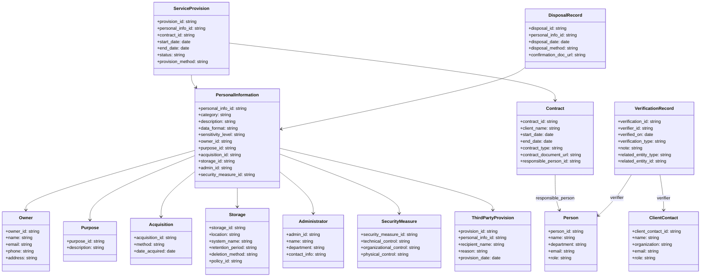
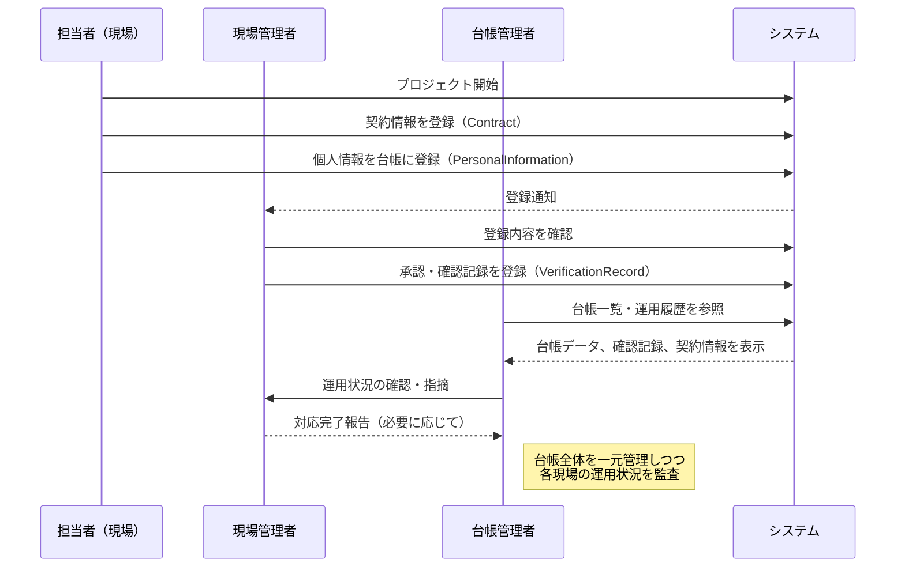

# なぜ作成したのか
- PPCが提供しているデータマッピング資料を見ているけれど、そのままだとちょっと扱いにくい気がしているので、ER図とかクラスで整理してみる

# ER図

## 🗂 ER図の概要（Entity-Relationship Diagram）

個人情報保護委員会の資料（例：「個人情報取扱事業者が講ずべき措置の例」）に基づく代表的な管理項目は以下のとおりです：

- 保有する個人情報の種類（例：氏名、住所、メールアドレス、電話番号など）
- 利用目的
- 取得方法
- 保管場所
- 提供先（第三者提供の有無と相手先）
- 管理責任者
- 保管期間
- 安全管理措置
- 処分方法

---

### 🧩 エンティティ一覧と主な属性

#### ① `PersonalInformation`（個人情報）
- `personal_info_id`（PK）
- `category`（氏名、住所、電話番号など）
- `description`（項目の説明）
- `data_format`（文字列、数値、画像など）
- `sensitivity_level`（機微情報の有無）

#### ② `Owner`（情報の本人）
- `owner_id`（PK）
- `name`
- `email`
- `phone`
- `address`

#### ③ `Purpose`（利用目的）
- `purpose_id`（PK）
- `description`

#### ④ `Acquisition`（取得方法）
- `acquisition_id`（PK）
- `method`（Webフォーム、書面、口頭など）
- `date_acquired`

#### ⑤ `Storage`（保管情報）
- `storage_id`（PK）
- `location`（ファイルサーバ、クラウド、紙媒体など）
- `system_name`
- `retention_period`
- `deletion_method`

#### ⑥ `ThirdPartyProvision`（第三者提供）
- `provision_id`（PK）
- `recipient_name`
- `reason`
- `provision_date`

#### ⑦ `Administrator`（管理責任者）
- `admin_id`（PK）
- `name`
- `department`
- `contact_info`

#### ⑧ `SecurityMeasure`（安全管理措置）
- `measure_id`（PK）
- `technical_control`（アクセス制御、暗号化など）
- `organizational_control`（教育、マニュアル整備など）
- `physical_control`（施錠、入退室管理など）

---

### 🔗 リレーション（主な関係）

- `Owner`は複数の`PersonalInformation`を保有（1:N）
- `PersonalInformation`は1つの`Purpose`、`Acquisition`、`Storage`に紐づく（N:1）
- `PersonalInformation`は複数の`ThirdPartyProvision`を持つ（1:N）
- `PersonalInformation`は1つの`Administrator`と`SecurityMeasure`に紐づく（N:1）

---

## 💡 ER図（テキストベース）

```plaintext
[Owner] ──< [PersonalInformation] >── [Purpose]
              │                          │
              │                          └──< [Acquisition]
              │
              └──< [ThirdPartyProvision]
              │
              └──> [Storage]
              └──> [Administrator]
              └──> [SecurityMeasure]
```

---

## ✅ 必要な観点：運用・証跡管理で押さえるべき要素

「台帳としての静的な情報管理」から一歩進んで、**実際の運用・ライフサイクル管理（契約～提供～終了～廃棄）をどう記録し、関係者の確認を記録に残すか**という点は、個人情報管理の中でも「運用上の信頼性・証跡確保」の重要な部分です。


| 観点 | 記録すべき内容 | 関連エンティティの例 |
|------|----------------|------------------------|
| 契約 | 契約開始日、契約書番号、委託元企業、契約形態 | Contract |
| 提供開始 | 実提供開始日、同意記録、システム連携のログ | ServiceProvision |
| 終了・廃棄 | 終了日、廃棄日、廃棄証明書、廃棄方法 | DisposalRecord |
| 委託元確認 | 委託元責任者の確認日、確認手段（電子署名/書面） | VerificationRecord |

---

## 🧩 追加すべきエンティティ構成案（拡張ERモデル）

### ① `Contract`（契約情報）
- `contract_id`（PK）
- `client_name`（委託元）
- `start_date`
- `end_date`
- `contract_type`（業務委託、共同利用 等）
- `contract_document_url`
- `responsible_person_id`（→ `Person`）

### ② `ServiceProvision`（提供管理）
- `provision_id`（PK）
- `personal_info_id`（→ `PersonalInformation`）
- `contract_id`（→ `Contract`）
- `start_date`
- `end_date`
- `status`（提供中、終了済み）
- `provision_method`（API, 紙媒体など）

### ③ `DisposalRecord`（廃棄記録）
- `disposal_id`（PK）
- `personal_info_id`（→ `PersonalInformation`）
- `disposal_date`
- `disposal_method`（シュレッダー、暗号消去など）
- `confirmation_doc_url`

### ④ `VerificationRecord`（確認記録）
- `verification_id`（PK）
- `verifier_id`（→ `Person` または `ClientContact`）
- `verified_on`（確認日時）
- `verification_type`（電子署名、メール確認、書面受領）
- `note`（確認内容メモ）
- `related_entity_type`（Contract, DisposalRecordなど）
- `related_entity_id`（関連レコードID）

---

## 👥 `Person`（社内担当者）／`ClientContact`（委託元担当者）

必要に応じて社内外の人物情報を以下のように区別して管理：

- `person_id`（PK）／`client_contact_id`
- `name`
- `department`
- `email`
- `role`（管理者、確認者、窓口）

---

## 🧾 記録の連携イメージ

```plaintext
[Contract] ──< [ServiceProvision] >── [PersonalInformation] >── [DisposalRecord]
      │                                     │                           │
      └──< [VerificationRecord]      [VerificationRecord]       [VerificationRecord]
```


## 📄 テーブル定義書（概要）

---

### `Owner`（個人情報の本人）

| カラム名      | データ型   | 制約    | 備考 |
|---------------|------------|---------|------|
| owner_id       | UUID       | PK      | 一意な本人ID |
| name           | VARCHAR(100) | NOT NULL | 氏名 |
| email          | VARCHAR(255) |         | メールアドレス |
| phone          | VARCHAR(20)  |         | 電話番号 |
| address        | TEXT        |         | 住所 |

---

### `PersonalInformation`（個人情報）

| カラム名             | データ型     | 制約     | 備考 |
|----------------------|--------------|----------|------|
| personal_info_id      | UUID         | PK       | 一意な情報ID |
| category              | VARCHAR(50)  | NOT NULL | 情報の種類（例：氏名） |
| description           | TEXT         |          | 説明 |
| data_format           | VARCHAR(50)  |          | 文字列、数値など |
| sensitivity_level     | VARCHAR(50)  |          | 機微情報かどうか |
| owner_id              | UUID         | FK → Owner(owner_id) | 本人 |
| purpose_id            | UUID         | FK → Purpose(purpose_id) | 利用目的 |
| acquisition_id        | UUID         | FK → Acquisition(acquisition_id) | 取得情報 |
| storage_id            | UUID         | FK → Storage(storage_id) | 保管情報 |
| admin_id              | UUID         | FK → Administrator(admin_id) | 管理責任者 |
| security_measure_id   | UUID         | FK → SecurityMeasure(security_measure_id) | 安全管理措置 |

---

### `Purpose`（利用目的）

| カラム名      | データ型     | 制約    | 備考 |
|---------------|--------------|---------|------|
| purpose_id     | UUID         | PK      | 一意な目的ID |
| description    | TEXT         |         | 利用目的の説明 |

---

### `Acquisition`（取得方法）

| カラム名        | データ型     | 制約    | 備考 |
|------------------|--------------|---------|------|
| acquisition_id    | UUID         | PK      | 一意なID |
| method            | VARCHAR(100) |         | Web、書面、口頭等 |
| date_acquired     | DATE         |         | 取得日 |

---

### `Storage`（保管情報）

| カラム名           | データ型     | 制約    | 備考 |
|--------------------|--------------|---------|------|
| storage_id          | UUID         | PK      | 一意なID |
| location            | VARCHAR(100) |         | 保管場所（クラウド等） |
| system_name         | VARCHAR(100) |         | 保管システム名 |
| retention_period    | VARCHAR(50)  |         | 保持期間（例：5年） |
| deletion_method     | VARCHAR(100) |         | 消去方法（例：暗号化削除） |

---

### `Administrator`（管理責任者）

| カラム名      | データ型     | 制約    | 備考 |
|---------------|--------------|---------|------|
| admin_id       | UUID         | PK      | 一意なID |
| name           | VARCHAR(100) |         | 氏名 |
| department     | VARCHAR(100) |         | 所属部署 |
| contact_info   | VARCHAR(255) |         | 連絡先 |

---

### `SecurityMeasure`（安全管理措置）

| カラム名              | データ型     | 制約    | 備考 |
|------------------------|--------------|---------|------|
| security_measure_id     | UUID         | PK      | 一意なID |
| technical_control       | TEXT         |         | アクセス制御等 |
| organizational_control  | TEXT         |         | 教育・規定整備等 |
| physical_control        | TEXT         |         | 入退室管理等 |

---

### `ThirdPartyProvision`（第三者提供記録）

| カラム名         | データ型     | 制約    | 備考 |
|------------------|--------------|---------|------|
| provision_id       | UUID         | PK      | 一意なID |
| personal_info_id   | UUID         | FK → PersonalInformation | 対象情報 |
| recipient_name     | VARCHAR(100) |         | 提供先 |
| reason             | TEXT         |         | 提供理由 |
| provision_date     | DATE         |         | 提供日 |

---

### `Contract`（契約情報）

| カラム名             | データ型     | 制約    | 備考 |
|----------------------|--------------|---------|------|
| contract_id           | UUID         | PK      | 一意なID |
| client_name           | VARCHAR(100) |         | 委託元名 |
| start_date            | DATE         |         | 契約開始 |
| end_date              | DATE         |         | 契約終了 |
| contract_type         | VARCHAR(50)  |         | 業務委託 等 |
| contract_document_url | TEXT         |         | 契約書リンク等 |
| responsible_person_id | UUID         | FK → Person(person_id) | 責任者 |

---

### `ServiceProvision`（提供管理）

| カラム名          | データ型     | 制約    | 備考 |
|-------------------|--------------|---------|------|
| provision_id        | UUID         | PK      | 一意なID |
| personal_info_id    | UUID         | FK → PersonalInformation |
| contract_id         | UUID         | FK → Contract |
| start_date          | DATE         |         | 提供開始 |
| end_date            | DATE         |         | 提供終了 |
| status              | VARCHAR(50)  |         | 提供中／終了等 |
| provision_method    | VARCHAR(100) |         | 提供手段（API等） |

---

### `DisposalRecord`（廃棄記録）

| カラム名            | データ型     | 制約    | 備考 |
|---------------------|--------------|---------|------|
| disposal_id          | UUID         | PK      | 一意なID |
| personal_info_id     | UUID         | FK → PersonalInformation |
| disposal_date        | DATE         |         | 廃棄日 |
| disposal_method      | VARCHAR(100) |         | 廃棄方法 |
| confirmation_doc_url | TEXT         |         | 廃棄証明書リンク等 |

---

### `VerificationRecord`（確認記録）

| カラム名            | データ型     | 制約    | 備考 |
|---------------------|--------------|---------|------|
| verification_id      | UUID         | PK      | 一意なID |
| verifier_id          | UUID         | FK → Person / ClientContact |
| verified_on          | DATE         |         | 確認日時 |
| verification_type    | VARCHAR(50)  |         | 電子署名など |
| note                 | TEXT         |         | 確認メモ |
| related_entity_type  | VARCHAR(50)  |         | "Contract"等 |
| related_entity_id    | UUID         |         | 紐づくID |

---

### `Person`（社内担当者）

| カラム名      | データ型     | 制約    | 備考 |
|---------------|--------------|---------|------|
| person_id      | UUID         | PK      | 担当者ID |
| name           | VARCHAR(100) |         | 氏名 |
| department     | VARCHAR(100) |         | 部署 |
| email          | VARCHAR(255) |         | 連絡先 |
| role           | VARCHAR(50)  |         | 担当者／確認者など |

---

### `ClientContact`（委託元担当者）

| カラム名         | データ型     | 制約    | 備考 |
|------------------|--------------|---------|------|
| client_contact_id | UUID         | PK      | 委託元ID |
| name              | VARCHAR(100) |         | 氏名 |
| organization      | VARCHAR(100) |         | 所属企業 |
| email             | VARCHAR(255) |         | 連絡先 |
| role              | VARCHAR(50)  |         | 窓口、責任者など |

---

## クラス図



---

## 🎯 ユースケース

| 役割           | 概要 |
|----------------|------|
| 担当者（現場）     | プロジェクト開始時に契約情報＋個人情報を登録 |
| 現場管理者         | 登録内容を確認・承認 |
| 台帳管理者         | 台帳全体を監督・運用状況の監査 |

---

## 🧩 シーケンス図



# 所感
- 実際の登録データを入れ込んでみないと適切かどうかはまだ判断つかない感じ。
- Appsheetで実装してみよう