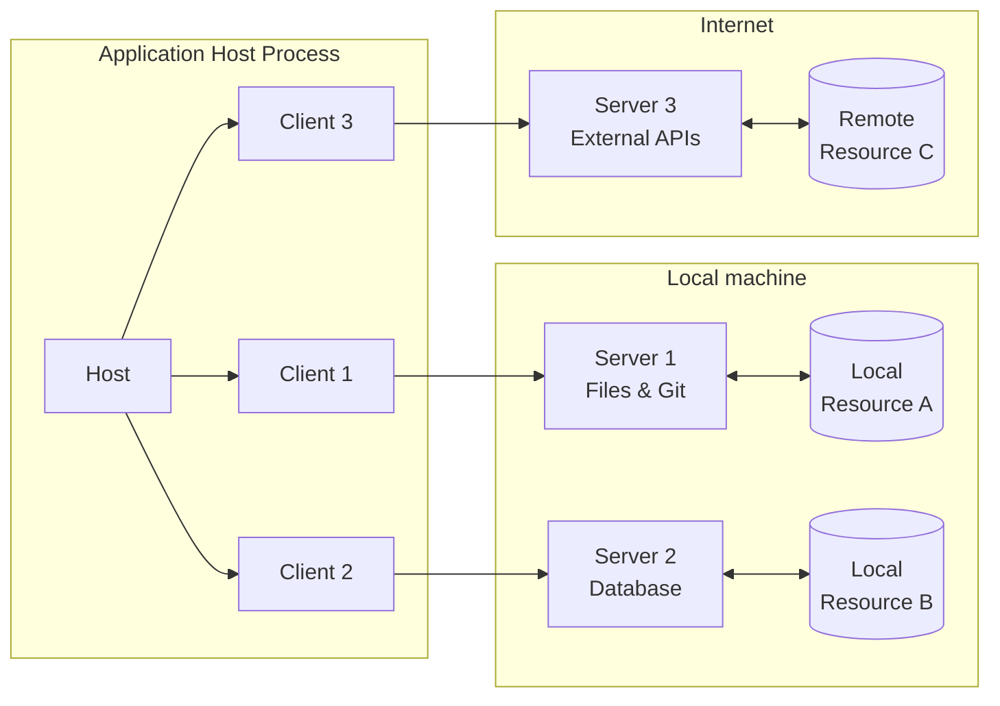
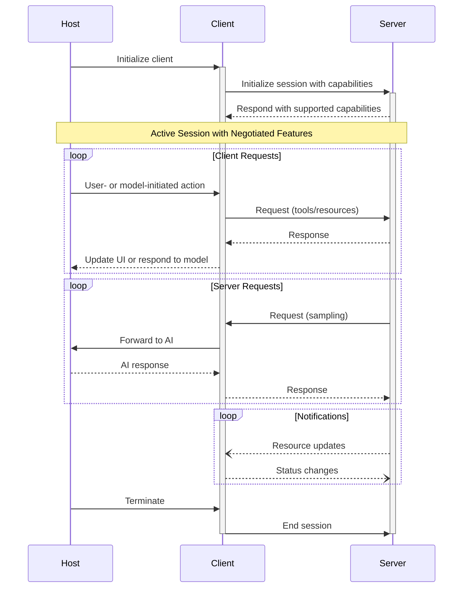

# なぜ作成したのか
- MCPエアプなので知識を増やしたい

# 参考
https://spec.modelcontextprotocol.io/specification/2025-03-26/
https://github.com/modelcontextprotocol

---

# Model Context Protocol（MCP）とは
- Model Context Protocol（MCP）は、大規模言語モデル（LLM）アプリケーションと外部データソースやツールとのシームレスな統合を可能にするオープンプロトコルです。 
- このプロトコルは、LLMアプリケーションが必要なコンテキスト情報にアクセスし、外部ツールを活用できるよう標準化された方法を提供します。

# 概要

MCPは、アプリケーションが以下を実現するための標準化された方法を提供します：

- 言語モデルとコンテキスト情報の共有
- AIシステムへのツールや機能の提供
- 組み合わせ可能な統合やワークフローの構築

このプロトコルは、JSON-RPC 2.0メッセージを使用して以下の間で通信を確立します：

- **ホスト**：接続を開始するLLMアプリケーション
- **クライアント**：ホストアプリケーション内のコネクタ
- **サーバー**：コンテキストや機能を提供するサービス

MCPは、Language Server Protocolから着想を得ており、AIアプリケーションのエコシステムに追加のコンテキストやツールを統合する方法を標準化しています。

# 主要な詳細

- **基本プロトコル**：JSON-RPCメッセージ形式、ステートフルな接続、サーバーとクライアントの機能交渉
- **サーバー機能**：リソース（ユーザーやAIモデルが使用するコンテキストやデータ）、プロンプト（ユーザー向けのテンプレート化されたメッセージやワークフロー）、ツール（AIモデルが実行する関数）
- **クライアント機能**：サンプリング（サーバー主導のエージェント行動や再帰的なLLMの相互作用）
- **追加ユーティリティ**：設定、進捗トラッキング、キャンセル、エラーレポート、ロギング

# セキュリティと信頼性

MCPは、任意のデータアクセスやコード実行経路を通じて強力な機能を提供しますが、それに伴い重要なセキュリティと信頼性の考慮が必要です。

- **ユーザーの同意と制御**：ユーザーはすべてのデータアクセスや操作に明示的に同意し、理解する必要があります。
- **データプライバシー**：ホストは、ユーザーデータをサーバーに公開する前に明示的なユーザーの同意を得る必要があります。
- **ツールの安全性**：ツールは任意のコード実行を表すため、適切な注意が必要です。ホストは、ツールを呼び出す前に明示的なユーザーの同意を得る必要があります。
- **LLMサンプリングの制御**：ユーザーは、LLMサンプリングリクエストを明示的に承認する必要があります。

# 実装ガイドライン

MCP自体はこれらのセキュリティ原則をプロトコルレベルで強制することはできませんが、実装者は以下を行うべきです：

1. 堅牢な同意と認可のフローをアプリケーションに組み込む
2. セキュリティ上の影響について明確な文書を提供する
3. 適切なアクセス制御とデータ保護を実装する
4. 統合においてセキュリティのベストプラクティスに従う
5. 機能設計においてプライバシーの影響を考慮する

# 所感
- MCPを社内サービスに持ち込むには、連携するサービスについて認証認可、API提供形式を精査したうえでアクセスガイドを構築したうえでサービスカタログを展開する、といった前準備が必要そう
- これは別にMCPがどうこうではなく、プロセスの連携による業務効率化をするならやらなければならなかったこと
- 生成AI、およびエージェントの台頭によりこの必要性が炙り出されていたことは、これまで社内システムを管理してた私の怠慢を責められている気分にもなる
- ちゃんと管理者らしいことをしよう