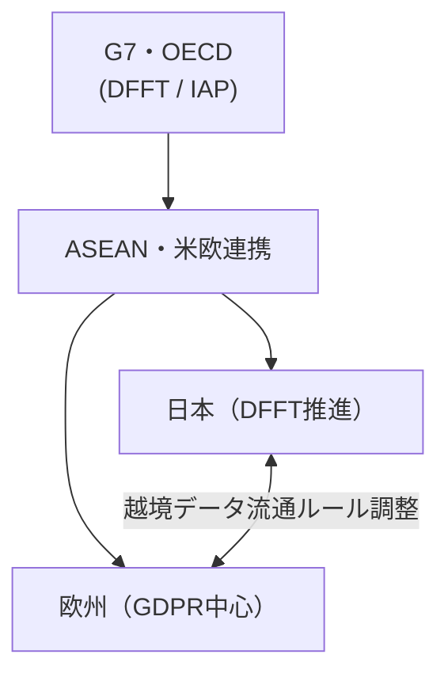

# なぜ作成したのか
- 丁度会社で個人情報の扱いを整理してるので読んでみる

# 参考

https://www.jipdec.or.jp/library/report/20250305-r01.html
https://www.jipdec.or.jp/library/report/o66i7e0000001uzc-att/20250305_r01.pdf

ありがとうございます。以下に、2025年3月5日に開催されたJIPDECセミナー「個人情報を取り巻く近年の動向」の講演資料をもとに、内容を時系列に整理しつつ、今後の動向や海外との比較、注意点を図とともに解説します。

---

## ■ 時系列で見る個人情報とAI・データ政策の動向（要約）

| 時期 | 出来事・政策動向 | 説明 |
|------|-------------------|------|
| **2019年1月** | DFFT（信頼に基づく自由なデータ流通）提唱 | 日本がG20で提唱。信頼あるデータ越境の基本枠組みとしてOECDへ展開。 |
| **2023年～2025年** | 日本：個人情報保護法「3年見直し」 | 個人の権利保護と利活用のバランスがテーマ。新概念「働きかけ可能な個人関連情報」も提案。 |
| **2024年5月** | EU：「AI規則」制定 | 高リスクAIに対する規制を含む。施行は2025年2月～8月。 |
| **2024年6月** | G7：IAP枠組み承認 | ASEAN連携含めた国際的な法制度整備が進展。 |
| **2025年1月** | 韓国：「AI基本法」成立 | 日本と異なり、包括的なAI規制を導入。 |
| **2025年2月** | 日本：「AI制度中間取りまとめ」公表 | 自主性尊重型のガイドライン中心。新たな法制導入には慎重。 |

---

## ■ 各国の個人情報保護・AI規制の比較

以下の図は、日本を中心に、米・欧・中・印など主要国の規制の違いと特徴をまとめたものです。

### 🌐 個人情報・AI規制の比較表

| 項目 | 日本 | 欧州（EU） | 米国 | 中国 | インド |
|------|------|------------|------|------|--------|
| 主な法令 | 個人情報保護法 | GDPR・AI規則 | 州法中心、FTCによる執行 | PIPL等 | DPDPA（2023年制定） |
| AIへの対応 | 自主ガイドライン重視 | リスク分類による規制 | 民間主導／州法乱立 | 国家レベル＋都市実験 | 高度義務＋罰則あり |
| 越境データ移転 | DFFT推進、契約型対応 | SCC等の標準契約義務 | 国家安全保障規制 | 厳格な越境規制 | 域外適用あり（曖昧） |
| こども保護 | 16歳基準、整備途上 | 16歳基準（GDPR） | COPPA等、強制執行 | 規制強化中 | 苦情処理権など独自規定 |
| 特徴 | バランス志向／同意原則重視 | 保護重視＋包括性 | 州別対応／事業者責任重視 | コンプライアンス重視 | 同意中心＋高リスク規制 |

---

## ■ 今後の動向（国内）

1. **AIとの共存ルールの深化**
   - 技術進化のスピードに対応するため、**アジャイルガバナンス**が求められる。
   - リスクベースでのガイドライン運用が強調されており、IPA等の指針が参考に。

2. **個人情報保護法の見直し継続**
   - 「働きかけ可能な個人関連情報」や顔特徴データに関する新たな概念が提案。
   - 統計的利用などの際に同意不要とする議論も進行。

3. **社会起点でのデータ利活用**
   - 医療・金融・エネルギーなど公益性の高い分野での再利用が重点。

---

## ■ 海外サービス利用時の注意点

### ✋ 主なリスクと対策

| リスク | 説明 | 推奨対応 |
|--------|------|----------|
| **越境データの法的リスク** | 利用国での保存・処理が法的制約を受ける可能性 | 契約書に準拠法とSCC（標準契約条項）明記 |
| **同意取得の不備** | 日本基準のままでは海外で問題になる場合も | 各国のプライバシー規制（例：GDPR）に合わせた調整 |
| **ローカライゼーション要件** | 中国など一部では国内保存を義務化 | クラウド選定時に現地リージョン対応可否を確認 |
| **サービス提供者の責任回避** | AIベンダーがリスクを負わない場合がある | 利用契約で「責任範囲」「データ所有権」の明確化 |

---

## ■ 補足図：国際的データガバナンス構造

---

## ■ まとめ：システム管理者が考慮すべきポイント

- **国内法の見直し動向**に注視し、AIサービスの導入前に社内ポリシーを見直す
- **国外クラウド・AIサービスの利用契約**では、データの取り扱いに関する合意条項を明確に
- **部門横断的なリスク管理体制**（特にAI導入に関するガバナンス）を早期に構築
- **子どもや特定属性に関するデータ**については、より厳格な規制対応が求められる可能性あり

---

# 所感
- ローカライゼーションは今後厳密になる気がする
- AI規制、越境データ規制については知見を広げておかないと痛い目を見そう