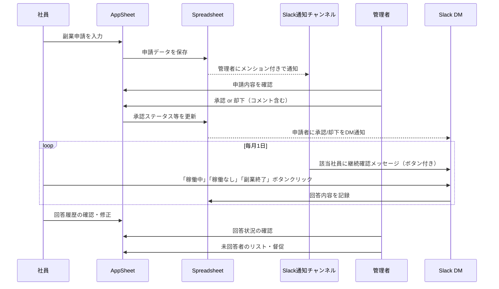
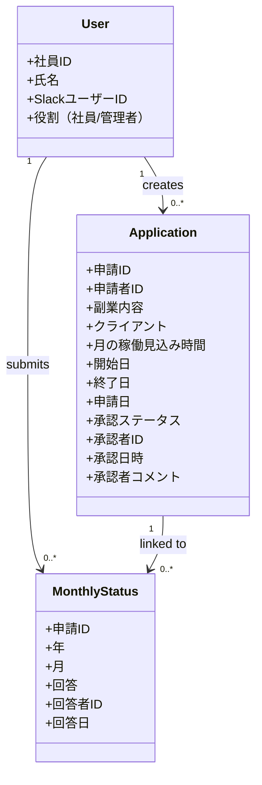

# なぜ作成したのか
- もうちょっと管理負荷を申請者にオフロードするアプリを作りたい

# 質問１（to ChatGPT）

> Spreadsheet,Appsheet,Slackで社員の副業申請、副業の継続状況監視をしたいです。
> ステークホルダーは以下の通りです。
> - 社員
> - 管理者
> 
> １．申請
> 
> 社員は副業を行う場合にAppsheetから副業申請を行います。
> 申請内容は本人と管理者にしか見えてはいけません。
> 申請する内容は以下です。
> - 副業内容
> - クライアント
> - 月の稼働見込み時間
> - 開始日
> - 終了日
> - 申請者
> - 申請日
>
> 申請データはSpreadsheetで管理します。
> 
> 申請が発行されたら、Slackの申請通知用チャンネルに管理者あてのメンションをつけてPostします。
> 管理者は申請内容をAppsheetで確認し、問題なければ承認します。問題があれば問題点を入力し、却下します。
> 承認時に、以下の承認記録を残します。
> - 承認ステータス
> - 承認者
> - 承認日時
> - 承認者コメント
> 承認・却下が行われたら、Slackbotから申請を行った社員にDMで通知します。
>
> ２．継続監視
> 申請された副業の開始日、終了日に基づき、毎月１日に申請を行った社員へDMで確認のメッセージをDMします。
> DMには「稼働中」「稼働なし」「副業終了」のボタンを設置し、該当の社員はいずれかをクリックします。
> クリックされたら、回答内容をもとにSpreadsheetに以下の情報を追加します。
> - 年
> - 月
> - 回答
> - 回答者
> - 回答日
> 社員は回答した内容をAppsheetから、副業申請データに紐づく形で確認、修正できるようにします。
>
> 管理者は各社員からの回答状況をAppsheetから確認します。
> 管理者がAppsheetから未回答者を確認し、督促ができるようにダッシュボード、または月別未回答リストを作成します。
> 
> 当該機能を実装します。
> まず処理をMarkdown書式のシーケンス図として整理して下さい。
> 同様にクラス図を作成してください。
> 最後にクラス図をもとにSpreadsheetの列設計を行ってください。


# 回答１
以下にご要望の業務プロセスに基づいて、処理の流れを整理した**Markdown形式のシーケンス図**、**クラス図**、および**Spreadsheetの列設計**を提示します。

---

## 🔁 シーケンス図



---

## 🧱 クラス図



---

## 📊 Spreadsheet列設計

### 1. ユーザー管理シート（Users）

| 社員ID | 氏名 | SlackユーザーID | 役割（社員/管理者） |
|--------|------|------------------|---------------------|
| U001   | 山田太郎 | @yamada          | 社員                |
| U002   | 佐藤花子 | @sato            | 管理者              |

---

### 2. 副業申請シート（Applications）

| 申請ID | 申請者ID | 副業内容 | クライアント | 月の稼働見込み時間 | 開始日 | 終了日 | 申請日 | 承認ステータス | 承認者ID | 承認日時 | 承認者コメント |
|--------|-----------|----------|--------------|---------------------|--------|--------|--------|----------------|------------|------------|------------------|
| A001   | U001      | Web制作 | 株式会社ABC | 20時間              | 2025/04/01 | 2025/09/30 | 2025/03/15 | 承認 | U002 | 2025/03/16 | 問題なし        |

---

### 3. 月次報告シート（MonthlyStatus）

| レコードID | 申請ID | 年 | 月 | 回答 | 回答者ID | 回答日 |
|------------|--------|----|----|------|------------|---------|
| R001       | A001   | 2025 | 04 | 稼働中 | U001 | 2025/04/01 |

---

# 質問２（to ChatGPT）

> ここまでの設計情報をもとに、Slack通知の機能を実装してください。

# 回答２

Slack通知の機能として、次の2つをGoogle Apps Script（GAS）で実装します。

---

## ✅ 機能一覧

### ① 管理者への副業申請通知（Slackチャンネルにメンション付き）
- AppSheet経由でSpreadsheetに新規申請が追加されたときに、Slackチャンネルへメンション付きで通知。

### ② 社員への承認／却下通知（Slack DM）
- 管理者がAppSheetで承認ステータスを更新したら、該当社員にDM通知。

---

## 📦 事前準備（Slack Bot設定）

1. [Slack API: Apps](https://api.slack.com/apps) にアクセスして新しいアプリを作成。
2. OAuth & Permissions にて以下のスコープを設定:
   - `chat:write`
   - `users:read`
   - `im:write`
3. Bot Token を取得して、GASのスクリプトプロパティに `SLACK_BOT_TOKEN` として保存。
4. 通知先チャンネルID（例: `副業申請通知用`）を調べて、スクリプトプロパティに `SLACK_NOTIFY_CHANNEL_ID` を保存。

---

## 🧩 GASコード：Slack通知スクリプト

```javascript
// Slack設定
const SLACK_TOKEN = PropertiesService.getScriptProperties().getProperty("SLACK_BOT_TOKEN");
const SLACK_NOTIFY_CHANNEL_ID = PropertiesService.getScriptProperties().getProperty("SLACK_NOTIFY_CHANNEL_ID");

// 社員情報を取得（Slack ID取得用）
function getUserMap() {
  const sheet = SpreadsheetApp.getActiveSpreadsheet().getSheetByName("Users");
  const rows = sheet.getDataRange().getValues();
  const map = {};
  for (let i = 1; i < rows.length; i++) {
    const [userId, name, slackId, role] = rows[i];
    map[userId] = { name, slackId, role };
  }
  return map;
}

// ① 管理者へ副業申請通知
function notifyNewApplication() {
  const sheet = SpreadsheetApp.getActiveSpreadsheet().getSheetByName("Applications");
  const lastRow = sheet.getLastRow();
  const row = sheet.getRange(lastRow, 1, 1, sheet.getLastColumn()).getValues()[0];

  const [申請ID, 申請者ID, 副業内容, クライアント, 月時間, 開始日, 終了日, 申請日] = row;

  const users = getUserMap();
  const 管理者 = Object.values(users).find(user => user.role === "管理者");
  if (!管理者) return;

  const message = `
📮 *新しい副業申請が届きました*
申請者: ${users[申請者ID]?.name}
副業内容: ${副業内容}
クライアント: ${クライアント}
月の稼働見込み時間: ${月時間}
期間: ${開始日} ～ ${終了日}
申請日: ${申請日}
<@${管理者.slackId}> ご確認ください。
`;

  postSlackMessage(SLACK_NOTIFY_CHANNEL_ID, message);
}

// ② 承認 or 却下通知を申請者にDM
function notifyApprovalStatus() {
  const sheet = SpreadsheetApp.getActiveSpreadsheet().getSheetByName("Applications");
  const lastRow = sheet.getLastRow();
  const row = sheet.getRange(lastRow, 1, 1, sheet.getLastColumn()).getValues()[0];

  const [申請ID, 申請者ID, , , , , , , 承認ステータス, 承認者ID, 承認日時, 承認者コメント] = row;

  const users = getUserMap();
  const 申請者SlackId = users[申請者ID]?.slackId;
  const 承認者名 = users[承認者ID]?.name;

  if (!申請者SlackId || !承認ステータス) return;

  const message = `
📢 *副業申請の結果通知*
あなたの申請（ID: ${申請ID}）は *${承認ステータス}* されました。

承認者: ${承認者名}
日時: ${承認日時}
コメント: ${承認者コメント || "（なし）"}
`;

  postSlackMessageToUser(申請者SlackId, message);
}

// Slackメッセージ送信（チャンネル向け）
function postSlackMessage(channelId, message) {
  const url = "https://slack.com/api/chat.postMessage";
  const payload = {
    channel: channelId,
    text: message,
    mrkdwn: true,
  };

  const options = {
    method: "post",
    contentType: "application/json",
    headers: {
      Authorization: `Bearer ${SLACK_TOKEN}`,
    },
    payload: JSON.stringify(payload),
  };

  UrlFetchApp.fetch(url, options);
}

// Slack DM送信
function postSlackMessageToUser(slackUserId, message) {
  // DMチャンネルを開く
  const imOpenUrl = "https://slack.com/api/conversations.open";
  const imOptions = {
    method: "post",
    contentType: "application/json",
    headers: {
      Authorization: `Bearer ${SLACK_TOKEN}`,
    },
    payload: JSON.stringify({ users: slackUserId }),
  };
  const response = JSON.parse(UrlFetchApp.fetch(imOpenUrl, imOptions).getContentText());
  const channelId = response.channel.id;

  postSlackMessage(channelId, message);
}
```

---

## ⏰ トリガー設定（AppSheet連携）

- `notifyNewApplication`：
  - AppSheetで「新しい行が追加されたとき」に実行されるように設定（GASトリガー or AppSheetからWebhook連携）
- `notifyApprovalStatus`：
  - AppSheetで「既存の行が更新されたとき」（承認ステータスが変わったとき）に実行

---

## ✅ 次のステップ

- 承認ステータスの変更を検知するトリガーをAppSheetまたはGASでどう実装するか。
- 継続確認DMのボタン付き通知（Slack Block Kit）への拡張。

この部分も含めて、継続確認の通知処理も実装していきましょうか？


# 質問３（to ChatGPT）

> 継続確認の通知処理を実装してください。

# 回答３

了解です！以下に、**継続確認のSlack通知処理（社員へのDM + ボタン付き回答 + 回答結果の記録）**を実装します。

---

## ✅ 処理概要（毎月1日）

1. Spreadsheet「Applications」から、終了日が過ぎていない申請を抽出。
2. 各該当社員に、Slack DMでボタン付き「継続確認メッセージ」を送信。
3. 社員がボタンを押したら、GASのWebhook（`doPost`) が受信。
4. 押された内容をもとに、「MonthlyStatus」シートへ回答を記録。

---

## 📁 Spreadsheet構成（再掲）

- `Applications`：副業申請一覧
- `MonthlyStatus`：月次の継続確認
- `Users`：社員情報（SlackユーザーIDあり）

---

## 🧩 GASスクリプト（継続確認通知＆回答記録）

### ① 毎月1日の通知トリガー処理

```javascript
function sendMonthlyStatusCheck() {
  const today = new Date();
  const year = today.getFullYear();
  const month = today.getMonth() + 1;

  const appsSheet = SpreadsheetApp.getActiveSpreadsheet().getSheetByName("Applications");
  const userMap = getUserMap();
  const rows = appsSheet.getDataRange().getValues();
  const headers = rows[0];
  const applications = rows.slice(1);

  applications.forEach(app => {
    const [申請ID, 申請者ID, , , , 開始日, 終了日] = app;
    const start = new Date(開始日);
    const end = new Date(終了日);

    // 対象の月内に活動期間が含まれる申請のみ通知
    if (today >= start && today <= end) {
      const slackId = userMap[申請者ID]?.slackId;
      if (slackId) {
        sendStatusCheckMessage(slackId, 申請ID, year, month);
      }
    }
  });
}
```

---

### ② Slackにボタン付きメッセージ送信

```javascript
function sendStatusCheckMessage(slackUserId, applicationId, year, month) {
  const url = "https://slack.com/api/conversations.open";
  const imResponse = UrlFetchApp.fetch(url, {
    method: "post",
    contentType: "application/json",
    headers: {
      Authorization: `Bearer ${SLACK_TOKEN}`,
    },
    payload: JSON.stringify({ users: slackUserId }),
  });

  const imData = JSON.parse(imResponse.getContentText());
  const channelId = imData.channel.id;

  const message = {
    channel: channelId,
    text: `副業継続状況の確認`,
    blocks: [
      {
        type: "section",
        text: {
          type: "mrkdwn",
          text: `📆 *${year}年${month}月* の副業状況をお知らせください。\n申請ID: *${applicationId}*`,
        },
      },
      {
        type: "actions",
        elements: ["稼働中", "稼働なし", "副業終了"].map(status => ({
          type: "button",
          text: {
            type: "plain_text",
            text: status,
          },
          value: JSON.stringify({ applicationId, year, month, status }),
          action_id: "monthly_status_update",
        })),
      },
    ],
  };

  UrlFetchApp.fetch("https://slack.com/api/chat.postMessage", {
    method: "post",
    contentType: "application/json",
    headers: {
      Authorization: `Bearer ${SLACK_TOKEN}`,
    },
    payload: JSON.stringify(message),
  });
}
```

---

### ③ ボタンクリックを受け取るWebhook（`doPost`）

```javascript
function doPost(e) {
  const payload = JSON.parse(e.postData.contents);
  if (payload.type === "block_actions") {
    const action = payload.actions[0];
    const userId = payload.user.id;
    const value = JSON.parse(action.value); // { applicationId, year, month, status }

    const sheet = SpreadsheetApp.getActiveSpreadsheet().getSheetByName("MonthlyStatus");
    const now = new Date();

    sheet.appendRow([
      new Date().getTime(), // レコードID代替
      value.applicationId,
      value.year,
      value.month,
      value.status,
      getUserIdBySlackId(userId),
      Utilities.formatDate(now, "Asia/Tokyo", "yyyy/MM/dd HH:mm:ss"),
    ]);

    // 確認メッセージを返信
    return ContentService.createTextOutput(
      JSON.stringify({ text: "回答を記録しました。ありがとうございました！" })
    ).setMimeType(ContentService.MimeType.JSON);
  }

  return ContentService.createTextOutput("OK");
}
```

---

### ④ Slack ID → 社員IDの変換

```javascript
function getUserIdBySlackId(slackId) {
  const users = getUserMap();
  for (const [userId, user] of Object.entries(users)) {
    if (user.slackId === slackId) return userId;
  }
  return null;
}
```

---

## ✅ デプロイ手順（Webhook設定）

1. GASの`doPost`関数があるスクリプトを**Webアプリとしてデプロイ**。
   - 実行するユーザー：自分
   - 誰でもアクセス可能（匿名ユーザーを許可）
2. Slack App設定画面で「Interactivity & Shortcuts」を有効にし、
   - Request URLにWebアプリのURLを登録。
3. `sendMonthlyStatusCheck()` を毎月1日にトリガー実行するように設定。

---

## ⏭️ 次のステップ（オプション）

- AppSheet 側で社員が過去の回答を確認・修正するUIを用意
- 管理者用のダッシュボード（未回答者の月次一覧）作成

それらの構築も必要であればサポートできます。どちらから進めますか？

# 質問４（to ChatGPT）
> AppSheet 側で社員が過去の回答を確認・修正するUIを作成してください

# 回答４

AppSheet 側で社員が「自分の副業申請」に紐づく「月次継続回答履歴」を確認・修正できるUI（ビュー）を構築するには、**以下のステップでAppSheetアプリを設計**します。

---

## ✅ 目指すUIのイメージ

- ログインユーザー（社員）は、自分の申請だけが見える。
- 各申請の詳細ページで、対応する月次ステータス（`MonthlyStatus`）の一覧を確認できる。
- ステータスを編集可能（例：「稼働中 → 稼働なし」に修正）。
- 新規に月次ステータスを追加することも可能。

---

## 🏗 AppSheet設計手順

### ① データソースの用意（Google Spreadsheet）
使用シート：
- `Users`
- `Applications`
- `MonthlyStatus`

### ② 各テーブル設定

#### `Users` テーブル
| 項目 | 設定内容 |
|------|----------|
| Security Filter | `[SlackユーザーID] = USEREMAIL()` などSlackIDかメールアドレスベースで制限 |
| Key Column | `社員ID` |

#### `Applications` テーブル
| 項目 | 設定内容 |
|------|----------|
| Security Filter | `[申請者ID] = LOOKUP(USEREMAIL(), "Users", "SlackユーザーID", "社員ID")` |
| Key Column | `申請ID` |

#### `MonthlyStatus` テーブル
| 項目 | 設定内容 |
|------|----------|
| Security Filter | `[回答者ID] = LOOKUP(USEREMAIL(), "Users", "SlackユーザーID", "社員ID")` |
| Key Column | `レコードID` |
| Ref | `申請ID` を `Applications` に対して参照型に設定 |

---

### ③ UXビュー構成（AppSheet）

#### A. メインビュー：`My Applications`
- **View Type**：Table / Deck
- **Data**：`Applications`
- **Display name**：`自分の副業申請`
- **Row filter**：自身の申請のみ（上記Security Filterで対応）
- **On Row Click**：**Detail View**へ遷移

#### B. Application Detailビュー
- **Data**：`Applications`
- **View Type**：Detail
- **表示項目**：
  - 副業内容・クライアント・稼働時間など
  - **Related MonthlyStatus**（仮想列：`Related MonthlyStatus`）

#### C. Embedded Table：`MonthlyStatus`（Detail内）
- 自動生成される仮想列 `Related MonthlyStatus` を表示
- 各月の回答（「稼働中」「稼働なし」など）を一覧表示
- 編集・削除可
- 「＋」ボタンで新規月次ステータスを追加可能（`ApplicationID` 自動連携）

---

### ④ フォームビュー：新規月次ステータス作成用

- フォームで入力する項目：
  - 年（`Enum`）
  - 月（`Enum`）
  - 回答（`Enum`: 稼働中 / 稼働なし / 副業終了）
- 回答日：初期値に `NOW()` を設定（非表示でもOK）
- 回答者ID：初期値に `LOOKUP(USEREMAIL(), "Users", "SlackユーザーID", "社員ID")`

---

### ⑤ 権限・セキュリティ強化（重要）

- ユーザーに自分のデータしか見せないよう、**Security Filter**をすべてのテーブルに設定。
- 編集対象を制限したい場合は、`Editable_If` ルールで「自身のデータかどうか」を条件にする。

---

## 📱 画面イメージ（構成例）

```
My Applications
├─ [Web制作 - 株式会社ABC]
│   ├─ 副業内容: Web制作
│   ├─ クライアント: 株式会社ABC
│   ├─ 稼働見込み: 20時間
│   ├─ Related MonthlyStatus
│   │   ├─ 2025年4月: 稼働中（編集可）
│   │   ├─ 2025年5月: 稼働なし（編集可）
│   │   └─ [+新規回答を追加]
```

---

## ✅ 完成後のチェックリスト

- [x] アプリにログインした社員は、自分の申請だけ見える。
- [x] 各申請に紐づいた月次ステータスを見られる・修正できる。
- [x] 必要なら新しい月のステータスを追加できる。
- [x] 管理者には全社員分が見えるよう、別ビューを作成可能。

---

ご希望があれば「管理者向けの未回答者ダッシュボード」の構成も続けて提案できます！作りましょうか？

# 質問５（to ChatGPT）

> 管理者向けの未回答者ダッシュボードを作成してください

# 解答５

了解です！以下に、**AppSheetで構築する「管理者向け未回答者ダッシュボード」**の設計をまとめます。

---

## 🎯 目的

- 管理者が毎月の副業継続確認状況を把握し、**未回答者を特定して督促**できる。
- 年・月を指定して、各申請に対して該当月の**月次回答が存在しない社員の一覧**を表示する。
- 該当申請の情報とともに、Slack IDや名前、申請IDも表示。

---

## 🧱 必要な要素

### 使用テーブル
- `Applications`：副業申請データ
- `MonthlyStatus`：月次回答データ
- `Users`：社員データ

---

## 🏗 設計手順（AppSheet）

---

### ① 仮想列を用いて未回答フラグを作成

`Applications` テーブルに以下の仮想列を追加：

#### A. 仮想列：`HasMonthlyResponse`
```appsheet
COUNT(
  SELECT(
    MonthlyStatus[レコードID],
    AND(
      [申請ID] = [_THISROW].[申請ID],
      [年] = ANY(AppSettings[対象年]),
      [月] = ANY(AppSettings[対象月])
    )
  )
) > 0
```

> 💡 `AppSettings` は「年」と「月」を一時的に保持する1行のテーブル（ユーザー入力を受けるために使用）

---

### ② 仮想列：`IsUnanswered`

```appsheet
NOT([HasMonthlyResponse])
```

---

### ③ Slice（ビューの元になる抽出条件）

#### Slice名：`UnansweredApplications`
- **Table**：`Applications`
- **Row filter condition**：
```appsheet
AND(
  [IsUnanswered],
  ISNOTBLANK([開始日]),
  ISNOTBLANK([終了日]),
  TODAY() >= [開始日],
  TODAY() <= [終了日]
)
```

---

### ④ UX：管理者用ビュー（Dashboard）

#### A. ビュー名：`未回答者リスト`
- **View Type**：Dashboard
- **Sub Views**：
  - `対象年月選択`（フォーム）
  - `未回答者一覧`（Table）

#### B. 年月選択ビュー（AppSettingsテーブルのフォーム）

- 単一レコードのテーブルに `対象年`, `対象月` を持たせて、
  - Enumで年（2025,2026…）
  - Enumで月（1〜12）

#### C. 未回答者一覧ビュー（Table）

- データ：`UnansweredApplications` スライス
- 表示項目：
  - 申請者名（ユーザー参照で表示）
  - 副業内容
  - SlackユーザーID
  - 申請ID
  - 申請日
- 並び順：申請者名または申請日

---

## 🧑‍💼 管理者アクション（例）

- 行をクリック → 申請の詳細を確認
- Slack IDから外部連携して手動でDM送信 or GAS経由で督促ボタンも追加可能（AppSheetボタン → GAS Webhook）

---

## 📱 UIイメージ

```
[未回答者リスト] 2025年4月 🔽

┌────────────┬────────┬────────────┬──────┐
│ 申請者名     │ SlackID │ 副業内容       │ 申請日 │
├────────────┼────────┼────────────┼──────┤
│ 山田太郎     │ @yamada │ Web制作        │ 3/10  │
│ 佐藤花子     │ @sato   │ マーケティング │ 3/15  │
└────────────┴────────┴────────────┴──────┘
```

---

## ✅ 追加アイデア（任意）

- `督促ボタン（Action）` を追加し、GAS Webhook 経由で Slack DM を送信。
- `AppSettings` の対象年月を、ログインユーザーごとに保持できるよう `USEREMAIL()` にひもづけ。

---

## 次のアクション

1. AppSheet で `AppSettings` テーブルを作成し、年・月を入力可能にする。
2. `Applications` に仮想列 `HasMonthlyResponse` を追加。
3. `UnansweredApplications` スライスを作成。
4. Dashboard ビューを作成し、管理者向けの月別確認ビューを完成！

---

必要であれば、**「Slackで未回答者へ一括督促」** するGASコードも作成できます。ご希望ですか？

# 質問６（to ChatGPT）

> Slackで未回答者へ一括督促するGASコードを作成してください

# 回答６

以下に、**Slackで未回答者へ一括督促メッセージをDM送信**するGoogle Apps Script（GAS）のコードを提示します。

---

## 🎯 目的

- AppSheetで指定した「対象年月」に対して、Spreadsheetで未回答の社員（`Applications` に該当があり、`MonthlyStatus` に該当がない）を抽出。
- その社員に Slack DM で「継続確認をお願いします」メッセージを一括で送信。

---

## 📁 使用シート

- `Applications`：副業申請
- `MonthlyStatus`：月次回答
- `Users`：社員情報（Slack ID 含む）
- `AppSettings`：対象年月を保持（1行のみ）

---

## 🧩 GASスクリプト：未回答者へのDM一括通知

```javascript
const SLACK_TOKEN = PropertiesService.getScriptProperties().getProperty("SLACK_BOT_TOKEN");

function notifyUnansweredUsers() {
  const ss = SpreadsheetApp.getActiveSpreadsheet();
  const appSheet = ss.getSheetByName("Applications");
  const statusSheet = ss.getSheetByName("MonthlyStatus");
  const usersSheet = ss.getSheetByName("Users");
  const settingsSheet = ss.getSheetByName("AppSettings");

  // 年月取得
  const [_, targetYear, targetMonth] = settingsSheet.getRange(2, 1, 1, 3).getValues()[0];

  const applications = appSheet.getDataRange().getValues();
  const statuses = statusSheet.getDataRange().getValues();
  const users = usersSheet.getDataRange().getValues();

  const userMap = {};
  for (let i = 1; i < users.length; i++) {
    const [userId, name, slackId] = users[i];
    userMap[userId] = { name, slackId };
  }

  // 応答済み applicationId + userId のセット
  const answeredSet = new Set();
  for (let i = 1; i < statuses.length; i++) {
    const [_, appId, year, month] = statuses[i];
    if (year == targetYear && month == targetMonth) {
      answeredSet.add(`${appId}`);
    }
  }

  const today = new Date();
  const unansweredList = [];

  for (let i = 1; i < applications.length; i++) {
    const row = applications[i];
    const [申請ID, 申請者ID, , , , 開始日, 終了日] = row;
    const start = new Date(開始日);
    const end = new Date(終了日);

    if (today >= start && today <= end && !answeredSet.has(申請ID)) {
      unansweredList.push({ 申請ID, 申請者ID });
    }
  }

  // メッセージ送信
  unansweredList.forEach(({ 申請ID, 申請者ID }) => {
    const user = userMap[申請者ID];
    if (!user?.slackId) return;

    const message = `
🔔 *副業継続状況の確認（${targetYear}年${targetMonth}月）*

申請ID: ${申請ID}
上記申請の今月の副業継続状況が未回答です。
AppSheet またはSlack通知よりご回答ください。
`;

    postSlackMessageToUser(user.slackId, message);
  });
}

// Slack DM送信処理
function postSlackMessageToUser(slackUserId, message) {
  // DMチャンネルを開く
  const imOpenUrl = "https://slack.com/api/conversations.open";
  const imOptions = {
    method: "post",
    contentType: "application/json",
    headers: {
      Authorization: `Bearer ${SLACK_TOKEN}`,
    },
    payload: JSON.stringify({ users: slackUserId }),
  };
  const response = JSON.parse(UrlFetchApp.fetch(imOpenUrl, imOptions).getContentText());
  const channelId = response.channel.id;

  // メッセージ送信
  const payload = {
    channel: channelId,
    text: message,
    mrkdwn: true,
  };

  const options = {
    method: "post",
    contentType: "application/json",
    headers: {
      Authorization: `Bearer ${SLACK_TOKEN}`,
    },
    payload: JSON.stringify(payload),
  };

  UrlFetchApp.fetch("https://slack.com/api/chat.postMessage", options);
}
```

---

## ✅ 補足：`AppSettings` の構成例

| キー名       | 対象年 | 対象月 |
|--------------|--------|--------|
| CurrentMonth | 2025   | 4      |

※GAS側で2行目（`getRange(2, 1, 1, 3)`）を読んでいます。必要に応じて調整してください。

---

## 🕘 実行タイミング

- AppSheetのダッシュボード上で「督促ボタン」にこのGAS関数をWebhook経由で紐づけ。
- または、管理者がGAS上で手動実行。

---

## 🔐 事前準備（再掲）

- Slack App のスコープに `chat:write`, `im:write` が必要です。
- Slack Bot Token は `SLACK_BOT_TOKEN` というスクリプトプロパティに設定。

---

ご希望があれば、「AppSheet の Action からこの関数を呼び出す」連携方法もご案内できます。必要ですか？

# 質問７（to ChatGPT）

> AppSheet の Action からこの関数を呼び出す連携方法を教えてください

# 回答７

了解しました！  
以下に、**AppSheetのAction（ボタン）からGASの `notifyUnansweredUsers()` 関数を呼び出す手順**をまとめます。これにより、管理者がAppSheetのUIからボタン1つでSlack督促を実行できるようになります。

---

## ✅ 構成イメージ

- AppSheet上に「Slackで未回答者を督促する」ボタン（Action）を作成
- そのボタンはGASのWebアプリ（Webhook）にリクエストを送る
- Webアプリ内で `notifyUnansweredUsers()` を呼び出して一括送信処理を実行

---

## 🧩 ステップバイステップ

---

### ① GASをWebアプリとして公開

1. GASエディタで以下のコードを追加：

```javascript
function doPost(e) {
  const token = ScriptProperties.getProperty("WEBHOOK_SECRET"); // セキュリティ用
  const payload = JSON.parse(e.postData.contents);

  if (payload.token !== token) {
    return ContentService.createTextOutput("Invalid token").setMimeType(ContentService.MimeType.TEXT);
  }

  // 通常のSlack通知処理を実行
  notifyUnansweredUsers();

  return ContentService.createTextOutput("督促通知を送信しました").setMimeType(ContentService.MimeType.TEXT);
}
```

2. スクリプトプロパティに以下を設定：
   - `WEBHOOK_SECRET`: 任意の長い文字列（例: `abc123456789secret`）

3. 「デプロイ」→「新しいデプロイ」→「ウェブアプリ」を選択：
   - 実行するユーザー：自分
   - アクセスできるユーザー：**匿名ユーザー（誰でも）**
   - デプロイ後、**WebアプリのURLをコピー**（例: `https://script.google.com/macros/s/XXXXX/exec`）

---

### ② AppSheetでWebhookアクションを作成

1. **AppSheetの管理画面へ**  
2. 左メニュー `Behavior` > `Actions` を選択
3. `New Action` を作成：

| 項目                | 内容                                                                 |
|---------------------|----------------------------------------------------------------------|
| For a record of     | `AppSettings`（または固定値テーブル）                                     |
| Name                | `未回答者にSlackで督促`                                                   |
| Do this             | `Webhook`                                                           |
| URL                 | `https://script.google.com/macros/s/XXXXX/exec`（↑でコピーしたURL）        |
| HTTP Content Type   | `JSON`                                                               |
| HTTP Verb           | `POST`                                                               |
| Body                | `{"token": "abc123456789secret"}`（↑で設定した秘密トークンと同じ）          |

---

### ③ アクションをビューに表示

1. `UX > Views` で管理者用のビュー（例: `未回答者ダッシュボード`）を開く
2. `Display > Event Actions` で「アクションボタンを表示」に設定
3. `Display prominently` にチェックを入れて、上部に表示

---

## 🧪 テスト手順

1. `AppSettings` テーブルに対象年月を入力
2. 管理者ビューで「未回答者にSlackで督促」ボタンを押す
3. Slackで未回答社員にDMが届くことを確認

---

## ✅ 補足セキュリティ（推奨）

- GASの `doPost` に秘密トークンを付けることで、**不正な外部からのアクセスを防止**
- Bot TokenやWebhook Secretは**Script Properties**に保存して、コード内に直書きしない

---


# 所感
- GASはいつも作ってもらってたけど、Appsheet作ってくれって言ったらこういうかんじになるのかあ
