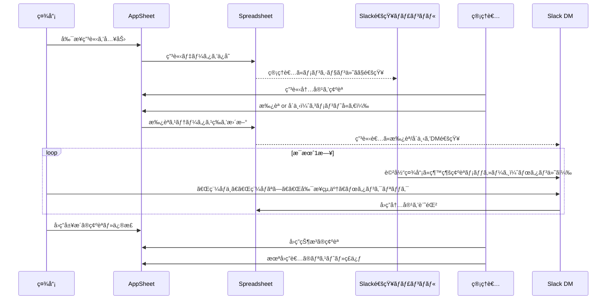
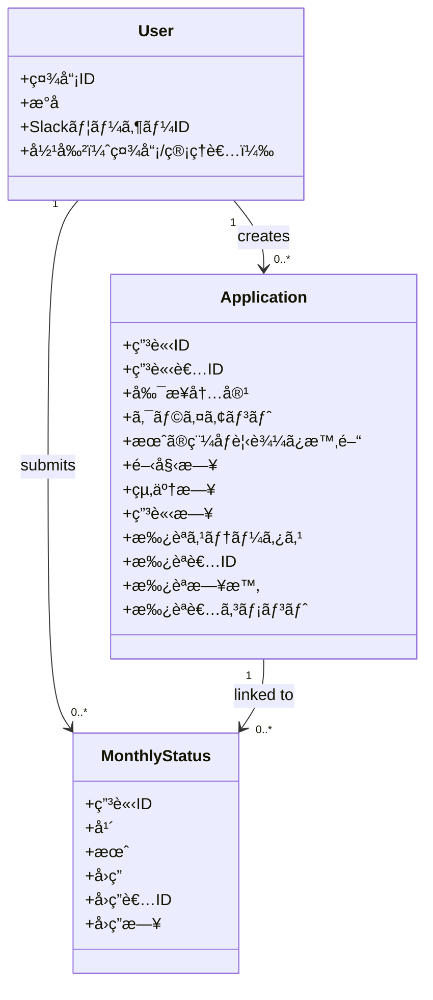

# ãªãœä½œæˆã—ãŸã®ã‹
- ã‚‚ã†ã¡ã‚‡ã£ã¨ç®¡ç†è² è·ã‚’申請者ã«ã‚ªãƒ•ãƒ­ãƒ¼ãƒ‰ã™ã‚‹ã‚¢ãƒ—リを作りãŸã„

# 質å•ï¼‘（to ChatGPT）

> Spreadsheet,Appsheet,Slackã§ç¤¾å“¡ã®å‰¯æ¥­ç”³è«‹ã€å‰¯æ¥­ã®ç¶™ç¶šçŠ¶æ³ç›£è¦–ã‚’ã—ãŸã„ã§ã™ã€‚
> ステークホルダーã¯ä»¥ä¸‹ã®é€šã‚Šã§ã™ã€‚
> - 社員
> - 管ç†è€…
> 
> １ï¼ç”³è«‹
> 
> 社員ã¯å‰¯æ¥­ã‚’è¡Œã†å ´åˆã«Appsheetã‹ã‚‰å‰¯æ¥­ç”³è«‹ã‚’è¡Œã„ã¾ã™ã€‚
> 申請内容ã¯æœ¬äººã¨ç®¡ç†è€…ã«ã—ã‹è¦‹ãˆã¦ã¯ã„ã‘ã¾ã›ã‚“。
> 申請ã™ã‚‹å†…容ã¯ä»¥ä¸‹ã§ã™ã€‚
> - 副業内容
> - クライアント
> - 月ã®ç¨¼åƒè¦‹è¾¼ã¿æ™‚é–“
> - 開始日
> - 終了日
> - 申請者
> - 申請日
>
> 申請データã¯Spreadsheetã§ç®¡ç†ã—ã¾ã™ã€‚
> 
> 申請ãŒç™ºè¡Œã•ã‚ŒãŸã‚‰ã€Slackã®ç”³è«‹é€šçŸ¥ç”¨ãƒãƒ£ãƒ³ãƒãƒ«ã«ç®¡ç†è€…ã‚ã¦ã®ãƒ¡ãƒ³ã‚·ãƒ§ãƒ³ã‚’ã¤ã‘ã¦Postã—ã¾ã™ã€‚
> 管ç†è€…ã¯ç”³è«‹å†…容をAppsheetã§ç¢ºèªã—ã€å•é¡Œãªã‘ã‚Œã°æ‰¿èªã—ã¾ã™ã€‚å•é¡ŒãŒã‚ã‚Œã°å•é¡Œç‚¹ã‚’入力ã—ã€å´ä¸‹ã—ã¾ã™ã€‚
> 承èªæ™‚ã«ã€ä»¥ä¸‹ã®æ‰¿èªè¨˜éŒ²ã‚’残ã—ã¾ã™ã€‚
> - 承èªã‚¹ãƒ†ãƒ¼ã‚¿ã‚¹
> - 承èªè€…
> - 承èªæ—¥æ™‚
> - 承èªè€…コメント
> 承èªãƒ»å´ä¸‹ãŒè¡Œã‚ã‚ŒãŸã‚‰ã€Slackbotã‹ã‚‰ç”³è«‹ã‚’è¡Œã£ãŸç¤¾å“¡ã«DMã§é€šçŸ¥ã—ã¾ã™ã€‚
>
> ï¼’ï¼ç¶™ç¶šç›£è¦–
> 申請ã•ã‚ŒãŸå‰¯æ¥­ã®é–‹å§‹æ—¥ã€çµ‚了日ã«åŸºã¥ãã€æ¯æœˆï¼‘æ—¥ã«ç”³è«‹ã‚’è¡Œã£ãŸç¤¾å“¡ã¸DMã§ç¢ºèªã®ãƒ¡ãƒƒã‚»ãƒ¼ã‚¸ã‚’DMã—ã¾ã™ã€‚
> DMã«ã¯ã€Œç¨¼åƒä¸­ã€ã€Œç¨¼åƒãªã—ã€ã€Œå‰¯æ¥­çµ‚了ã€ã®ãƒœã‚¿ãƒ³ã‚’設置ã—ã€è©²å½“ã®ç¤¾å“¡ã¯ã„ãšã‚Œã‹ã‚’クリックã—ã¾ã™ã€‚
> クリックã•ã‚ŒãŸã‚‰ã€å›ç­”内容をもã¨ã«Spreadsheetã«ä»¥ä¸‹ã®æƒ…報を追加ã—ã¾ã™ã€‚
> - å¹´
> - 月
> - å›ç­”
> - å›ç­”者
> - å›ç­”æ—¥
> 社員ã¯å›ç­”ã—ãŸå†…容をAppsheetã‹ã‚‰ã€å‰¯æ¥­ç”³è«‹ãƒ‡ãƒ¼ã‚¿ã«ç´ã¥ãå½¢ã§ç¢ºèªã€ä¿®æ­£ã§ãるよã†ã«ã—ã¾ã™ã€‚
>
> 管ç†è€…ã¯å„社員ã‹ã‚‰ã®å›ç­”状æ³ã‚’Appsheetã‹ã‚‰ç¢ºèªã—ã¾ã™ã€‚
> 管ç†è€…ãŒAppsheetã‹ã‚‰æœªå›ç­”者を確èªã—ã€ç£ä¿ƒãŒã§ãるよã†ã«ãƒ€ãƒƒã‚·ãƒ¥ãƒœãƒ¼ãƒ‰ã€ã¾ãŸã¯æœˆåˆ¥æœªå›ç­”リストを作æˆã—ã¾ã™ã€‚
> 
> 当該機能を実装ã—ã¾ã™ã€‚
> ã¾ãšå‡¦ç†ã‚’Markdown書å¼ã®ã‚·ãƒ¼ã‚±ãƒ³ã‚¹å›³ã¨ã—ã¦æ•´ç†ã—ã¦ä¸‹ã•ã„。
> åŒæ§˜ã«ã‚¯ãƒ©ã‚¹å›³ã‚’作æˆã—ã¦ãã ã•ã„。
> 最後ã«ã‚¯ãƒ©ã‚¹å›³ã‚’ã‚‚ã¨ã«Spreadsheetã®åˆ—設計を行ã£ã¦ãã ã•ã„。


# å›ç­”１
以下ã«ã”è¦æœ›ã®æ¥­å‹™ãƒ—ロセスã«åŸºã¥ã„ã¦ã€å‡¦ç†ã®æµã‚Œã‚’æ•´ç†ã—ãŸ**Markdownå½¢å¼ã®ã‚·ãƒ¼ã‚±ãƒ³ã‚¹å›³**ã€**クラス図**ã€ãŠã‚ˆã³**Spreadsheetã®åˆ—設計**ã‚’æ示ã—ã¾ã™ã€‚

---

## 🔠シーケンス図



---

## 🧱 クラス図



---

## 📊 Spreadsheet列設計

### 1. ユーザー管ç†ã‚·ãƒ¼ãƒˆï¼ˆUsers）

| 社員ID | æ°å | SlackユーザーID | 役割（社員/管ç†è€…） |
|--------|------|------------------|---------------------|
| U001   | å±±ç”°å¤ªéƒ | @yamada          | 社員                |
| U002   | ä½è—¤èŠ±å­ | @sato            | 管ç†è€…              |

---

### 2. 副業申請シート（Applications）

| 申請ID | 申請者ID | 副業内容 | クライアント | 月ã®ç¨¼åƒè¦‹è¾¼ã¿æ™‚é–“ | 開始日 | 終了日 | 申請日 | 承èªã‚¹ãƒ†ãƒ¼ã‚¿ã‚¹ | 承èªè€…ID | 承èªæ—¥æ™‚ | 承èªè€…コメント |
|--------|-----------|----------|--------------|---------------------|--------|--------|--------|----------------|------------|------------|------------------|
| A001   | U001      | Web制作 | æ ªå¼ä¼šç¤¾ABC | 20時間              | 2025/04/01 | 2025/09/30 | 2025/03/15 | æ‰¿èª | U002 | 2025/03/16 | å•é¡Œãªã—        |

---

### 3. 月次報告シート（MonthlyStatus）

| レコードID | 申請ID | å¹´ | 月 | å›ç­” | å›ç­”者ID | å›ç­”æ—¥ |
|------------|--------|----|----|------|------------|---------|
| R001       | A001   | 2025 | 04 | 稼åƒä¸­ | U001 | 2025/04/01 |

---

# 質å•ï¼’（to ChatGPT）

> ã“ã“ã¾ã§ã®è¨­è¨ˆæƒ…報をもã¨ã«ã€Slack通知ã®æ©Ÿèƒ½ã‚’実装ã—ã¦ãã ã•ã„。

# å›ç­”ï¼’

Slack通知ã®æ©Ÿèƒ½ã¨ã—ã¦ã€æ¬¡ã®2ã¤ã‚’Google Apps Script（GAS）ã§å®Ÿè£…ã—ã¾ã™ã€‚

---

## ✅ 機能一覧

### â‘  管ç†è€…ã¸ã®å‰¯æ¥­ç”³è«‹é€šçŸ¥ï¼ˆSlackãƒãƒ£ãƒ³ãƒãƒ«ã«ãƒ¡ãƒ³ã‚·ãƒ§ãƒ³ä»˜ã）
- AppSheet経由ã§Spreadsheetã«æ–°è¦ç”³è«‹ãŒè¿½åŠ ã•ã‚ŒãŸã¨ãã«ã€Slackãƒãƒ£ãƒ³ãƒãƒ«ã¸ãƒ¡ãƒ³ã‚·ãƒ§ãƒ³ä»˜ãã§é€šçŸ¥ã€‚

### â‘¡ 社員ã¸ã®æ‰¿èªï¼å´ä¸‹é€šçŸ¥ï¼ˆSlack DM）
- 管ç†è€…ãŒAppSheetã§æ‰¿èªã‚¹ãƒ†ãƒ¼ã‚¿ã‚¹ã‚’æ›´æ–°ã—ãŸã‚‰ã€è©²å½“社員ã«DM通知。

---

## 📦 事å‰æº–備（Slack Bot設定）

1. [Slack API: Apps](https://api.slack.com/apps) ã«ã‚¢ã‚¯ã‚»ã‚¹ã—ã¦æ–°ã—ã„アプリを作æˆã€‚
2. OAuth & Permissions ã«ã¦ä»¥ä¸‹ã®ã‚¹ã‚³ãƒ¼ãƒ—を設定:
   - `chat:write`
   - `users:read`
   - `im:write`
3. Bot Token ã‚’å–å¾—ã—ã¦ã€GASã®ã‚¹ã‚¯ãƒªãƒ—トプロパティ㫠`SLACK_BOT_TOKEN` ã¨ã—ã¦ä¿å­˜ã€‚
4. 通知先ãƒãƒ£ãƒ³ãƒãƒ«ID（例: `副業申請通知用`）を調ã¹ã¦ã€ã‚¹ã‚¯ãƒªãƒ—トプロパティ㫠`SLACK_NOTIFY_CHANNEL_ID` ã‚’ä¿å­˜ã€‚

---

## 🧩 GASコード：Slack通知スクリプト

```javascript
// Slack設定
const SLACK_TOKEN = PropertiesService.getScriptProperties().getProperty("SLACK_BOT_TOKEN");
const SLACK_NOTIFY_CHANNEL_ID = PropertiesService.getScriptProperties().getProperty("SLACK_NOTIFY_CHANNEL_ID");

// 社員情報をå–得（Slack IDå–得用）
function getUserMap() {
  const sheet = SpreadsheetApp.getActiveSpreadsheet().getSheetByName("Users");
  const rows = sheet.getDataRange().getValues();
  const map = {};
  for (let i = 1; i < rows.length; i++) {
    const [userId, name, slackId, role] = rows[i];
    map[userId] = { name, slackId, role };
  }
  return map;
}

// â‘  管ç†è€…ã¸å‰¯æ¥­ç”³è«‹é€šçŸ¥
function notifyNewApplication() {
  const sheet = SpreadsheetApp.getActiveSpreadsheet().getSheetByName("Applications");
  const lastRow = sheet.getLastRow();
  const row = sheet.getRange(lastRow, 1, 1, sheet.getLastColumn()).getValues()[0];

  const [申請ID, 申請者ID, 副業内容, クライアント, 月時間, 開始日, 終了日, 申請日] = row;

  const users = getUserMap();
  const 管ç†è€… = Object.values(users).find(user => user.role === "管ç†è€…");
  if (!管ç†è€…) return;

  const message = `
📮 *æ–°ã—ã„副業申請ãŒå±Šãã¾ã—ãŸ*
申請者: ${users[申請者ID]?.name}
副業内容: ${副業内容}
クライアント: ${クライアント}
月ã®ç¨¼åƒè¦‹è¾¼ã¿æ™‚é–“: ${月時間}
期間: ${開始日} ï½ ${終了日}
申請日: ${申請日}
<@${管ç†è€….slackId}> ã”確èªãã ã•ã„。
`;

  postSlackMessage(SLACK_NOTIFY_CHANNEL_ID, message);
}

// â‘¡ æ‰¿èª or å´ä¸‹é€šçŸ¥ã‚’申請者ã«DM
function notifyApprovalStatus() {
  const sheet = SpreadsheetApp.getActiveSpreadsheet().getSheetByName("Applications");
  const lastRow = sheet.getLastRow();
  const row = sheet.getRange(lastRow, 1, 1, sheet.getLastColumn()).getValues()[0];

  const [申請ID, 申請者ID, , , , , , , 承èªã‚¹ãƒ†ãƒ¼ã‚¿ã‚¹, 承èªè€…ID, 承èªæ—¥æ™‚, 承èªè€…コメント] = row;

  const users = getUserMap();
  const 申請者SlackId = users[申請者ID]?.slackId;
  const 承èªè€…å = users[承èªè€…ID]?.name;

  if (!申請者SlackId || !承èªã‚¹ãƒ†ãƒ¼ã‚¿ã‚¹) return;

  const message = `
📢 *副業申請ã®çµæœé€šçŸ¥*
ã‚ãªãŸã®ç”³è«‹ï¼ˆID: ${申請ID}）㯠*${承èªã‚¹ãƒ†ãƒ¼ã‚¿ã‚¹}* ã•ã‚Œã¾ã—ãŸã€‚

承èªè€…: ${承èªè€…å}
日時: ${承èªæ—¥æ™‚}
コメント: ${承èªè€…コメント || "（ãªã—）"}
`;

  postSlackMessageToUser(申請者SlackId, message);
}

// Slackメッセージé€ä¿¡ï¼ˆãƒãƒ£ãƒ³ãƒãƒ«å‘ã‘）
function postSlackMessage(channelId, message) {
  const url = "https://slack.com/api/chat.postMessage";
  const payload = {
    channel: channelId,
    text: message,
    mrkdwn: true,
  };

  const options = {
    method: "post",
    contentType: "application/json",
    headers: {
      Authorization: `Bearer ${SLACK_TOKEN}`,
    },
    payload: JSON.stringify(payload),
  };

  UrlFetchApp.fetch(url, options);
}

// Slack DMé€ä¿¡
function postSlackMessageToUser(slackUserId, message) {
  // DMãƒãƒ£ãƒ³ãƒãƒ«ã‚’é–‹ã
  const imOpenUrl = "https://slack.com/api/conversations.open";
  const imOptions = {
    method: "post",
    contentType: "application/json",
    headers: {
      Authorization: `Bearer ${SLACK_TOKEN}`,
    },
    payload: JSON.stringify({ users: slackUserId }),
  };
  const response = JSON.parse(UrlFetchApp.fetch(imOpenUrl, imOptions).getContentText());
  const channelId = response.channel.id;

  postSlackMessage(channelId, message);
}
```

---

## Ⱐトリガー設定（AppSheet連æºï¼‰

- `notifyNewApplication`：
  - AppSheetã§ã€Œæ–°ã—ã„è¡ŒãŒè¿½åŠ ã•ã‚ŒãŸã¨ãã€ã«å®Ÿè¡Œã•ã‚Œã‚‹ã‚ˆã†ã«è¨­å®šï¼ˆGASトリガー or AppSheetã‹ã‚‰Webhook連æºï¼‰
- `notifyApprovalStatus`：
  - AppSheetã§ã€Œæ—¢å­˜ã®è¡ŒãŒæ›´æ–°ã•ã‚ŒãŸã¨ãã€ï¼ˆæ‰¿èªã‚¹ãƒ†ãƒ¼ã‚¿ã‚¹ãŒå¤‰ã‚ã£ãŸã¨ã）ã«å®Ÿè¡Œ

---

## ✅ 次ã®ã‚¹ãƒ†ãƒƒãƒ—

- 承èªã‚¹ãƒ†ãƒ¼ã‚¿ã‚¹ã®å¤‰æ›´ã‚’検知ã™ã‚‹ãƒˆãƒªã‚¬ãƒ¼ã‚’AppSheetã¾ãŸã¯GASã§ã©ã†å®Ÿè£…ã™ã‚‹ã‹ã€‚
- 継続確èªDMã®ãƒœã‚¿ãƒ³ä»˜ã通知（Slack Block Kit）ã¸ã®æ‹¡å¼µã€‚

ã“ã®éƒ¨åˆ†ã‚‚å«ã‚ã¦ã€ç¶™ç¶šç¢ºèªã®é€šçŸ¥å‡¦ç†ã‚‚実装ã—ã¦ã„ãã¾ã—ょã†ã‹ï¼Ÿ


# 質å•ï¼“（to ChatGPT）

> 継続確èªã®é€šçŸ¥å‡¦ç†ã‚’実装ã—ã¦ãã ã•ã„。

# å›ç­”３

了解ã§ã™ï¼ä»¥ä¸‹ã«ã€**継続確èªã®Slack通知処ç†ï¼ˆç¤¾å“¡ã¸ã®DM + ボタン付ãå›ç­” + å›ç­”çµæœã®è¨˜éŒ²ï¼‰**を実装ã—ã¾ã™ã€‚

---

## ✅ 処ç†æ¦‚è¦ï¼ˆæ¯æœˆ1日）

1. Spreadsheet「Applicationsã€ã‹ã‚‰ã€çµ‚了日ãŒéãã¦ã„ãªã„申請を抽出。
2. å„該当社員ã«ã€Slack DMã§ãƒœã‚¿ãƒ³ä»˜ã「継続確èªãƒ¡ãƒƒã‚»ãƒ¼ã‚¸ã€ã‚’é€ä¿¡ã€‚
3. 社員ãŒãƒœã‚¿ãƒ³ã‚’押ã—ãŸã‚‰ã€GASã®Webhook（`doPost`) ãŒå—信。
4. 押ã•ã‚ŒãŸå†…容をもã¨ã«ã€ã€ŒMonthlyStatusã€ã‚·ãƒ¼ãƒˆã¸å›ç­”を記録。

---

## 📠Spreadsheet構æˆï¼ˆå†æ²ï¼‰

- `Applications`：副業申請一覧
- `MonthlyStatus`：月次ã®ç¶™ç¶šç¢ºèª
- `Users`：社員情報（SlackユーザーIDã‚り）

---

## 🧩 GASスクリプト（継続確èªé€šçŸ¥ï¼†å›ç­”記録）

### â‘  æ¯æœˆ1æ—¥ã®é€šçŸ¥ãƒˆãƒªã‚¬ãƒ¼å‡¦ç†

```javascript
function sendMonthlyStatusCheck() {
  const today = new Date();
  const year = today.getFullYear();
  const month = today.getMonth() + 1;

  const appsSheet = SpreadsheetApp.getActiveSpreadsheet().getSheetByName("Applications");
  const userMap = getUserMap();
  const rows = appsSheet.getDataRange().getValues();
  const headers = rows[0];
  const applications = rows.slice(1);

  applications.forEach(app => {
    const [申請ID, 申請者ID, , , , 開始日, 終了日] = app;
    const start = new Date(開始日);
    const end = new Date(終了日);

    // 対象ã®æœˆå†…ã«æ´»å‹•æœŸé–“ãŒå«ã¾ã‚Œã‚‹ç”³è«‹ã®ã¿é€šçŸ¥
    if (today >= start && today <= end) {
      const slackId = userMap[申請者ID]?.slackId;
      if (slackId) {
        sendStatusCheckMessage(slackId, 申請ID, year, month);
      }
    }
  });
}
```

---

### â‘¡ Slackã«ãƒœã‚¿ãƒ³ä»˜ãメッセージé€ä¿¡

```javascript
function sendStatusCheckMessage(slackUserId, applicationId, year, month) {
  const url = "https://slack.com/api/conversations.open";
  const imResponse = UrlFetchApp.fetch(url, {
    method: "post",
    contentType: "application/json",
    headers: {
      Authorization: `Bearer ${SLACK_TOKEN}`,
    },
    payload: JSON.stringify({ users: slackUserId }),
  });

  const imData = JSON.parse(imResponse.getContentText());
  const channelId = imData.channel.id;

  const message = {
    channel: channelId,
    text: `副業継続状æ³ã®ç¢ºèª`,
    blocks: [
      {
        type: "section",
        text: {
          type: "mrkdwn",
          text: `📆 *${year}å¹´${month}月* ã®å‰¯æ¥­çŠ¶æ³ã‚’ãŠçŸ¥ã‚‰ã›ãã ã•ã„。\n申請ID: *${applicationId}*`,
        },
      },
      {
        type: "actions",
        elements: ["稼åƒä¸­", "稼åƒãªã—", "副業終了"].map(status => ({
          type: "button",
          text: {
            type: "plain_text",
            text: status,
          },
          value: JSON.stringify({ applicationId, year, month, status }),
          action_id: "monthly_status_update",
        })),
      },
    ],
  };

  UrlFetchApp.fetch("https://slack.com/api/chat.postMessage", {
    method: "post",
    contentType: "application/json",
    headers: {
      Authorization: `Bearer ${SLACK_TOKEN}`,
    },
    payload: JSON.stringify(message),
  });
}
```

---

### â‘¢ ボタンクリックをå—ã‘å–ã‚‹Webhook（`doPost`）

```javascript
function doPost(e) {
  const payload = JSON.parse(e.postData.contents);
  if (payload.type === "block_actions") {
    const action = payload.actions[0];
    const userId = payload.user.id;
    const value = JSON.parse(action.value); // { applicationId, year, month, status }

    const sheet = SpreadsheetApp.getActiveSpreadsheet().getSheetByName("MonthlyStatus");
    const now = new Date();

    sheet.appendRow([
      new Date().getTime(), // レコードID代替
      value.applicationId,
      value.year,
      value.month,
      value.status,
      getUserIdBySlackId(userId),
      Utilities.formatDate(now, "Asia/Tokyo", "yyyy/MM/dd HH:mm:ss"),
    ]);

    // 確èªãƒ¡ãƒƒã‚»ãƒ¼ã‚¸ã‚’返信
    return ContentService.createTextOutput(
      JSON.stringify({ text: "å›ç­”を記録ã—ã¾ã—ãŸã€‚ã‚ã‚ŠãŒã¨ã†ã”ã–ã„ã¾ã—ãŸï¼" })
    ).setMimeType(ContentService.MimeType.JSON);
  }

  return ContentService.createTextOutput("OK");
}
```

---

### â‘£ Slack ID → 社員IDã®å¤‰æ›

```javascript
function getUserIdBySlackId(slackId) {
  const users = getUserMap();
  for (const [userId, user] of Object.entries(users)) {
    if (user.slackId === slackId) return userId;
  }
  return null;
}
```

---

## ✅ デプロイ手順（Webhook設定）

1. GASã®`doPost`関数ãŒã‚るスクリプトを**Webアプリã¨ã—ã¦ãƒ‡ãƒ—ロイ**。
   - 実行ã™ã‚‹ãƒ¦ãƒ¼ã‚¶ãƒ¼ï¼šè‡ªåˆ†
   - 誰ã§ã‚‚アクセスå¯èƒ½ï¼ˆåŒ¿åユーザーを許å¯ï¼‰
2. Slack App設定画é¢ã§ã€ŒInteractivity & Shortcutsã€ã‚’有効ã«ã—ã€
   - Request URLã«Webアプリã®URLを登録。
3. `sendMonthlyStatusCheck()` ã‚’æ¯æœˆ1æ—¥ã«ãƒˆãƒªã‚¬ãƒ¼å®Ÿè¡Œã™ã‚‹ã‚ˆã†ã«è¨­å®šã€‚

---

## â­ï¸ 次ã®ã‚¹ãƒ†ãƒƒãƒ—（オプション）

- AppSheet å´ã§ç¤¾å“¡ãŒéå»ã®å›ç­”を確èªãƒ»ä¿®æ­£ã™ã‚‹UIを用æ„
- 管ç†è€…用ã®ãƒ€ãƒƒã‚·ãƒ¥ãƒœãƒ¼ãƒ‰ï¼ˆæœªå›ç­”者ã®æœˆæ¬¡ä¸€è¦§ï¼‰ä½œæˆ

ãれらã®æ§‹ç¯‰ã‚‚å¿…è¦ã§ã‚ã‚Œã°ã‚µãƒãƒ¼ãƒˆã§ãã¾ã™ã€‚ã©ã¡ã‚‰ã‹ã‚‰é€²ã‚ã¾ã™ã‹ï¼Ÿ

# 質å•ï¼”（to ChatGPT）
> AppSheet å´ã§ç¤¾å“¡ãŒéå»ã®å›ç­”を確èªãƒ»ä¿®æ­£ã™ã‚‹UIを作æˆã—ã¦ãã ã•ã„

# å›ç­”ï¼”

AppSheet å´ã§ç¤¾å“¡ãŒã€Œè‡ªåˆ†ã®å‰¯æ¥­ç”³è«‹ã€ã«ç´ã¥ã「月次継続å›ç­”履歴ã€ã‚’確èªãƒ»ä¿®æ­£ã§ãã‚‹UI（ビュー）を構築ã™ã‚‹ã«ã¯ã€**以下ã®ã‚¹ãƒ†ãƒƒãƒ—ã§AppSheetアプリを設計**ã—ã¾ã™ã€‚

---

## ✅ 目指ã™UIã®ã‚¤ãƒ¡ãƒ¼ã‚¸

- ログインユーザー（社員）ã¯ã€è‡ªåˆ†ã®ç”³è«‹ã ã‘ãŒè¦‹ãˆã‚‹ã€‚
- å„申請ã®è©³ç´°ãƒšãƒ¼ã‚¸ã§ã€å¯¾å¿œã™ã‚‹æœˆæ¬¡ã‚¹ãƒ†ãƒ¼ã‚¿ã‚¹ï¼ˆ`MonthlyStatus`）ã®ä¸€è¦§ã‚’確èªã§ãる。
- ステータスを編集å¯èƒ½ï¼ˆä¾‹ï¼šã€Œç¨¼åƒä¸­ → 稼åƒãªã—ã€ã«ä¿®æ­£ï¼‰ã€‚
- æ–°è¦ã«æœˆæ¬¡ã‚¹ãƒ†ãƒ¼ã‚¿ã‚¹ã‚’追加ã™ã‚‹ã“ã¨ã‚‚å¯èƒ½ã€‚

---

## 🗠AppSheet設計手順

### â‘  データソースã®ç”¨æ„（Google Spreadsheet）
使用シート：
- `Users`
- `Applications`
- `MonthlyStatus`

### â‘¡ å„テーブル設定

#### `Users` テーブル
| 項目 | 設定内容 |
|------|----------|
| Security Filter | `[SlackユーザーID] = USEREMAIL()` ãªã©SlackIDã‹ãƒ¡ãƒ¼ãƒ«ã‚¢ãƒ‰ãƒ¬ã‚¹ãƒ™ãƒ¼ã‚¹ã§åˆ¶é™ |
| Key Column | `社員ID` |

#### `Applications` テーブル
| 項目 | 設定内容 |
|------|----------|
| Security Filter | `[申請者ID] = LOOKUP(USEREMAIL(), "Users", "SlackユーザーID", "社員ID")` |
| Key Column | `申請ID` |

#### `MonthlyStatus` テーブル
| 項目 | 設定内容 |
|------|----------|
| Security Filter | `[å›ç­”者ID] = LOOKUP(USEREMAIL(), "Users", "SlackユーザーID", "社員ID")` |
| Key Column | `レコードID` |
| Ref | `申請ID` ã‚’ `Applications` ã«å¯¾ã—ã¦å‚ç…§å‹ã«è¨­å®š |

---

### â‘¢ UXビュー構æˆï¼ˆAppSheet）

#### A. メインビュー：`My Applications`
- **View Type**：Table / Deck
- **Data**：`Applications`
- **Display name**：`自分ã®å‰¯æ¥­ç”³è«‹`
- **Row filter**：自身ã®ç”³è«‹ã®ã¿ï¼ˆä¸Šè¨˜Security Filterã§å¯¾å¿œï¼‰
- **On Row Click**：**Detail View**ã¸é·ç§»

#### B. Application Detailビュー
- **Data**：`Applications`
- **View Type**：Detail
- **表示項目**：
  - 副業内容・クライアント・稼åƒæ™‚é–“ãªã©
  - **Related MonthlyStatus**（仮想列：`Related MonthlyStatus`）

#### C. Embedded Table：`MonthlyStatus`（Detail内）
- 自動生æˆã•ã‚Œã‚‹ä»®æƒ³åˆ— `Related MonthlyStatus` を表示
- å„月ã®å›ç­”（「稼åƒä¸­ã€ã€Œç¨¼åƒãªã—ã€ãªã©ï¼‰ã‚’一覧表示
- 編集・削除å¯
- 「＋ã€ãƒœã‚¿ãƒ³ã§æ–°è¦æœˆæ¬¡ã‚¹ãƒ†ãƒ¼ã‚¿ã‚¹ã‚’追加å¯èƒ½ï¼ˆ`ApplicationID` 自動連æºï¼‰

---

### â‘£ フォームビュー：新è¦æœˆæ¬¡ã‚¹ãƒ†ãƒ¼ã‚¿ã‚¹ä½œæˆç”¨

- フォームã§å…¥åŠ›ã™ã‚‹é …目：
  - 年（`Enum`）
  - 月（`Enum`）
  - å›ç­”（`Enum`: 稼åƒä¸­ / 稼åƒãªã— / 副業終了）
- å›ç­”日：åˆæœŸå€¤ã« `NOW()` を設定（é表示ã§ã‚‚OK）
- å›ç­”者ID：åˆæœŸå€¤ã« `LOOKUP(USEREMAIL(), "Users", "SlackユーザーID", "社員ID")`

---

### ⑤ 権é™ãƒ»ã‚»ã‚­ãƒ¥ãƒªãƒ†ã‚£å¼·åŒ–（é‡è¦ï¼‰

- ユーザーã«è‡ªåˆ†ã®ãƒ‡ãƒ¼ã‚¿ã—ã‹è¦‹ã›ãªã„よã†ã€**Security Filter**ã‚’ã™ã¹ã¦ã®ãƒ†ãƒ¼ãƒ–ルã«è¨­å®šã€‚
- 編集対象を制é™ã—ãŸã„å ´åˆã¯ã€`Editable_If` ルールã§ã€Œè‡ªèº«ã®ãƒ‡ãƒ¼ã‚¿ã‹ã©ã†ã‹ã€ã‚’æ¡ä»¶ã«ã™ã‚‹ã€‚

---

## 📱 ç”»é¢ã‚¤ãƒ¡ãƒ¼ã‚¸ï¼ˆæ§‹æˆä¾‹ï¼‰

```
My Applications
├─ [Web制作 - æ ªå¼ä¼šç¤¾ABC]
│   ├─ 副業内容: Web制作
│   ├─ クライアント: æ ªå¼ä¼šç¤¾ABC
│   ├─ 稼åƒè¦‹è¾¼ã¿: 20時間
│   ├─ Related MonthlyStatus
│   │   ├─ 2025å¹´4月: 稼åƒä¸­ï¼ˆç·¨é›†å¯ï¼‰
│   │   ├─ 2025å¹´5月: 稼åƒãªã—（編集å¯ï¼‰
│   │   └─ [+æ–°è¦å›ç­”を追加]
```

---

## ✅ 完æˆå¾Œã®ãƒã‚§ãƒƒã‚¯ãƒªã‚¹ãƒˆ

- [x] アプリã«ãƒ­ã‚°ã‚¤ãƒ³ã—ãŸç¤¾å“¡ã¯ã€è‡ªåˆ†ã®ç”³è«‹ã ã‘見ãˆã‚‹ã€‚
- [x] å„申請ã«ç´ã¥ã„ãŸæœˆæ¬¡ã‚¹ãƒ†ãƒ¼ã‚¿ã‚¹ã‚’見られる・修正ã§ãる。
- [x] å¿…è¦ãªã‚‰æ–°ã—ã„月ã®ã‚¹ãƒ†ãƒ¼ã‚¿ã‚¹ã‚’追加ã§ãる。
- [x] 管ç†è€…ã«ã¯å…¨ç¤¾å“¡åˆ†ãŒè¦‹ãˆã‚‹ã‚ˆã†ã€åˆ¥ãƒ“ューを作æˆå¯èƒ½ã€‚

---

ã”希望ãŒã‚ã‚Œã°ã€Œç®¡ç†è€…å‘ã‘ã®æœªå›ç­”者ダッシュボードã€ã®æ§‹æˆã‚‚続ã‘ã¦æ案ã§ãã¾ã™ï¼ä½œã‚Šã¾ã—ょã†ã‹ï¼Ÿ

# 質å•ï¼•ï¼ˆto ChatGPT）

> 管ç†è€…å‘ã‘ã®æœªå›ç­”者ダッシュボードを作æˆã—ã¦ãã ã•ã„

# 解答５

了解ã§ã™ï¼ä»¥ä¸‹ã«ã€**AppSheetã§æ§‹ç¯‰ã™ã‚‹ã€Œç®¡ç†è€…å‘ã‘未å›ç­”者ダッシュボードã€**ã®è¨­è¨ˆã‚’ã¾ã¨ã‚ã¾ã™ã€‚

---

## 🯠目的

- 管ç†è€…ãŒæ¯æœˆã®å‰¯æ¥­ç¶™ç¶šç¢ºèªçŠ¶æ³ã‚’把æ¡ã—ã€**未å›ç­”者を特定ã—ã¦ç£ä¿ƒ**ã§ãる。
- 年・月を指定ã—ã¦ã€å„申請ã«å¯¾ã—ã¦è©²å½“月ã®**月次å›ç­”ãŒå­˜åœ¨ã—ãªã„社員ã®ä¸€è¦§**を表示ã™ã‚‹ã€‚
- 該当申請ã®æƒ…å ±ã¨ã¨ã‚‚ã«ã€Slack IDã‚„åå‰ã€ç”³è«‹IDも表示。

---

## 🧱 å¿…è¦ãªè¦ç´ 

### 使用テーブル
- `Applications`：副業申請データ
- `MonthlyStatus`：月次å›ç­”データ
- `Users`：社員データ

---

## 🗠設計手順（AppSheet）

---

### â‘  仮想列を用ã„ã¦æœªå›ç­”フラグを作æˆ

`Applications` テーブルã«ä»¥ä¸‹ã®ä»®æƒ³åˆ—を追加：

#### A. 仮想列：`HasMonthlyResponse`
```appsheet
COUNT(
  SELECT(
    MonthlyStatus[レコードID],
    AND(
      [申請ID] = [_THISROW].[申請ID],
      [年] = ANY(AppSettings[対象年]),
      [月] = ANY(AppSettings[対象月])
    )
  )
) > 0
```

> 💡 `AppSettings` ã¯ã€Œå¹´ã€ã¨ã€Œæœˆã€ã‚’一時的ã«ä¿æŒã™ã‚‹1è¡Œã®ãƒ†ãƒ¼ãƒ–ル（ユーザー入力をå—ã‘ã‚‹ãŸã‚ã«ä½¿ç”¨ï¼‰

---

### ② 仮想列：`IsUnanswered`

```appsheet
NOT([HasMonthlyResponse])
```

---

### â‘¢ Slice（ビューã®å…ƒã«ãªã‚‹æŠ½å‡ºæ¡ä»¶ï¼‰

#### Sliceå：`UnansweredApplications`
- **Table**：`Applications`
- **Row filter condition**：
```appsheet
AND(
  [IsUnanswered],
  ISNOTBLANK([開始日]),
  ISNOTBLANK([終了日]),
  TODAY() >= [開始日],
  TODAY() <= [終了日]
)
```

---

### â‘£ UX：管ç†è€…用ビュー（Dashboard）

#### A. ビューå：`未å›ç­”者リスト`
- **View Type**：Dashboard
- **Sub Views**：
  - `対象年月é¸æŠ`（フォーム）
  - `未å›ç­”者一覧`（Table）

#### B. 年月é¸æŠãƒ“ュー（AppSettingsテーブルã®ãƒ•ã‚©ãƒ¼ãƒ ï¼‰

- å˜ä¸€ãƒ¬ã‚³ãƒ¼ãƒ‰ã®ãƒ†ãƒ¼ãƒ–ル㫠`対象年`, `対象月` ã‚’æŒãŸã›ã¦ã€
  - Enumã§å¹´ï¼ˆ2025,2026…）
  - Enumã§æœˆï¼ˆ1〜12）

#### C. 未å›ç­”者一覧ビュー（Table）

- データ：`UnansweredApplications` スライス
- 表示項目：
  - 申請者å（ユーザーå‚ç…§ã§è¡¨ç¤ºï¼‰
  - 副業内容
  - SlackユーザーID
  - 申請ID
  - 申請日
- 並ã³é †ï¼šç”³è«‹è€…åã¾ãŸã¯ç”³è«‹æ—¥

---

## 🧑â€ğŸ’¼ 管ç†è€…アクション（例）

- 行をクリック → 申請ã®è©³ç´°ã‚’確èª
- Slack IDã‹ã‚‰å¤–部連æºã—ã¦æ‰‹å‹•ã§DMé€ä¿¡ or GAS経由ã§ç£ä¿ƒãƒœã‚¿ãƒ³ã‚‚追加å¯èƒ½ï¼ˆAppSheetボタン → GAS Webhook）

---

## 📱 UIイメージ

```
[未å›ç­”者リスト] 2025å¹´4月 🔽

┌────────────┬────────┬────────────┬──────â”
│ ç”³è«‹è€…å     │ SlackID │ 副業内容       │ 申請日 │
├────────────┼────────┼────────────┼──────┤
│ å±±ç”°å¤ªéƒ     │ @yamada │ Web制作        │ 3/10  │
│ ä½è—¤èŠ±å­     │ @sato   │ ãƒãƒ¼ã‚±ãƒ†ã‚£ãƒ³ã‚° │ 3/15  │
└────────────┴────────┴────────────┴──────┘
```

---

## ✅ 追加アイデア（任æ„）

- `ç£ä¿ƒãƒœã‚¿ãƒ³ï¼ˆAction）` を追加ã—ã€GAS Webhook 経由㧠Slack DM ã‚’é€ä¿¡ã€‚
- `AppSettings` ã®å¯¾è±¡å¹´æœˆã‚’ã€ãƒ­ã‚°ã‚¤ãƒ³ãƒ¦ãƒ¼ã‚¶ãƒ¼ã”ã¨ã«ä¿æŒã§ãるよㆠ`USEREMAIL()` ã«ã²ã‚‚ã¥ã‘。

---

## 次ã®ã‚¢ã‚¯ã‚·ãƒ§ãƒ³

1. AppSheet 㧠`AppSettings` テーブルを作æˆã—ã€å¹´ãƒ»æœˆã‚’入力å¯èƒ½ã«ã™ã‚‹ã€‚
2. `Applications` ã«ä»®æƒ³åˆ— `HasMonthlyResponse` を追加。
3. `UnansweredApplications` スライスを作æˆã€‚
4. Dashboard ビューを作æˆã—ã€ç®¡ç†è€…å‘ã‘ã®æœˆåˆ¥ç¢ºèªãƒ“ューを完æˆï¼

---

å¿…è¦ã§ã‚ã‚Œã°ã€**「Slackã§æœªå›ç­”者ã¸ä¸€æ‹¬ç£ä¿ƒã€** ã™ã‚‹GASコードも作æˆã§ãã¾ã™ã€‚ã”希望ã§ã™ã‹ï¼Ÿ

# 質å•ï¼–（to ChatGPT）

> Slackã§æœªå›ç­”者ã¸ä¸€æ‹¬ç£ä¿ƒã™ã‚‹GASコードを作æˆã—ã¦ãã ã•ã„

# å›ç­”ï¼–

以下ã«ã€**Slackã§æœªå›ç­”者ã¸ä¸€æ‹¬ç£ä¿ƒãƒ¡ãƒƒã‚»ãƒ¼ã‚¸ã‚’DMé€ä¿¡**ã™ã‚‹Google Apps Script（GAS）ã®ã‚³ãƒ¼ãƒ‰ã‚’æ示ã—ã¾ã™ã€‚

---

## 🯠目的

- AppSheetã§æŒ‡å®šã—ãŸã€Œå¯¾è±¡å¹´æœˆã€ã«å¯¾ã—ã¦ã€Spreadsheetã§æœªå›ç­”ã®ç¤¾å“¡ï¼ˆ`Applications` ã«è©²å½“ãŒã‚ã‚Šã€`MonthlyStatus` ã«è©²å½“ãŒãªã„）を抽出。
- ãã®ç¤¾å“¡ã« Slack DM ã§ã€Œç¶™ç¶šç¢ºèªã‚’ãŠé¡˜ã„ã—ã¾ã™ã€ãƒ¡ãƒƒã‚»ãƒ¼ã‚¸ã‚’一括ã§é€ä¿¡ã€‚

---

## 📠使用シート

- `Applications`：副業申請
- `MonthlyStatus`：月次å›ç­”
- `Users`：社員情報（Slack ID å«ã‚€ï¼‰
- `AppSettings`：対象年月をä¿æŒï¼ˆ1è¡Œã®ã¿ï¼‰

---

## 🧩 GASスクリプト：未å›ç­”者ã¸ã®DM一括通知

```javascript
const SLACK_TOKEN = PropertiesService.getScriptProperties().getProperty("SLACK_BOT_TOKEN");

function notifyUnansweredUsers() {
  const ss = SpreadsheetApp.getActiveSpreadsheet();
  const appSheet = ss.getSheetByName("Applications");
  const statusSheet = ss.getSheetByName("MonthlyStatus");
  const usersSheet = ss.getSheetByName("Users");
  const settingsSheet = ss.getSheetByName("AppSettings");

  // 年月å–å¾—
  const [_, targetYear, targetMonth] = settingsSheet.getRange(2, 1, 1, 3).getValues()[0];

  const applications = appSheet.getDataRange().getValues();
  const statuses = statusSheet.getDataRange().getValues();
  const users = usersSheet.getDataRange().getValues();

  const userMap = {};
  for (let i = 1; i < users.length; i++) {
    const [userId, name, slackId] = users[i];
    userMap[userId] = { name, slackId };
  }

  // 応答済㿠applicationId + userId ã®ã‚»ãƒƒãƒˆ
  const answeredSet = new Set();
  for (let i = 1; i < statuses.length; i++) {
    const [_, appId, year, month] = statuses[i];
    if (year == targetYear && month == targetMonth) {
      answeredSet.add(`${appId}`);
    }
  }

  const today = new Date();
  const unansweredList = [];

  for (let i = 1; i < applications.length; i++) {
    const row = applications[i];
    const [申請ID, 申請者ID, , , , 開始日, 終了日] = row;
    const start = new Date(開始日);
    const end = new Date(終了日);

    if (today >= start && today <= end && !answeredSet.has(申請ID)) {
      unansweredList.push({ 申請ID, 申請者ID });
    }
  }

  // メッセージé€ä¿¡
  unansweredList.forEach(({ 申請ID, 申請者ID }) => {
    const user = userMap[申請者ID];
    if (!user?.slackId) return;

    const message = `
🔔 *副業継続状æ³ã®ç¢ºèªï¼ˆ${targetYear}å¹´${targetMonth}月）*

申請ID: ${申請ID}
上記申請ã®ä»Šæœˆã®å‰¯æ¥­ç¶™ç¶šçŠ¶æ³ãŒæœªå›ç­”ã§ã™ã€‚
AppSheet ã¾ãŸã¯Slack通知よりã”å›ç­”ãã ã•ã„。
`;

    postSlackMessageToUser(user.slackId, message);
  });
}

// Slack DMé€ä¿¡å‡¦ç†
function postSlackMessageToUser(slackUserId, message) {
  // DMãƒãƒ£ãƒ³ãƒãƒ«ã‚’é–‹ã
  const imOpenUrl = "https://slack.com/api/conversations.open";
  const imOptions = {
    method: "post",
    contentType: "application/json",
    headers: {
      Authorization: `Bearer ${SLACK_TOKEN}`,
    },
    payload: JSON.stringify({ users: slackUserId }),
  };
  const response = JSON.parse(UrlFetchApp.fetch(imOpenUrl, imOptions).getContentText());
  const channelId = response.channel.id;

  // メッセージé€ä¿¡
  const payload = {
    channel: channelId,
    text: message,
    mrkdwn: true,
  };

  const options = {
    method: "post",
    contentType: "application/json",
    headers: {
      Authorization: `Bearer ${SLACK_TOKEN}`,
    },
    payload: JSON.stringify(payload),
  };

  UrlFetchApp.fetch("https://slack.com/api/chat.postMessage", options);
}
```

---

## ✅ 補足：`AppSettings` ã®æ§‹æˆä¾‹

| ã‚­ãƒ¼å       | 対象年 | 対象月 |
|--------------|--------|--------|
| CurrentMonth | 2025   | 4      |

※GASå´ã§2行目（`getRange(2, 1, 1, 3)`）を読んã§ã„ã¾ã™ã€‚å¿…è¦ã«å¿œã˜ã¦èª¿æ•´ã—ã¦ãã ã•ã„。

---

## 🕘 実行タイミング

- AppSheetã®ãƒ€ãƒƒã‚·ãƒ¥ãƒœãƒ¼ãƒ‰ä¸Šã§ã€Œç£ä¿ƒãƒœã‚¿ãƒ³ã€ã«ã“ã®GAS関数をWebhook経由ã§ç´ã¥ã‘。
- ã¾ãŸã¯ã€ç®¡ç†è€…ãŒGAS上ã§æ‰‹å‹•å®Ÿè¡Œã€‚

---

## 🔠事å‰æº–備（å†æ²ï¼‰

- Slack App ã®ã‚¹ã‚³ãƒ¼ãƒ—ã« `chat:write`, `im:write` ãŒå¿…è¦ã§ã™ã€‚
- Slack Bot Token 㯠`SLACK_BOT_TOKEN` ã¨ã„ã†ã‚¹ã‚¯ãƒªãƒ—トプロパティã«è¨­å®šã€‚

---

ã”希望ãŒã‚ã‚Œã°ã€ã€ŒAppSheet ã® Action ã‹ã‚‰ã“ã®é–¢æ•°ã‚’呼ã³å‡ºã™ã€é€£æºæ–¹æ³•ã‚‚ã”案内ã§ãã¾ã™ã€‚å¿…è¦ã§ã™ã‹ï¼Ÿ

# 質å•ï¼—（to ChatGPT）

> AppSheet ã® Action ã‹ã‚‰ã“ã®é–¢æ•°ã‚’呼ã³å‡ºã™é€£æºæ–¹æ³•ã‚’æ•™ãˆã¦ãã ã•ã„

# å›ç­”ï¼—

了解ã—ã¾ã—ãŸï¼  
以下ã«ã€**AppSheetã®Action（ボタン）ã‹ã‚‰GASã® `notifyUnansweredUsers()` 関数を呼ã³å‡ºã™æ‰‹é †**ã‚’ã¾ã¨ã‚ã¾ã™ã€‚ã“ã‚Œã«ã‚ˆã‚Šã€ç®¡ç†è€…ãŒAppSheetã®UIã‹ã‚‰ãƒœã‚¿ãƒ³1ã¤ã§Slackç£ä¿ƒã‚’実行ã§ãるよã†ã«ãªã‚Šã¾ã™ã€‚

---

## ✅ 構æˆã‚¤ãƒ¡ãƒ¼ã‚¸

- AppSheet上ã«ã€ŒSlackã§æœªå›ç­”者をç£ä¿ƒã™ã‚‹ã€ãƒœã‚¿ãƒ³ï¼ˆAction）を作æˆ
- ãã®ãƒœã‚¿ãƒ³ã¯GASã®Webアプリ（Webhook）ã«ãƒªã‚¯ã‚¨ã‚¹ãƒˆã‚’é€ã‚‹
- Webアプリ内㧠`notifyUnansweredUsers()` を呼ã³å‡ºã—ã¦ä¸€æ‹¬é€ä¿¡å‡¦ç†ã‚’実行

---

## 🧩 ステップãƒã‚¤ã‚¹ãƒ†ãƒƒãƒ—

---

### â‘  GASã‚’Webアプリã¨ã—ã¦å…¬é–‹

1. GASエディタã§ä»¥ä¸‹ã®ã‚³ãƒ¼ãƒ‰ã‚’追加：

```javascript
function doPost(e) {
  const token = ScriptProperties.getProperty("WEBHOOK_SECRET"); // セキュリティ用
  const payload = JSON.parse(e.postData.contents);

  if (payload.token !== token) {
    return ContentService.createTextOutput("Invalid token").setMimeType(ContentService.MimeType.TEXT);
  }

  // 通常ã®Slack通知処ç†ã‚’実行
  notifyUnansweredUsers();

  return ContentService.createTextOutput("ç£ä¿ƒé€šçŸ¥ã‚’é€ä¿¡ã—ã¾ã—ãŸ").setMimeType(ContentService.MimeType.TEXT);
}
```

2. スクリプトプロパティã«ä»¥ä¸‹ã‚’設定：
   - `WEBHOOK_SECRET`: ä»»æ„ã®é•·ã„文字列（例: `abc123456789secret`）

3. 「デプロイã€â†’「新ã—ã„デプロイã€â†’「ウェブアプリã€ã‚’é¸æŠï¼š
   - 実行ã™ã‚‹ãƒ¦ãƒ¼ã‚¶ãƒ¼ï¼šè‡ªåˆ†
   - アクセスã§ãるユーザー：**匿åユーザー（誰ã§ã‚‚）**
   - デプロイ後ã€**Webアプリã®URLをコピー**（例: `https://script.google.com/macros/s/XXXXX/exec`）

---

### â‘¡ AppSheetã§Webhookアクションを作æˆ

1. **AppSheetã®ç®¡ç†ç”»é¢ã¸**  
2. 左メニュー `Behavior` > `Actions` ã‚’é¸æŠ
3. `New Action` を作æˆï¼š

| 項目                | 内容                                                                 |
|---------------------|----------------------------------------------------------------------|
| For a record of     | `AppSettings`（ã¾ãŸã¯å›ºå®šå€¤ãƒ†ãƒ¼ãƒ–ル）                                     |
| Name                | `未å›ç­”者ã«Slackã§ç£ä¿ƒ`                                                   |
| Do this             | `Webhook`                                                           |
| URL                 | `https://script.google.com/macros/s/XXXXX/exec`（↑ã§ã‚³ãƒ”ーã—ãŸURL）        |
| HTTP Content Type   | `JSON`                                                               |
| HTTP Verb           | `POST`                                                               |
| Body                | `{"token": "abc123456789secret"}`（↑ã§è¨­å®šã—ãŸç§˜å¯†ãƒˆãƒ¼ã‚¯ãƒ³ã¨åŒã˜ï¼‰          |

---

### â‘¢ アクションをビューã«è¡¨ç¤º

1. `UX > Views` ã§ç®¡ç†è€…用ã®ãƒ“ュー（例: `未å›ç­”者ダッシュボード`）を開ã
2. `Display > Event Actions` ã§ã€Œã‚¢ã‚¯ã‚·ãƒ§ãƒ³ãƒœã‚¿ãƒ³ã‚’表示ã€ã«è¨­å®š
3. `Display prominently` ã«ãƒã‚§ãƒƒã‚¯ã‚’入れã¦ã€ä¸Šéƒ¨ã«è¡¨ç¤º

---

## 🧪 テスト手順

1. `AppSettings` テーブルã«å¯¾è±¡å¹´æœˆã‚’入力
2. 管ç†è€…ビューã§ã€Œæœªå›ç­”者ã«Slackã§ç£ä¿ƒã€ãƒœã‚¿ãƒ³ã‚’押ã™
3. Slackã§æœªå›ç­”社員ã«DMãŒå±Šãã“ã¨ã‚’確èª

---

## ✅ 補足セキュリティ（æ¨å¥¨ï¼‰

- GASã® `doPost` ã«ç§˜å¯†ãƒˆãƒ¼ã‚¯ãƒ³ã‚’付ã‘ã‚‹ã“ã¨ã§ã€**ä¸æ­£ãªå¤–部ã‹ã‚‰ã®ã‚¢ã‚¯ã‚»ã‚¹ã‚’防止**
- Bot Tokenã‚„Webhook Secretã¯**Script Properties**ã«ä¿å­˜ã—ã¦ã€ã‚³ãƒ¼ãƒ‰å†…ã«ç›´æ›¸ãã—ãªã„

---


# 所感
- GASã¯ã„ã¤ã‚‚作ã£ã¦ã‚‚らã£ã¦ãŸã‘ã©ã€Appsheet作ã£ã¦ãã‚Œã£ã¦è¨€ã£ãŸã‚‰ã“ã†ã„ã†ã‹ã‚“ã˜ã«ãªã‚‹ã®ã‹ã‚
