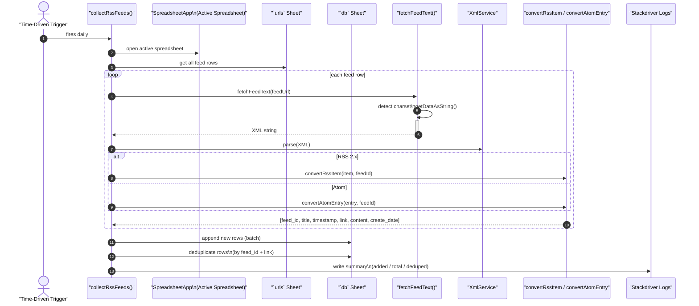
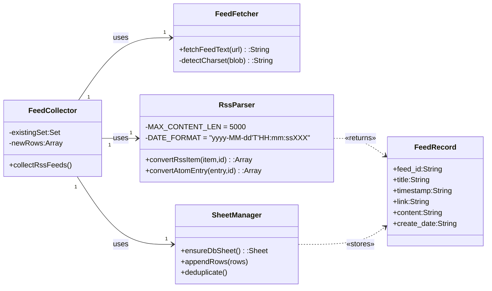
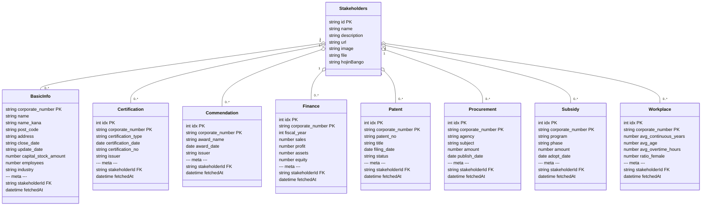

# なぜ作成したのか

- これまでまとめていたRSSFeed関連処理を実装して、現行の処理から移行する

# 実装記録

## 設計概要

---

### RSSFeed情報取得シーケンス図 



---

### RSSFeed情報取得クラス図




---

## 法人番号情報のシーケンス図 — 登録・バッチ更新フロー

```mermaid
sequenceDiagram
    autonumber
    participant Admin as 情シス担当者<br/>(AppSheet)
    participant SS as Google Spreadsheet
    participant GAS as Apps Script
    participant gBiz as gBizINFO API

    %% --- 手動登録フロー ---------------------------------
    Admin->>SS: Stakeholders シートに<br/>hojinBango 登録/更新
    SS-->>GAS: onEdit(e) トリガー
    alt hojinBango 空
        GAS-->>SS: 何もしない
    else
        GAS->>gBiz: 全 7 エンドポイント呼び出し<br/>(finance, patent …)
        gBiz-->>GAS: JSON 配列
        loop 各エンドポイント
            GAS->>SS: 子シートへ upsert<br/>(idx 付き複数行)
        end
        GAS->>gBiz: 法人基本情報 (最後)
        gBiz-->>GAS: JSON オブジェクト
        GAS->>SS: BasicInfo アップサート (1 行)
        GAS-->>Admin: 完了メール
    end

    %% --- 定期バッチフロー ---------------------------------
    note over GAS: cronFetchAll (03:00 毎日)
    GAS->>SS: Stakeholders & BasicInfo 取得
    loop for each stakeholder
        alt BasicInfo 未取得
            GAS->>gBiz: 全 7 + BasicInfo 取得
            gBiz-->>GAS: 各配列
            loop ep in ENDPOINTS
                GAS->>SS: 子シート upsert
            end
            GAS->>SS: BasicInfo upsert (最後)
        else BasicInfo 既取得
            GAS-->>GAS: skip
        end
        alt 残り実行時間 < 30s
            GAS-->>GAS: safety break (次回続行)
            break
        end
    end

```

---

## 法人番号情報クラス図 — スプレッドシート構造



## Appsheet

### 取得したRSSFeed情報


### 取得した法人情報の住所データをマッピングした画面


# 所感
- 一旦処理は回るようになったのでしばらく運用してみる
- できればDifyとAPI連携して毎日のサマリ情報をレポート通知したい
- ついでに情報の仕分けもめんどくさいから分類自動化→優先度高い情報をレポート抽出にするのが理想的かなあ