# なぜ作成したのか

- 自作の書籍管理アプリで間違ってJANコードの方を読み取ってしまい、うまく書籍情報をしゅとくできなかった
- JANコードという言葉は知っていたが、実はその内容はよく知らないことに気づき、これを機に整理しておこうと思った

# やりたいこと
- 書籍のISBN、JANコード、ついでに雑誌コードについて理解する
- アプリでの読み込み処理の精度を上げる

---

# 調査

## 1. 全体像：本・雑誌の「番号」は何種類あるのか？

ざっくり分けると、出版物まわりには次のような番号が登場する。

* **ISBN（International Standard Book Number）**

  * 単行本・コミック・一部のムックなど「本」に付く、世界共通の **図書の識別子**。
  * 実体として使うときは現在 13 桁（978 / 979 ではじまる）。
* **日本図書コード & 書籍 JAN コード（2 段バーコード）**

  * 日本固有の「流通上のコード」。
  * 裏表紙の **2 段バーコード** の正体。
  * 上段：ISBN を EAN-13 化したバーコード（978/979…）
  * 下段：**192 で始まるコード**で、C コード＋本体価格などを表現。
* **雑誌コード & 定期刊行物 JAN コード（旧：雑誌コード）**

  * **定期刊行物（雑誌・新聞など）のためのコード体系**。
  * 13 桁の「定期刊行物 JAN コード」＋ 5 桁のアドオンで価格を表現（合計 18 桁）。([JPO 一般社団法人日本出版インフラセンター][1])

関連図：

```mermaid
graph LR
  subgraph Book
    A[ISBN-13<br/>978/979-...] --> B[上段バーコード<br/>EAN-13 978/979...]
    C[日本図書コード+Cコード] --> D[下段バーコード<br/>EAN-13 192 + Cコード + 価格]
  end

  subgraph Magazine
    E[雑誌コード<br/>5桁] --> F[定期刊行物JAN<br/>13桁 + アドオン5桁]
  end

  A --> H[書誌API<br/>openBD / NDL / Google Books / JPRO]

  B --> G[書店POS / 在庫管理]
  D --> G
  F --> G

  F --> I[JPRO Web API<br>雑誌]
```



---

## 2. ISBN の体系（2025–2026）

### 2.1 ISBN とは

* 国際規格 **ISO 2108** に基づく、単行出版物の識別子。
* 日本では日本図書コード管理センターが唯一の発行機関。
* 2007 年以降、**13 桁 ISBN（ISBN-13）** に移行（978/979 プレフィックス）。

ISBN-13 の構造（例：`978-4-7993-1234-5`）：

1. プレフィックス：`978` または `979`
2. 国・地域記号：日本は `4`
3. 出版者記号
4. 書名記号
5. チェックデジット

ISBN は **「本そのものの住所」** のイメージ。
「どの国の」「どの出版社の」「何番目の本か」を世界共通のルールで表している。

### 2.2 2025〜2026 年での変化

* 2025 年に『利用の手引き 2025 年版』が改訂され、

  * ISBN 付与対象 / 非対象
  * C コードの用語整理
    などの運用ルールが整理されたが、**ISBN の基本構造や桁数自体は変わらない**。
* 2026 年に向けて、現時点で **ISBN のコード体系が変わる予定は公式にはアナウンスされていない**（2025-12 時点）。

→ **ISBN については 2025 と 2026 で構造的な違いはない**と見てよい。

---

## 3. 日本図書コード・書籍 JAN コード（2 段バーコード）

### 3.1 2 段バーコードの中身

日本の書籍の裏表紙でお馴染みの **2 段バーコード** はこうなっている。

* **上段（13 桁 EAN-13）**

  * `978`（または `979`）＋ ISBN の残り桁
  * → 実質的に **ISBN-13 をバーコード化したもの**
* **下段（13 桁 EAN-13）**

  * 先頭 `192` 固定
  * 続く 4 桁：**C コード**（ジャンル・読者対象・内容区分）
  * 続く 4 桁：本体価格（税抜）
  * 最後 1 桁：チェックデジット

ざっくりイメージ：

```text
上段: 9784xxxxxxxxC  → 「どの本か」（世界共通）
下段: 192abcdppppC   → 「どんなジャンルで、いくらか」（日本独自）
```

ここで **C コード** は、
1桁目：大分類ジャンル / 2桁目：読者対象 / 3–4桁目：内容形態
を表す日本独自の分類。

### 3.2 よくあるバーコード読み取りの落とし穴

アプリでバーコードを読むときの典型的な失敗パターン：

* **失敗例 1：下段（192 始まり）を読んで「ISBN 検索」してしまう**
  → `1924xxxxppppC` は ISBN ではなく「価格情報付き JAN」であり、ISBN ベースの API には通らない。
* **失敗例 2：本体価格だけ載っている雑誌扱いコミックス・ムックを、書籍 API で引けると勘違い**
  → 雑誌扱いコミックスとムックは **2 段型の書籍 JAN コードを使うが、流通上の取り扱いが雑誌寄り** の場合もあるため、書誌 API によってはヒットしないことがある。([JPO 一般社団法人日本出版インフラセンター][1])

**処理上の鉄則：**

> **API で書誌を引きたいときは「必ず 978/979 で始まる上段バーコード」を ISBN に変換して使う。**
> `192...` で始まるコードは ISBN ではない。

---

## 4. 雑誌コード・定期刊行物 JAN コード（大きな変更点あり）

### 4.1 雑誌コードとは

* 各雑誌タイトルに割り当てられる **5 桁のコード**（例：`12345`）。([JPO 一般社団法人日本出版インフラセンター][1])
* これは単体でバーコードにはならず、**定期刊行物 JAN コードの一部**として使われる。

### 4.2 定期刊行物 JAN コードの構造（2026 年仕様）

雑誌コード管理センターの説明によれば、
**定期刊行物 JAN コード**は次のような 13 桁＋アドオン 5 桁の体系。([JPO 一般社団法人日本出版インフラセンター][1])

**JAN 本体 13 桁：**

```text
① 4 9 1  Y1 Z1 Z2 Z3 Z4 Z5  V1 V2  Y2  C
   └───┬──┘└─────────────┬─────────────┘└─┬┘└┬┘└┬┘
     フラグ   雑誌コード(5桁)          号数(2桁)    年号[2]  チェック
                 （タイトル別）      （月号/号数）  (年の下1桁)
               ↑
             Y1：年号[1]（西暦の下2桁目：2026年→「2」）
```

**アドオン 5 桁：**

```text
  0  P1 P2 P3 P4
  └┘└──────┬──────┘
  予備     本体価格（4桁、10,000円以上は0000）
```

* フラグ `491` は「これは定期刊行物 JAN です」のしるし。
* `Y1` と `Y2` が「西暦の下 2 桁」を分割して表す仕組み。

  * 例：**2026 年 → Y1=2, Y2=6**。([JPO 一般社団法人日本出版インフラセンター][1])

### 4.3 2025→2026 の仕様変更（ここが一番重要）

**GS1 Japan と JPO の案内：**

* 2025-08-01：

  * 名称が **「定期刊行物コード（雑誌）」→「定期刊行物 JAN コード」** に変更。([GS1 Japan][2])
* 2026-01 発行の雑誌から：

  * **4 桁目（従来は 0 固定）が `Y1`（西暦年の下 2 桁目）になる**。

    * 例）2026 年号 → `4912...`、2030 年代 → `4913...` など。([GS1 Japan][2])
* 2025-12 号までは、**旧仕様**（4 桁目が 0 のまま）、つまり `4910` で始まるコード。

**システム影響：**

* 従来「雑誌コードは `4910` 始まり」と決め打ちしていた POS / アプリは、

  * 2026-01 以降の雑誌（`4912...` など）を **「知らないコード」としてはじいてしまう**危険がある。([GS1 Japan][2])
* 2025→2026 の移行に合わせて、

  * 「一律 `4910` 始まり」前提の正規表現やチェックを **`^491[0-9]` に緩める** 必要がある。

**簡単なタイムライン：**

| 年月           | 出版物 | コード仕様                                          |
| ------------ | --- | ---------------------------------------------- |
| 〜2025-12 発行号 | 雑誌  | 13 桁本体が `4910` で始まる旧仕様                         |
| 2025-08-01〜  | 雑誌  | 名称が「定期刊行物 JAN コード」に変更         ([GS1 Japan][2]) |
| 2026-01 発行号〜 | 雑誌  | 4桁目が年号[1]（`Y1`）。例：2026 年 → `4912`…             |

---

## 5. 2025–2026 時点での主な情報ソース

### 5.1 公式・準公式な資料

* 日本図書コード管理センター

  * 『ISBN（国際標準図書番号）および日本図書コード・書籍 JAN コード 利用の手引き 2025 年版』PDF 
* GS1 Japan

  * 「書籍 JAN コード」の解説（JAN 全体の国コード／書籍用プレフィックス 978/979 など）([キーエンス][3])
  * 「定期刊行物 JAN コード」に関する名称変更・仕様変更のお知らせ（2025–2026）([GS1 Japan][2])
* 雑誌コード管理センター（JPO 内）

  * 「定期刊行物 JAN コード概要とコード体系」ページ（Y1/Y2 の説明など）([JPO 一般社団法人日本出版インフラセンター][1])

### 5.2 公開 API・データベース

* **openBD** – 書誌情報・書影を無料で提供する高速 API

  * 仕様ページ： `/get?isbn=ISBN,ISBN` で ISBN をキーに JSON 返却。([openBD][4])
* **国立国会図書館サーチ（NDL Search） API**

  * 書誌メタデータの JSON / RDF / MARC 出力。([国立国会図書館サーチ（NDLサーチ）][5])
  * 書影 API： `https://ndlsearch.ndl.go.jp/thumbnail/[ISBN or JP-e].jpg` （ISBN は 13 桁・ハイフン無し）。([国立国会図書館サーチ（NDLサーチ）][6])
* **JPRO Web API（JSON版）**

  * ISBN / 定期刊行物 JAN をキーに ONIX ベースの出版情報を JSON で返す **有償 API**。([JPO出版情報登録センター][7])

### 5.3 参考になる技術記事

* openBD API を用いた大規模 ISBN バッチ処理の実例（約 20 万件）([Qiita][8])
* ISBN と JAN コード・2 段バーコードの解説記事（Booko ブログ）([Booko][9])

---

## 6. API で情報を取得するときの注意点とベストプラクティス

### 6.1 入力値（バーコード）の正規化

#### 6.1.1 書籍の場合：上段バーコードから ISBN を導出

1. スキャナから取得したコードが 13 桁で、

   * 先頭が `978` または `979` → ほぼ確実に ISBN-13。
2. ハイフンが混在していても、多くの API（openBD など）は許容してくれるが、

   * **内部的には「数字だけ 13 桁」に正規化しておく**とトラブルが少ない。([Qiita][8])
3. 下段 `192` で始まるバーコードが読まれた場合は、

   * ISBN としては扱わず、**価格情報としてだけ保存**する。

#### 6.1.2 雑誌の場合：491… を正しく扱う

1. 13 桁で先頭が `491` のコードを読んだら「定期刊行物 JAN 候補」とみなす。([JPO 一般社団法人日本出版インフラセンター][1])
2. 4 桁目が 0 だから雑誌、というロジックは **2026 年以降破綻する** ので、

   * `^491[0-9]` を「定期刊行物 JAN」の判定条件にする。
3. 必要であれば、Y1/Y2・号数などから

   * 「何年何月号か」を逆算するロジックを実装する（※JPO の仕様に従う）。

---

### 6.2 API 選定の考え方（書籍）

ざっくり用途別に整理すると：

| 種別                       | 特徴・向いている用途                                                          | 注意点                                           |
| ------------------------ | ------------------------------------------------------------------- | --------------------------------------------- |
| **openBD**               | 和書メイン、ISBN キーで書誌＋書影。無料・高速。1 リクエスト最大 100 件。([openBD][4])             | すべての本が収録されているわけではない。近刊情報は更新遅延の可能性あり。          |
| **NDL Search**           | 国内外を含む網羅的な書誌メタデータ。JSON / RDF / MARC で取得可能。([国立国会図書館サーチ（NDLサーチ）][5]) | メタデータ中心で、書影は別 API（JPRO 提供分のみ）。件数が多いと扱いがやや重い。  |
| **NDL 書影 API**           | ISBN から公式系の書影を取得。JPRO 提供データに依存。([国立国会図書館サーチ（NDLサーチ）][6])            | 書影が無い本は 404。常に最新版とは限らないので、定期的な再取得推奨。          |
| **Google Books API**     | 洋書・電子書籍などを含む幅広い書誌。サムネイル URL 等が充実。([Qiita][8])                       | 無料枠は 1,000 リク/日など制限厳しめ。1 リクエスト 1 件。利用規約の確認必須。 |
| **Rakuten Books API など** | コマース寄りの情報（ランキング・在庫・レビュー等）を取りたいとき。([Qiita][8])                       | API キー登録・利用規約の制約あり。ISBN 以外での商品IDも混在する。        |
| **JPRO Web API**         | 和書・雑誌ともに ONIX ベースの公式書誌。既刊＋近刊も取得可能。([JPO出版情報登録センター][7])              | **有償・事前契約が必要**。IP 制御・リクエスト制限もあり。              |

**実装上のおすすめパターン（書籍中心のアプリ）：**

1. **第一候補：openBD**（ISBN から書誌＋書影を一気に取得）
2. 取れなかった場合：NDL Search → 必要があれば Google Books をフォールバック
3. カバー画像は：

   * openBD（`summary.cover`） → なければ NDL 書影 API → なければ Google Books の thumbnail

---

### 6.3 API 利用のベストプラクティス

#### 6.3.1 正規化と一意キー

* **内部の主キーは ISBN-13（数字のみ 13 桁）に統一**する。

  * 10 桁 ISBN が来た場合は、必要なら 13 桁に変換して保存。
* JAN コード（書籍上段・下段・定期刊行物）は「外部 ID」として保持しつつ、

  * 可能な限り ISBN-13 / 雑誌コードなどにマッピングしておく。


#### 6.3.2 キャッシュと同期

* openBD

  * 「全件取得・同期」前提の API 設計であり、キャッシュして再利用することが推奨されている。([openBD][4])
* NDL 書影 API

  * JPRO データに基づき、定期的に更新される。
  * 書影をキャッシュする場合でも **定期的に再取得して更新**することが推奨されている。([国立国会図書館サーチ（NDLサーチ）][6])
* JPRO Web API

  * 近刊情報も含むので、**情報解禁日前には取れない**仕様。([JPO出版情報登録センター][7])
  * 大量アクセス時の制限・429 エラーを考慮して、バックオフ・リトライ実装が必須。

#### 6.3.3 エラー処理とフォールバック

* openBD / NDL / Google Books / JPRO いずれも、

  * 「該当無し」「アクセス制限超過」「サーバ不調」にそれぞれ異なるステータス・レスポンスを返す。
* ベストプラクティス：

  1. **ISBN 単位で「問い合わせ済みフラグ＋結果」** をロギングし、再問い合わせの無駄を減らす。
  2. 404 やデータなしの場合は、「存在しない」のか「まだ登録されていないだけなのか」を区別せず、

     * 「一定期間後に再試行キューに入れる」かどうかをポリシーで決める。
  3. 大量バッチ時は

     * バッチサイズ（openBD なら最大 100 件／リクエストなど）を守る。([Qiita][8])
     * API 側に負荷をかけないよう **指数バックオフ付きリトライ** を実装する。

---

### 6.4 2026 年の定期刊行物 JAN 変更への対応

定期刊行物 JAN の変更は **バーコード解析ロジック** に直撃するので、次のような対応が望ましい。

#### 6.4.1 判定ロジックの見直し

* NG 例（旧来の想定）

  ```regex
  ^4910[0-9]{9}$   // 4桁目を 0 で固定している
  ```

* OK 例（2026 以降も対応）

  ```regex
  ^491[0-9][0-9]{9}$ // 4桁目は 0〜9 の任意の数字
  ```

#### 6.4.2 年度情報の算出（必要な場合）

雑誌コード管理センターの仕様に基づき、

* `Y1`：西暦の下 2 桁目（十の位）
* `Y2`：西暦の下 1 桁目（一の位）

から **発行年** を算出できる。([JPO 一般社団法人日本出版インフラセンター][1])

例えば 2026 年なら：

* `Y1 = 2`, `Y2 = 6` → 下 2 桁が `26` → 2026 年と推定。

実務上は、**あくまで補助情報**（ラベル表示）として扱い、
メインの識別は「定期刊行物 JAN＋雑誌コード＋号数」で行うと堅牢。

---

## 7. 書籍アプリの設計イメージ（Mermaid 図）

### 7.1 スキャン〜書誌取得フロー（シーケンス図）

```mermaid
sequenceDiagram
  participant App as 書籍アプリ
  participant Scanner as バーコード入力
  participant Decoder as コード判別ロジック
  participant Resolver as APIルータ
  participant OB as openBD
  participant NDL as NDL Search/書影
  participant GB as Google Books
  participant JPRO as JPRO API

  App->>Scanner: バーコードを読み取る
  Scanner->>App: EAN-13(または2段のうち一方)

  App->>Decoder: コード種別を判定
  Decoder->>App: 種別(ISBN_JAN / PRICE_JAN / PERIODICAL_JAN)

  alt ISBN_JAN
    App->>Resolver: ISBN-13を問い合わせ
    Resolver->>OB: /get?isbn=...
    OB-->>Resolver: 書誌+書影 or null
    alt openBDで取得成功
      Resolver-->>App: 書誌データ
    else openBDにデータなし
      Resolver->>NDL: 書誌API + 書影API
      NDL-->>Resolver: 書誌/書影 or null
      else NDLにデータなし
        Resolver->>GB: volume?q=isbn:...
        GB-->>Resolver: 書誌 or null
      end
      Resolver-->>App: 最終的な書誌データ
    end
  else PERIODICAL_JAN
    App->>JPRO: /magazines/get/{periodicalJAN}
    JPRO-->>App: 雑誌書誌データ
  else PRICE_JAN(192...)
    App-->>App: 価格・Cコード情報として保持のみ
  end

  App-->>App: ローカルDBに保存/更新
```

### 7.2 情報設計のポイント

* **内部データ構造：**

  * Book / Magazine テーブルは「人間が欲しいメタ情報」を持つ。
  * Barcode テーブルは「スキャナから来る raw コード」をすべて保持し、

    * どの本・雑誌に紐づくかをマッピングする。

* **スキャン時の処理：**

  * 2 段バーコードの場合、「両方読めたら上段を ISBN、下段は価格」という扱いに固定。
  * 491 始まりの定期刊行物 JAN は、**2026 年以降も正しくマッチする正規表現**で判定。

---

## 8. まとめ

* ISBN は「本の住所」、書籍 JAN は「流通向けの商品コード」、雑誌コード / 定期刊行物 JAN は「雑誌のための流通コード」。
* **API で書誌を取得したいときは、常に ISBN-13 を主キーにする**のが基本。
* 2 段バーコードの **下段（192…）や雑誌の 491… コードを ISBN と誤認すると検索失敗の原因**になる。
* 2026 年からは、**定期刊行物 JAN の 4 桁目が年号[1] になり、`4910` 固定という前提は完全に崩れる**。
* 書籍アプリでの実装としては、

  * バーコード種別の判定ロジック
  * ISBN 正規化
  * API 選定とフォールバック
  * キャッシュ・同期・エラー処理
    をしっかり設計しておくと、長期的に安定した運用ができる。

---

# 所感

- 書籍管理アプリはAppsheetで作成していて、バーコードはカメラで読み込んでいる
  - 
- 今のところ雑誌もコードは取得しているけれど、情報は自前で検索して登録している
- 有償API使用してまで自動化が必要なほど定期購読している雑誌は多くないので当面雑誌の運用はこのままでよいかなあという気持ち
- 一方、自宅に眠る数千の書籍は今後手放していくつもりなので、「かつて所有していた記録」としてISBN登録の効率化は必須。Validation（Appsheet登録時のJANコードチェック）はちゃんとかけていきたい


[1]: https://jpo.or.jp/magcode/info/system.html "定期刊行物JANコード概要とコード体系｜雑誌コードと定期刊行物JANコードについて｜雑誌コード管理センター"
[2]: https://www.gs1jp.org/code/jan_periodical_publication/ "定期刊行物JANコード | 各種コード登録・概要  | GS1 Japan 一般財団法人流通システム開発センター"
[3]: https://www.keyence.co.jp/ss/products/autoid/codereader/basic_jan.jsp "JAN | バーコード講座 | キーエンス"
[4]: https://openbd.jp/ "openBD | 書誌情報・書影を自由に"
[5]: https://ndlsearch.ndl.go.jp/help/metadata "16.書誌情報の出力 | NDLサーチ | 国立国会図書館"
[6]: https://ndlsearch.ndl.go.jp/help/api/thumbnail "国立国会図書館サーチが提供する書影API | NDLサーチ | 国立国会図書館"
[7]: https://jpro2.jpo.or.jp/documents/%E3%80%90API%E4%BB%95%E6%A7%98%E6%9B%B8%E3%80%91JSON%E4%BB%95%E6%A7%98_20251021.pdf "Microsoft Word - 20251021_JPRO_JSONÕØ.docx"
[8]: https://qiita.com/noeten916523/items/8eef97a10a745704a1e0 "ISBNによる書籍検索を最速で行うAPI、openBDの紹介 #GoogleBooksAPI - Qiita"
[9]: https://www.booko.co.jp/blog/isbn "ISBNとJANコードの違いを図解で徹底解説｜自費出版で知っておきたい基本|本を作るアプリBooko（ぶっこ）"
