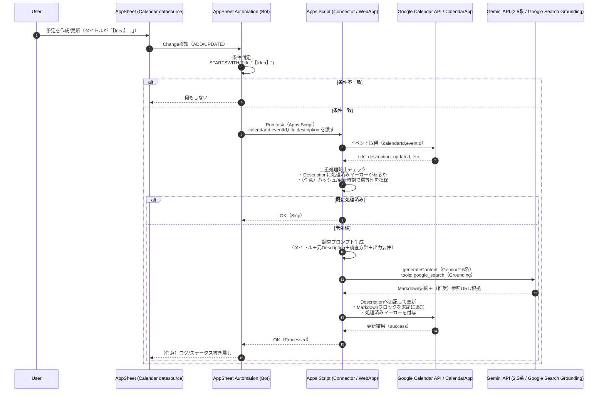

# なぜ作成したのか

- 日々無為で自堕落な生活を過ごしがちなので、ちょっとづつでも何かを蓄積したい
- そこで「毎日一つは何故？を問おう」と心に決めたものの、思い付きや日々の問いなど容易く頭からこぼれおちていくもの
- 継続的かつ簡便に思い付きを残しつつ、後で振り返りやすい容れ物をつくりたい

# やりたいこと
- その時々をふりかえる、という時系列を考えるとGoogleカレンダーがちょうどよさそう
  - ちょうどランニング記録や資格試験の有効期限管理のため、AppsheetアプリにGoogleカレンダーをデータソース登録していた
- 何か思いついたらカレンダーに予定としてメモ（接頭辞に【Idea】とかを付与）を登録、メモを識別したら生成AIを使って下調べを自動実行して、良さげなネタならあとでBlogで文書化する感じを試してみたい

---

# ChatGPTくんと相談

- ChatGPTくんからいくつか案の提示があるなかでA案を採用することにした（B案C案は割愛）
- 生成AIとしてはひとまずGemini2.5flashを使用、グラウンディングにGoogle検索を併用

---

## A案：AppSheet Automation → Apps Script Connector → Calendar更新 → Gemini呼び出し

**狙い**：AppSheet側で「【Idea】が付いた予定」を検知し、Apps ScriptでGemini調査→Description更新まで完結。

### 処理フロー




1. **AppSheet（Google Calendarをデータソース）**

   * Bot（Automation）を作成
   * Event：レコード追加/更新（Calendarイベント）
   * Condition：`STARTSWITH([Title], "【Idea】")`
2. **Task：Apps Scriptタスク（Apps Script connector）**

   * 引数：`calendarId`, `eventId`, `title`, `description` など（AppSheetの列から渡す）
3. **Apps Script（サーバ処理）**

   * Googleカレンダーから該当イベント取得
   * **二重処理防止**（例：Description内に `<!--GEMINI_DONE-->` があればスキップ）
   * Gemini API を **Google検索Grounding付き**で呼び出し

     * Gemini APIの `tools: [{ "google_search": {} }]` を使う（モデルが必要に応じ検索し、根拠を返す） ([Google AI for Developers][1])
   * 生成MarkdownをDescription末尾へ追記してイベント更新（`CalendarEvent.setDescription()` 等）
4. **（任意）AppSheetに処理結果を書き戻し**

   * “ProcessedAt”“Status”“Error”などを別テーブルで持つと運用が安定


### 重要な設計ポイント（運用で効くところ）

* **再トリガ対策（超重要）**

  * Descriptionを更新するとAppSheet側の「更新」でBotが再発火しがちなので、以下のどれかを入れます

    * Description末尾に `<!--GEMINI_DONE:eventId:hash-->` を入れてスキップ
    * Titleを `【Idea】` → `【Idea✅】` に変更（ただしUXに影響）
    * “処理対象フラグ列”を別途持てるなら、完了後にfalseへ
* **プロンプトの型**

  * 「タイトル＋元Description」から、調べたい観点（会社概要/脆弱性/ニュース/競合/法規制など）をテンプレ化
    * Geminiへ渡す情報は「タイトル・本文」だけでなく、目的・観点・出力仕様を固定して品質を安定させます。
  * 返却は**Markdown固定**、末尾に「参照URL（箇条書き）」を必須化すると後から検証しやすい

:::details プロンプト例
```js
"あなたは「調査・整理アシスタント」です。
ユーザーのアイデア（予定タイトルと説明）を起点に、Google検索で根拠を確認しながら調査し、知識として再利用しやすい形に整理してください。

## 最重要ルール
- 出力は **Markdownのみ**（前置き・謝辞・余談は禁止）。
- 推測で断定しない。不確実な点は「不明」「要確認」と明示する。
- 参照した情報は、可能な範囲で **出典URLを箇条書き**で示す（最後にまとめる）。
- アイデア内容は業務に限定しない。技術・ビジネス・法規制・学術・生活など広いテーマを対象にする。
- 「調査して何がわかったか」だけでなく、次のアクションに繋がる形でまとめる。
 
## 入力
### 予定タイトル
{TITLE}
 
### 元のDescription（メモ）
{DESCRIPTION}

## 期待するアウトプット構成（Markdown）
1. 要約（3〜7行）
2. 目的の再定義（このIdeaで達成したいこと / 想定ユースケース）
3. 背景・前提（用語、関連概念、類似事例など）
4. 調査結果（重要点を箇条書き。必要なら小見出しで整理）
5. 選択肢・比較（方法/サービス/アプローチが複数ある場合）
6. リスク・注意点（誤解しやすい点、前提が崩れる条件、限界、法務/倫理/安全面など該当すれば）
7. 次のアクション（今週できる小さな一歩 / 深掘り質問 / 検証方法）
8. 参考リンク（URLの箇条書き。可能なら短い注釈も）

## スタイル
- 見出しは `##` と `###` を中心に。
- 文章は簡潔に、箇条書きを多用。
- 可能なら「チェックリスト」「比較表（Markdown表）」を含めて可読性を上げる。
- 元Descriptionが短い/曖昧なら、仮説を置いた上で「確認したい質問」を「次のアクション」に列挙する。
```
:::


* **APIキー保護**

  * Gemini APIキーはApps Scriptの **Script Properties** に保存（コード直書きしない）
* **コストと課金の注意**

  * 「Grounding with Google Search」は課金/カウント仕様がモデル世代で異なり、特にGemini 3系は検索回数課金が示されています（また2026-01-05からの課金開始 नोटあり）。 ([Google AI for Developers][1])

---


## Apps Script実装イメージ（A案の中核・RESTでGemini呼び出し）

Gemini APIの「Google検索Grounding」は、RESTだと `tools: [{ "google_search": {} }]` を付けます。 ([Google AI for Developers][1])

```javascript
/**
 * AppSheet から呼ばれる想定
 * @param {string} calendarId
 * @param {string} eventId
 * @param {string} title
 */
function enrichIdeaEvent(calendarId, eventId, title) {
  const MARKER = "<!--GEMINI_DONE-->";
  const apiKey = PropertiesService.getScriptProperties().getProperty("GEMINI_API_KEY");
  if (!apiKey) throw new Error("Missing GEMINI_API_KEY in Script Properties");

  // 1) カレンダー予定を取得
  const ev = CalendarApp.getCalendarById(calendarId).getEventById(eventId);
  if (!ev) throw new Error("Event not found");

  const desc = ev.getDescription() || "";
  if (!title.startsWith("【Idea】")) return;            // 念のため
  if (desc.includes(MARKER)) return;                   // 二重処理防止

  // 2) Geminiへ渡すプロンプト
  const prompt = [
    "あなたは調査アシスタントです。Google検索で根拠を確認しながら調査してください。",
    "出力はMarkdownのみ。最後に参照URLを箇条書きで付けてください。",
    "",
    `# 予定タイトル\n${title}`,
    "",
    `# 依頼内容（元Description）\n${desc}`
  ].join("\n");

  // 3) Gemini API（Google検索Grounding付き）
  const url = "https://generativelanguage.googleapis.com/v1beta/models/gemini-2.5-flash:generateContent";
  const payload = {
    contents: [{ parts: [{ text: prompt }] }],
    tools: [{ google_search: {} }],
  };

  const res = UrlFetchApp.fetch(url, {
    method: "post",
    contentType: "application/json",
    headers: { "x-goog-api-key": apiKey },
    payload: JSON.stringify(payload),
    muteHttpExceptions: true,
  });

  if (res.getResponseCode() >= 300) {
    throw new Error(`Gemini API error ${res.getResponseCode()}: ${res.getContentText()}`);
  }

  const json = JSON.parse(res.getContentText());
  const md = json?.candidates?.[0]?.content?.parts?.map(p => p.text).join("") || "";
  if (!md) throw new Error("Empty Gemini response");

  // 4) Descriptionに追記して更新
  const stamp = Utilities.formatDate(new Date(), "Asia/Tokyo", "yyyy-MM-dd HH:mm:ss");
  const appended = [
    desc.trim(),
    "",
    "---",
    `## 調査メモ（Gemini / Google検索Grounding）`,
    `生成日時: ${stamp}`,
    "",
    md.trim(),
    "",
    MARKER
  ].join("\n");

  ev.setDescription(appended); // CalendarEvent更新 :contentReference[oaicite:3]{index=3}
}
```


[1]: https://ai.google.dev/gemini-api/docs/google-search "Grounding with Google Search  |  Gemini API  |  Google AI for Developers"


# 実験

- 実装した日（1/4）に試しに入力してみたけれど、Descriptionには情報が追記されない
- AppsheetのMonitorを確認してみるもそもそも対象に検出されてない。。。
  - 
- 後で見直そうと思いしばらく放置
- 何気なくメモを追加してみるといつの間にか追記動作が実行されていることを発見（1/17）
  - 
- グラウンディングにGoogle検索してることもあり出典URLもつけてくれるのだけれど、VertixaiのリダイレクトURLとして記載されるのがあまり好みじゃない（要改善）
  - 


# まとめ
- 初期動作確認時に情報追記されなかった原因は不明
- 予定と実績を紐づけるのも、思いついたことを書き留めるのもカレンダーを軸にするのが案外便利
- ランニング習慣とかもカレンダーで予実管理するようにしてるし、いろいろ紐づけて活動の気づきが増えるかも

