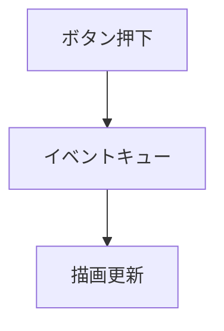
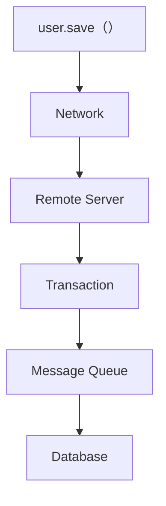
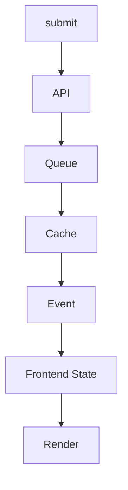

# IT民俗学：なぜコードは眠るのか

古いコードやテストコードを見ていると、ときどき妙なものに出会います。

```js
await sleep(1000)
```

一秒、眠る。

処理を待っているらしい。

しかし、何を待っているのかは書かれていないことが多いです。

さらに不思議なのは、こういうコードにはコメントが添えられていることがあるのです。

```js
// 消すな壊れる
await sleep(1000)
```

怖い。

なぜ消してはいけないのか。
何が壊れるというのか。
そもそも、なぜ眠る必要があるのか。

聞いても返ってくる答えはだいたい曖昧です。

* 「昔からある」
* 「CIだけ落ちる」
* 「たまに失敗する」
* 「これを消したら本番で事故った」

技術的説明というより、どこか禁忌に近い。

私はこういうコードを見るたびに、「ITにも呪術みたいなものがあるな」と感じています。

## sleep は何をしているのか

もちろん、コンピュータに待機処理そのものは必要です。

たとえば画面保存のテストコード。

```js
await page.click("#save")
await sleep(1000)
await expect(page.locator(".message")).toHaveText("保存しました")
```

保存ボタンを押したあと、一秒待ってから結果を確認しています。

現代的な感覚だと、少し雑に見えるかもしれません。

本来なら、「保存完了」という状態を待つべきだからです。

```js 
await page.click("#save")
await expect(page.locator(".message")).toHaveText("保存しました")
```

しかし現実には、sleep が入っているコードをよく見かけます。

しかも、その sleep を消すと意図したように動かないことがある。

ここで、ふと思うのです。

そもそも、この sleep は何を待っているのだろう。

テストコードの sleep であれば、「非同期処理が落ち着くのを待っている」という説明はできます。

でも、そもそもこのゼロとイチが支配するバイナリな世界で、曖昧に「sleepして待つ」という発想自体いつ頃から現れたのだろう。

昔のプログラムにも、こんな「眠りの呪文」は存在していたのだろうか。

## 何を待っているのかわからない

sleep は、「何かを待っている」のは確かなのに、「何を待っているのか」がコードから読めないことがあります。

* DB反映？
* キャッシュ更新？
* 非同期処理？
* JavaScript描画？
* 外部API？
* CI環境特有の遅延？

誰も正確にはわからない。

ただ、「 **一秒待つと安定する** 」という結果だけが残っている。

私は、いささか浪漫的に過ぎると自覚的ではあるものの、 sleep は、仕様から生まれたコードというより、誰かが事故や不具合との戦いの中で偶然手にした奇跡の痕跡なのかもしれない、と考えています。

## ある日突然、生まれる

たぶん、こういうコードはある日突然生まれます。

深夜。
障害対応中。
あるいはリリース直前。

```js
await page.click("#save")
await expect(page.locator(".message")).toHaveText("保存しました")
```

落ちる。

なぜかわからない。

ローカルでは再現しない。
CIだけ失敗する。
ログも曖昧。

そこで誰かが試しに書く。

```js
await sleep(1000)
```

通る。

もう一回試す。

通る。

十回試す。

通る。

すると、その一秒は「闇雲な試行錯誤」から、失敗を打ち払う「奇跡のコード」に昇華する。
限られた時間の中、根本原因の追究は等閑になり、失敗の解消という結果だけが喜びとともに環境に溶けていく。
やがて時は経て、失敗事象を知らない世代に受け継がれた「奇跡のコード」は、「消してはいけないコード」に変わっていく。

もちろん根本原因の追究が必要なことは言うまでもありません。「奇跡のコード」は一時しのぎでしかありませんが、たしかにその時、その環境は救われたのです。
いつか破られるその日まで、 sleep は、過去の事故との停戦協定といえるのかもしれません。

## 昔のプログラムは、もっと単純だったのかもしれない

sleep を見ていると、妙な感覚になることがあります。

たしかに今のWebシステムでは、「少し待つ」が必要になる場面は多い。

でも、昔のプログラムも同じだったのだろうか。

あるいは、システムが複雑になっていく中で、だんだん「待たないとわからない世界」になっていったのだろうか。

少し時代ごとに並べてみます。

| 時代        | システム観                | 待っているもの     | 典型的な待機       |
| --------- | -------------------- | ----------- | ------------ |
| 単体プログラム時代 | 同期処理中心               | IO・ハードウェア   | wait         |
| GUI時代     | イベント駆動               | 描画更新        | repaint待ち    |
| 分散システム時代  | RPC・ネットワーク           | リモート応答      | Thread.sleep |
| Web時代     | 非同期通信                | DOM・Ajax    | setTimeout   |
| Cloud時代   | eventual consistency | リソース反映      | sleep 30     |
| AI時代      | ブラックボックス             | 「よくわからない何か」 | AI提案sleep    |

こうして並べてみると、システムが複雑になるほど、「いつ終わったのか」が見えにくくなっていったようにも見えます。

もしかすると sleep は、そういう「見えない処理」と付き合うための作法として増えていったのかもしれません。

## GUI時代：「画面更新を待つ」

GUIアプリケーションが普及すると、「描画待ち」が発生します。



つまり、 「 **処理は終わったのに、画面はまだ更新されていない** 」という世界が生まれた。

ここで「少し待つ」が発生します。

## 分散システム時代：「向こう側」を待つ

さらに CORBA や SOAP のような分散システム時代になると、状況はもっと複雑になります。

一見すると普通のメソッド呼び出しに見えても、

```java
user.save()
```

実際には、



のように、さまざまなレイヤを跨いでいる。

つまり、「いつ終わったのか」がローカルから見えにくくなっていきます。

しかも失敗原因も曖昧です。

* 通信遅延
* タイムアウト
* 部分失敗
* ミドルウェア差異

ここでまた、「少し待つ」が増えていったのではないかと思っています。

## Web時代：「終わり」が消える

WebとJavaScriptの時代になると、sleep文化はさらに加速したように見えます。

昔のフォーム送信は比較的単純でした。

```text
submit → complete
```

しかし現代のWebは違います。



どこで「完了」したのかがわからない。

画面表示は非同期。
通信も非同期。
状態管理も非同期。

こうして並べてみると、人類は少しずつ、 「 **処理がいつ終わったのかを完全には把握できない世界** 」に住み始めたようにも見えます。

すると、

```js
await sleep(1000)
```

が俄然市民権を得るようになる。

なぜなら、「 **だいたい終わる** 」からです。

## Cloud時代：「反映待ち」が日常になる

クラウドやKubernetesの世界でも似たことが起きています。

```bash
kubectl apply
```

しても、すぐ反映されるとは限らない。

* Pod起動
* DNS反映
* Service同期
* LoadBalancer更新

全部非同期。

するとCI/CDにもこういうものが現れます。

```yaml
- run: terraform apply
- run: sleep 30
- run: integration-test
```

これも現代版の「眠りの呪文」に見えます。

## sleep は「同期世界の崩壊」の痕跡なのかもしれない

こうして並べてみると、sleep文化は単なる雑な実装ではなく、 **システムが同期的に理解できなくなっていった歴史** の痕跡にも見えてきます。


時代が進むほど、「向こう側」が増えていく。

* 見えない処理
* 遅れて反映される状態
* 非同期イベント
* 別マシン
* 別リージョン
* ブラックボックス

そして私たちは、「状態」を完全には把握できなくなった。

だから、「少し待つ」が文化として残った。

私はそんなふうに感じます。

## 「変なコード」には理由があるのかもしれない

私は古いコードを見るとき、「これは何と戦った痕跡なんだろう」と考えるようにしています。

妙な sleep。
謎の retry。
意味不明な timeout。
異常に慎重な確認処理。

それらは単なる悪い実装ではなく、過去の事故や制約の化石なのかもしれません。

少し前にベストセラーになった「変な家」を読んだ時にも似た気持ちになりました。「間取りのこの空白はなんだろう？」

あとから増築したのかもしれない。
昔は別の用途だったのかもしれない。
何か事件があったのかもしれない。

一見すると意味不明なのに、背景を想像すると急に人間の事情が見えてくる。

sleep も、「変なコード」を起点に、その背景を辿っていく感覚に近いのかもしれません。

## AI時代に失われていくもの

最近は、生成AIがコードを書いてくれるようになりました。

私も日常的に使っていますし、本当に便利だと思っています。

ただ、その一方で、「なぜそう書かれているのか」という理解を人間側が手放していく感覚があると思います。

sleep もその典型だと思うのです。

AIに「テストが不安定です」と相談すると、かなり高確率で sleep を提案してきます。

たぶんこれまでの結果として蓄積されたコードを学習したAIの提案コードは、統計的にはきっと正しい。

実際、直ることも多い。

でも、その一秒が何と戦っているのかまではわからない。

だからこそ、こういう「現場に残った妙なコード」を観察しておきたい。

それは単なるアンチパターン集ではなく、人間とシステムの戦いの記録なのかもしれない、と私は思っています。

## 参考にした概念・近い研究

### Cargo Cult Programming

「理由を理解しないまま、形式だけを模倣する」現象を指す言葉。

ITでは、

* 「この sleep は消すな」
* 「この設定にすると動く」
* 「このコメントを消すと壊れる」

のような、“理由を失った儀式” を説明するときによく使われるそうです。

* https://en.wikipedia.org/wiki/Cargo_cult_programming

### Selenium の待機戦略

Selenium 公式ドキュメントでも、待機処理は重要なテーマとして扱われています。

特に implicit wait と explicit wait の扱いは複雑で、「何を待つか」を明示することの重要性が説明されています。

* https://www.selenium.dev/documentation/webdriver/waits/

## 影響を受けたコンテンツ

* 雨穴『[変な家](https://www.youtube.com/watch?v=uY4uM-QAigA&t=3175s)』

今回の記事は、「奇妙なものの背景を辿っていく」という感覚で書いてみました。

もし皆さんの現場にも「消すと壊れるコード」や「理由はわからないが残っている作法」があれば、ぜひ教えてほしいです。

