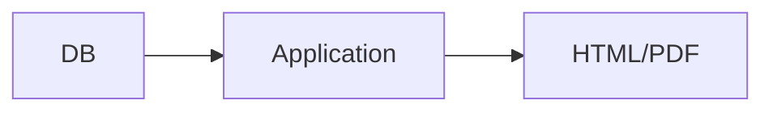
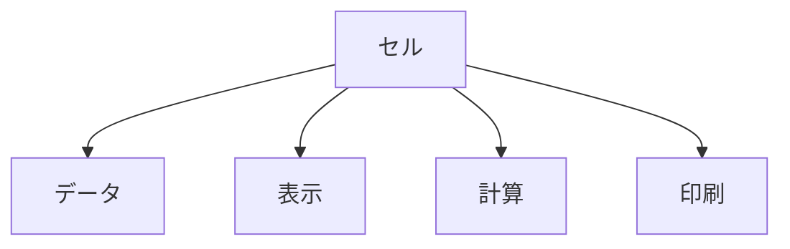

# IT民俗学：なぜExcel方眼紙は滅びないのか

かつて社給PCがWindowsだったころ、すべてのPCにはExcelが標準搭載されていました。

そして職場には大量のExcelファイルがありました。

それらはマニュアルであり、申請書であり、障害台帳であり、タイムカードでもありました。

開いてみると、枠線やヘッダ/フッタが整備されている。

入力された予定日付に従ってセルに■が表示されスケジュールが視認できる。

実績日程が入力されていると、予定との進捗差異をイナヅマ線として線オブジェクトが配置される。

決められたルールで入力すれば、勝手に内容が埋まっていく。

Excelさえあれば誰でも使えるそれらのExcelファイルは、業務を効率化してくれる福音であると同時に、変えてはならない禁忌でもありました。


セルの幅を変えてはならない
行を追加してはならない
非表示行を展開してはならない
印刷範囲外のセルに触れてはならない

「触れたら正しく印刷されなくなります」

そう、すべては印刷されるはずの紙のために。

そこで私はかつての方眼紙のようなExcelファイルたちを思い返し、「人類はなぜ表計算ソフトで“紙”を再現しようとしたのだろう」と考えてみることにしました。

## まず、「Excel方眼紙」とは何なのか

ここでいう「Excel方眼紙」を定義しておきます。

単にセル幅を揃えたExcelファイルのことではありません。

ここでいう Excel 方眼紙とは、 **Excel を「表計算ソフト」ではなく、「自由にレイアウトできる紙」として使う文化** を指しています。

たとえば、こんなものです。

* セルを正方形に揃える
* 罫線で帳票を描く
* 文字位置をセル単位で調整する
* 図形を配置する
* 印刷結果を前提に設計する
* 「1ページに綺麗に収める」を重視する

つまり、

```text
Excel = 計算ツール
```

ではなく、

```text
Excel = 紙
```

として扱っている。

これが、いわゆる「Excel方眼紙」と呼ばれる文化なのだと思っています。

## 「紙っぽい」のに、なぜ違和感があるのか

紙っぽいレイアウト自体は、今でも普通に存在しています。

請求書も、領収書も、契約書も、PDF帳票として大量に使われている。

では、なぜ Excel 方眼紙だけが独特の違和感を持つのだろう。

たぶん違うのは、「紙らしさ」そのものではないのです。

むしろ、 **「データ」と「紙」が分離していない** ことなのかもしれません。

## PDFは「紙」だが、Excel方眼紙は「紙になろうとしているシステム」

PDFは、基本的には完成された表示物です。

* 表示する
* 印刷する
* 配布する

という役割が中心で、そこに複雑なロジックはほとんど入りません。

つまり、

```text
PDF = 紙
```

と整理できると思います。

一方、Excel は違います。

Excel は本来、

* 計算
* 集計
* データ管理
* 自動化

を扱える、かなりシステム寄りの存在です。

しかし Excel 方眼紙では、その中に、

* 帳票
* レイアウト
* 印刷
* 入力UI
* 業務ロジック
* ワークフロー

まで同居しています。

つまり、

```text
セル = データ
セル = 表示
セル = 入力欄
セル = 印刷
セル = ロジック
```

になっている。

この多機能性はかなり独特です。

## 「全部セル」が生む違和感

たとえば現代のWebシステムでは、



のように、

* データ
* 処理
* 表示

を分離するのが一般的です。

なぜなら、 **「意味」と「見た目」は分けるべき** という思想が強いからです。

一方、Excel方眼紙では、



全部セル。

だから、

* セル結合を外すと壊れる
* 列幅を変えると帳票が崩れる
* 図形がズレる
* VBAが突然止まる

みたいなことが起きます。

現代エンジニアが違和感を覚えるのは、たぶんこの、 **「責務境界の未分化」** なのだと思います。

## でも、それは「間違った進化」だったのだろうか

ただ、ここで少し立ち止まりたくなるのです。

Excel方眼紙は、本当に単なるアンチパターンだったのだろうか。

実際には、かなり合理的だった時代もあったはずです。

たとえば、紙とハンコ文化が根付いた職場で電子化を進めるなか。

* 非IT部門でも編集できる
* メール添付できる
* 印刷結果をその場で確認できる
* 稟議に回せる
* ハンコ欄を固定できる
* 「見た目が変わらない」

というのは、紙文化とデジタル作業の架け橋的な役割としてかなり大きかったはず。

特にSIや官公庁文化では、 **「レイアウトが絶対に変わらない」** ことが非常に重要だったのだと思います。

つまり Excel 方眼紙は、 **構造化データとしては不安定** だけれど、


**紙文化を前提とした組織運用としては極めて強い** 存在だったのかもしれません。

## Excel方眼紙は「紙」と「データベース」の中間生物だった

こうして見ていると、Excel方眼紙って少し不思議な存在です。

紙文化の時代は、

```text
見る = 書く = 保存する
```

が一体でした。

紙そのものが、

* UI
* ストレージ
* 帳票
* インタラクション

全部だった。

しかし、WebやDBの時代になると、

```text
データ ≠ 表示
```

になっていく。

ここで、

* リレーショナルDB
* API
* semantic HTML
* CSS分離

のような、「構造」と「見た目」を分ける思想が強くなる。

つまり世界観が、

```text
意味 = 位置
```

から、

```text
意味 = 関係
```

へ移っていった。

でも Excel 方眼紙は、その中間にいた。

セル位置に意味があり、
印刷結果に意味があり、
同時に関数やVBAも持っている。

つまり、 **「紙」と「システム」が未分化なまま共存している** のです。

私はここに、少し文明の過渡期っぽさを感じています。

## なぜ、今も滅びないのか

ここまで考えてみると、Excel方眼紙が今でも残っている理由も、少し見えてくる気がします。

技術的に見れば、

* 構造化しづらい
* 保守しづらい
* 壊れやすい
* 責務分離が曖昧

など、問題は多い。

それでも、完全には消えていない。

たぶんそれは、Excel方眼紙が単なるファイル形式ではなく、 **「組織と人間を接続するための道具」** だからなのだと思います。

Excel は誰でも開ける。

少し詳しい人なら現場で修正できる。

印刷して回覧できる。

メール添付できる。

「システム改修依頼」を出さなくても、その場で運用を継ぎ足せる。

つまり Excel 方眼紙は、

```text
紙文化 + 現場運用 + システム化
```

の折衷案として非常に強かった。

しかも厄介なことに、その合理性は今も完全には消えていないのです。

だから Excel 方眼紙は、「古いのに残っている」のではなく、 **「今でも組織の境界条件に適応している」** のかもしれません。


## AI時代、「紙」を再び読めるようになった

さらに面白いのは、最近のAIです。

生成AIは、

* PDFを読む
* スクリーンショットを理解する
* OCRする
* レイアウトごと解釈する

のがかなり得意になってきています。

これは少し不思議な変化にも見えます。

かつてシステム開発の世界では、 **「見た目」と「構造」を分離する** 方向へ進んできました。

人間向けの帳票やレイアウトは、そのままではシステム処理しづらい。

だから、

* CSV化する
* DBへ登録する
* APIで受け渡す
* semantic HTMLに変換する

といった形で、「意味」を構造化データとして切り出すことが重視されていた。

つまり従来の理想は、

```text
人間向け帳票
↓
人間が読む
↓
必要な情報を抽出する
↓
構造化データへ変換する
↓
システムが処理する
```

という流れだったのだと思います。

ここで重要なのは、 **「人間」が翻訳レイヤーだった** ことです。

紙を読む。
意味を理解する。
必要な項目を転記する。

人間が、「人間向け表現」と「システム構造」の間を仲介していた。

でも生成AIは、この流れを少し変え始めています。

AIは、

* PDF
* スクリーンショット
* Excel帳票
* レイアウト付き文書

のような、「人間向けに作られたもの」を、そのまま読める。

つまり今は、

```text
人間向け帳票
↓
AIが読む
↓
意味を抽出する
↓
構造化データ化する
↓
システムが処理する
```

が成立し始めているのです。

これは、**翻訳レイヤーをAIに委任できるようになった** と理解できます。


考えてみれば、これまで人間は、

* 帳票を読む
* 意味を理解する
* 必要な情報を転記する

という、“曖昧さの翻訳レイヤ”を長く担っていました。

Excel方眼紙も、そうした「人間が読むこと」を前提とした文化だったのだと思います。

そして今、その役割の一部をAIが肩代わりし始めている。

そう考えると、Excel方眼紙は単なる古い悪習ではなく、 **「人間とシステムの間を、人間自身が仲介していた時代の痕跡」** だったと解釈することができると思います。


## 「方眼紙」には、人間が残っている

Excel 方眼紙を見ることで、「この帳票が必要とされる背景にどんな文化があるのだろう」と考えると発見が多いのではないかと思います。

印鑑欄があるということは、実印文化が残っているはず。

A4固定印刷で、ヘッダにFAX番号が記載されているということは、FAX送信業務が残っているのかもしれない。

左の余白が大きくとられているということは、ファイリング文化が残っているかもしれない。

一見すると非合理なことも、その時、その場所の文化と照合すると接点が見えてくる。

その背景を想像すると、急に人間の事情が見えてくる。

だから私は、Excel方眼紙を単なるアンチパターンとして切り捨てるのではなく、 **「設計当時の組織文化の化石」** として観察してみたいのです。

もし皆さんの環境にも、「これは完全にExcelでやるものではないだろう……」と思う帳票が残っていたら、ぜひ教えてほしいです。
