# IT民俗学：なぜ再起動はすべてを癒すのか

月曜日の朝。

Teamsがつながらない。

ブラウザは開く。

VPNも接続済みになっている。

でも社内システムにアクセスできない。

利用者は困って情シスへ相談する。

すると返ってくる言葉はだいたい決まっています。

**「一度再起動してみてください」**

利用者は少し不思議に思います。

なぜ再起動なのだろう。

原因はわからないままなのに。

しかし言われた通り再起動してみる。

すると直る。

「ああ、再起動すると復旧するんだ」

そして利用者は業務に戻り、再起動は利用者の日常に溶けていく。

## 再起動で何が起きているのか

利用者から見える世界はとても単純です。

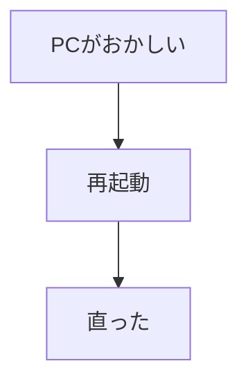

でも実際のコンピュータの中では、もっと多くのことが起きています。

たとえば、

* キャッシュの不整合
* ソケットの取り残し
* 一時ファイルの残存
* メモリリーク
* ドライバの異常状態
* ネットワークスタックの不整合

などです。

本来であれば、それぞれを切り分けて原因を調査する必要があります。

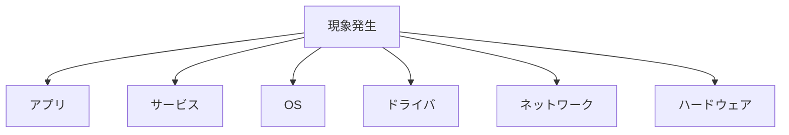

しかし、再起動するとこうなります。

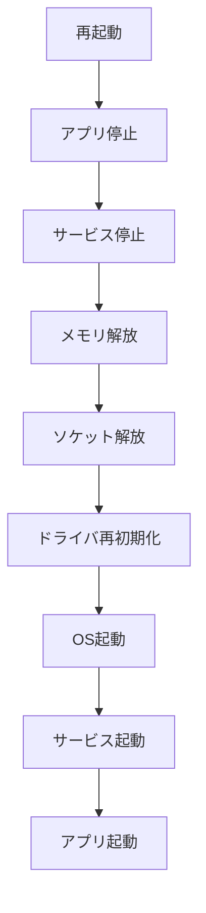

つまり再起動とは、

**依存関係順の停止**
**状態初期化**
**依存関係順の起動**

を一つの操作に圧縮したものなのです。

利用者はそれらを知らなくてよい。

「再起動」というひとつの行為だけ知っていればよい。

**何が壊れたのかを知らなくても実行できること**

ここに私は、再起動信仰の強さの源泉がある気がしています。

## 同じ再起動なのに、見ている世界が違う

ふと思うのです。

同じ「再起動」でも、立場によって意味は違うのではないだろうか。

### 利用者の世界

利用者が求めているのは原因ではありません。

使えることです。

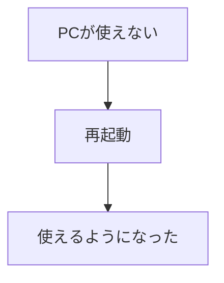

利用者にとって重要なのは、

**なぜ壊れたか** ではなく、 **どうすれば仕事ができるか** です。

だから、成功体験があれば **「困ったら再起動」** が経験則として残る。

理由は知らなくても困らない。

効けばよいのです。

### 情シスの世界

情シスはもう少し事情を知っています。

再起動が状態初期化であることも知っている。

しかし同時に、 **再起動すると証拠が消える**[^1] ことも知っています。

[^1]:問題発生時、PC上でなにが起こっていたかを調査するには異常発生中のメモリダンプを取得することが有効とされます。これは再起動するとメモリの内容がクリアされるため取得できなくなります

本来なら原因を追いたい。

でも利用者は今すぐ仕事をしたい。

100人の問い合わせに対して個別調査などできません。

だから情シスは、

という現実の中で、 **サービス復旧を優先する** という判断を行います。

再起動は技術的対処であると同時に、運用上の合理的判断でもあるのです。

### ベンダーの世界

さらにOSやソフトウェアなどのベンダーになると見える世界が変わります。

利用者が見ているのは現象。

情シスが見ているのは状態。

ベンダーが見ているのは原因です。

最近、macOSで長期間再起動せずに稼働すると、新しいTCP通信が確立できなくなる不具合が報告されました。

利用者から見ると、

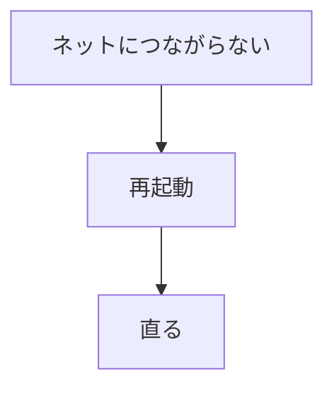

です。

しかし実際には、

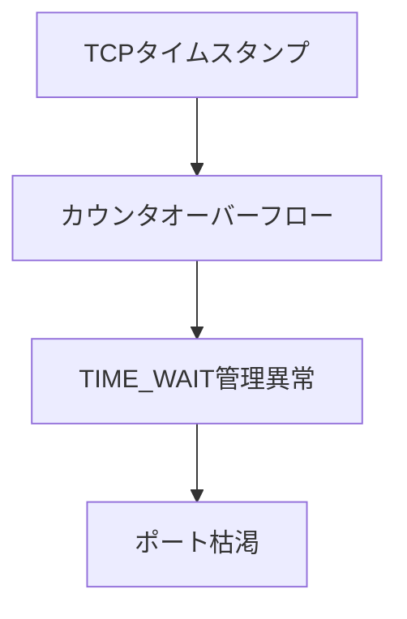

が起きていました。

参考:
https://photon.codes/blog/we-found-a-ticking-time-bomb-in-macos-tcp-networking

再起動は迷信ではありません。

実際にポート枯渇リスクをクリアする処置として、ちゃんと効いていたのです。

## 再起動は昔から同じだったのだろうか

歴史的な背景を考えてみます。

再起動は昔から今と同じ意味だったのだろうか。

### メインフレーム時代

当時の再起動は儀式というより運用手順でした。

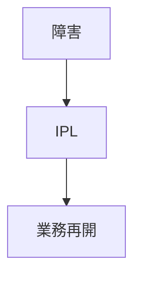

再起動は日常の経験則ではなく、運用マニュアルの世界にありました。

### UNIX時代

長時間稼働するサーバーが増えます。

すると、

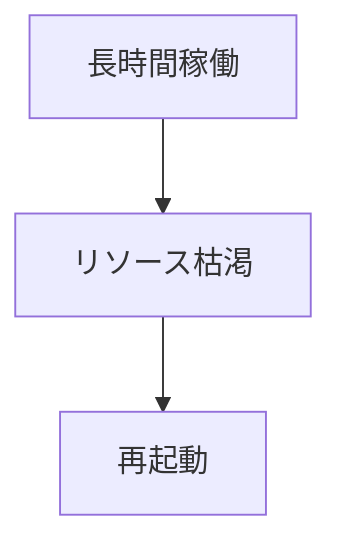

という発想が一般化します。
週末夜間に順番にサーバーを再起動する、といった再起動スケジュールをどの環境でも目にしました。
当時、サーバーは一度起動したら何ヶ月も止めないのが理想でした。
しかし現実にはメモリリークやプロセス異常が起こる。
「止めたくない」と「止めないと戻らない」の間で、再起動の楔はサービス可用性という考え方の根幹にあったものだと思います。

### Windows時代

ここで再起動は一気に身近になります。
利用者個人のPC利用が爆発的に普及します。
事象はサーバー室ではなく、オフィスや自宅にあるPCに広がります。
サーバーをスケールダウンしたPCでも、

* ドライバ
* レジストリ
* DLL

など、多くのレイヤーが積み重なり、 **困ったら再起動** が一般利用者の経験則になっていきます。

### クラウド時代

本来なら再起動文化は消えるはずでした。

- コンテナ
- 冗長化
- セルフヒーリング

クラウドは「再起動しなくても動き続ける」世界を目指していたからです。

でも利用者の視点から再起動は消えなかった。

サーバーがクラウドに代わっても、提供されるサービスにPCからアクセスすることには変わりがないのです。

サービスにつながらないとき、手元で動作しているPCに対して **困ったら再起動** がそのまま生き続けています。

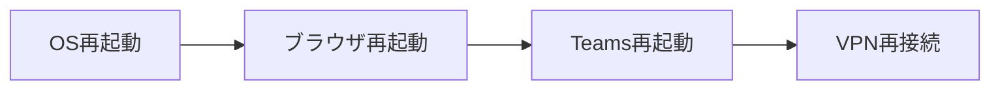

変わらなかったのは、 **状態初期化** という考え方。

変わったのは、 **どのレイヤーを初期化するか** だったのです。

## 再起動とは何のための作法なのか

ここで少し抽象化してみます。

再起動ってコンピュータだけだろうか。

人間も、

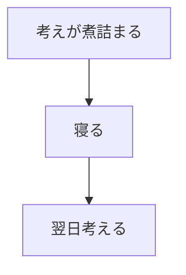

をやります。

プロジェクトも、

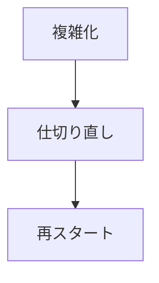

をやります。

どうも人間は、

**複雑になりすぎた状態を一度整理する**

という行為を繰り返しているようです。

そう考えると、再起動とは単なるコンピュータの機能ではなく、

**複雑さと折り合うための作法**

なのかもしれません。

## AI時代、儀式はどう変わるのだろう

最近は生成AIが一次サポートに入るようになってきました。

利用者は情シスへ問い合わせる前にAIへ相談する。

AIはログを読む。

状態を診断する。

原因候補を提示する。

一見すると、再起動のような経験則は不要になりそうにも見えます。

でも私は、むしろ逆なのではないかと思っています。

なぜならAIもまた、一つのシステムだからです。

利用者から見れば、

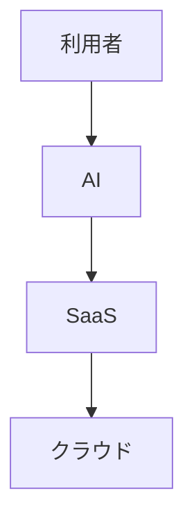

という新しいレイヤーが増えただけとも言えます。

もしAIにつながらなかったら。

AI自身が不調だったら。

AIの回答が取得できなかったら。

そのとき利用者は、どこまで原因を追えるのでしょうか。

おそらく多くの場合、追えません。

これは昔から変わらないような気がしています。

メインフレーム時代には運用担当者がいました。

Windows時代には情シスがいました。

AI時代にはAIがいます。

技術や役割は変わってきました。

でも利用者が求めるものは変わりません。

**原因ではなく復旧です。**

そして復旧のための共通語として、 **再起動** は今も残り続けています。

私は再起動という作法が消えるのではなく、その役割が少しずつ変化しているのだと思っています。

昔は障害対応の手順でした。

その後、利用者が知る経験則になりました。

そしてこれからは、 **より高度な解決手段が失敗したあとに残る最後の共通手順** になるのかもしれません。

AIが原因を説明してくれる未来は来るでしょう。

でもAI自身もまた複雑なシステムの一部です。

その複雑さを前にしたとき、人類はきっと昔と同じことをするのだと思います。

- 一度閉じる。
- もう一度開く。
- 再起動する。

技術がどれだけ変わっても、この作法だけは最後まで残るのかもしれません。

## 「再起動」には思惑がある

「まず再起動してください」と聞くと、そう口にした人の立場を想像します。

利用者は救済を求める。

情シスは復旧を求める。

ベンダーは原因を求める。

本来なら見ている方向は違うはずです。

それでも全員が「まず再起動」という作法を共有している。

私はそこに少し民俗学らしさを感じます。

立場も目的も違う人々が、長い時間をかけて同じ振る舞いを受け継いでいる。

再起動とは単なる技術操作ではなく、複雑なシステムと付き合うために人類が獲得した共通言語なのかもしれません。