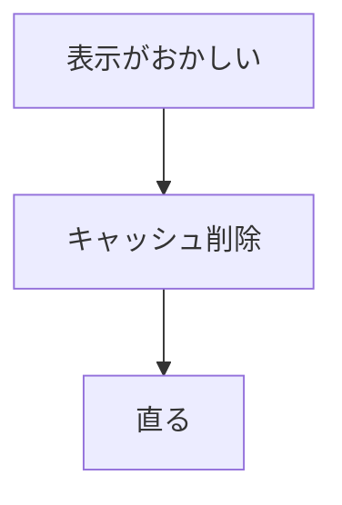
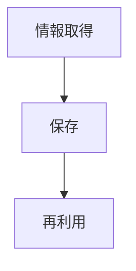
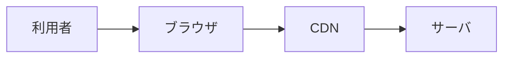
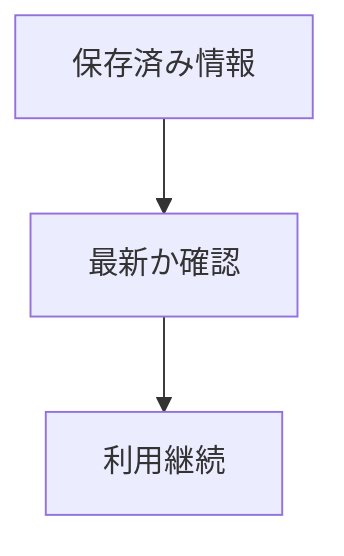
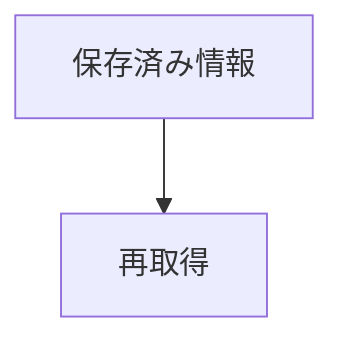
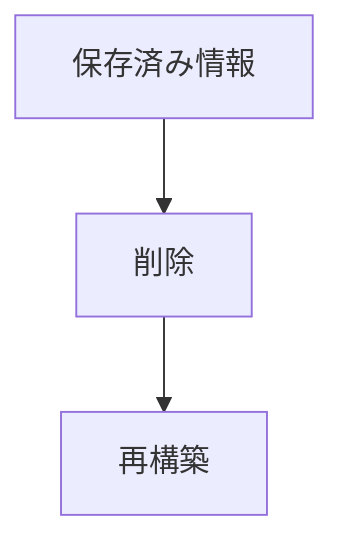
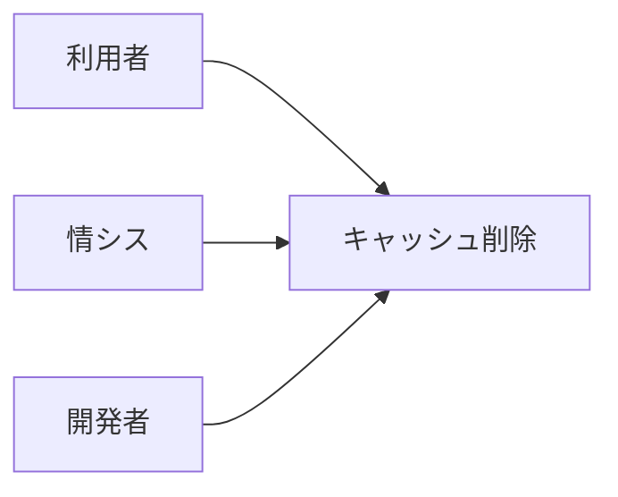
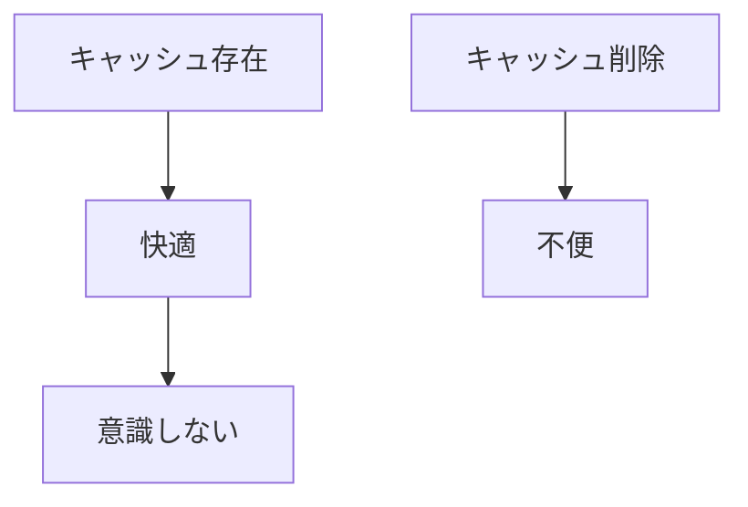

# IT民俗学：なぜ人はキャッシュを消すのか

新しいドメインを取得した。

レンタルサーバーを契約し、簡単なコンテンツを作成、アップロードしてサイトの動きを確認した。

動作は問題なさそう。

公開するためにレンタルサーバーが提供するTLS証明書も手配した。

サーバー側で発酵処理状況を確認すると完了したようだ。

しかしブラウザでアクセスすると、 **「保護されていない通信」** と表示される。

おかしい。

設定を見直す。どれも間違っていない。

ブラウザの証明書情報を確認する。確かに発行はされているらしい。でも「保護されていない通信」。何故？

ブラウザの更新（F5）をしてみる。
それでも「保護されていない通信」は消えない。

途方に暮れ、FAQや事例を探る。

> シークレットウィンドウで開いてみよ

意図したHTTPS表示で、通信も保護されている！

FAQの続きを見る。

> キャッシュを消してください

言われるがまま削除すると、なるほど「保護されていない通信」の表示は消えた。

設定も正しかった。
コンテンツも正しかった。
証明書の手配も正しかった。
キャッシュをクリアしたら正しく動作するようになった。
何が邪魔をしていたのだろうか。
何がクリアされたのだろうか。
キャッシュはクリアしなければならないものだったのだろうか。

時はながれ、日々の更新業務の作業で原初の記憶は希釈されていく。

かくしてキャッシュとともに事象の記憶も失われ、以後「保護されていない通信」を見たものはいない。

## キャッシュとは何なのか

ブラウザを介していろいろなサービスを利用するようになり、「キャッシュ」という言葉を見聞きするようになりました。

開発者は主に「サービス品質を上げるために必要な機能」として

利用者は主に「困ったときに目にする言葉」として

利用者から見える世界は単純です。

困ったことが起きると、誰かの指示でキャッシュを削除します。
結果、改善の体験を得ることになります。

> 利用者：「キャッシュとかいうやつが邪魔していたらしい」

利用者視点では事象の原因としてのキャッシュが認知されることが多いと思います。

しかし、これはキャッシュの振る舞いにおける一側面でしかありません。

開発者視点では広義のキャッシュの動きが見えます。

この視点でキャッシュとは、**一度取得した情報を保存し、次回以降に再利用する仕組み** です。

本来の目的は単純です。

**速くすること。**

毎回遠くにあるサーバーへ問い合わせるより、一度取得したものを手元に置いて使った方が速い。

だからキャッシュは生まれました。

私はキャッシュを、**「コンピュータの記憶」** と考えると理解しやすい気がしています。

毎回ゼロから世界を認識するのではなく、過去の経験を使って効率化する。

人間の記憶と少し似ています。

## キャッシュはインターネットの縁の下の力持ち

ふだん私たちはキャッシュを意識しません。

でも実は、インターネットの多くはキャッシュの上に成立しています。

例えば、

* ブラウザキャッシュ
* DNSキャッシュ
* CDNキャッシュ
* Cookie
* LocalStorage
* Service Worker Cache

などです。

利用者はページを開いているだけに見えます。

でも実際には、さまざまな場所で保存された過去の情報が利用されています。

もしキャッシュがなければ、

* Webページはもっと遅い
* サーバーコストはもっと高い
* 大規模サービスは成立しにくい

でしょう。

サービス提供者にとって、 **キャッシュは性能そのもの** なのです。

## 「更新」と「キャッシュ削除」は何が違うのか

FAQなどを事例を手繰ると、ややこしいことがあります。
多くの場合、以下のような操作がまとめて併記されているのです。

- 「ページを更新してください」
- 「Ctrl+F5を押してください」
- 「キャッシュを削除してください」

この三つは順番に行うの？それぞれ並列して行うの？キャッシュだけ削除しちゃダメなの？
惰性で切り分けしていると意識から外れがちですが、これらの操作はそれぞれ意図することが違います。

| 操作      | 過去の情報への態度 |
| ------- | --------- |
| F5      | 信じる       |
| Ctrl+F5 | 疑う        |
| キャッシュ削除 | 捨てる       |

F5は、

です。

過去の記憶は維持したまま、最新かどうかを確認する。

一方でCtrl+F5は、

です。

HTMLやCSS、JavaScriptなどを強制的に取り直します。

しかしログイン状態や設定情報は残ることが多い。

そしてキャッシュ削除。

こちらはもっと過激です。

場合によっては、

* ログイン状態
* サイト設定
* 閲覧履歴
* オフラインデータ

まで失われます。

つまりキャッシュ削除とは、

**単なる再取得ではない。**

**利用者とサイトが積み重ねてきた記憶を手放す行為** なのです。

## どうして我々はキャッシュを消さねばならないのか

キャッシュ削除は万能ではありません。

- サーバー障害。
- データベース不整合。
- CDN設定ミス。
- プログラムのバグ。

そういった問題には効きません。

それでも、 **「まずキャッシュを消してみてください」** という言葉は広く使われています。

なぜでしょうか。

この誘導はOSの再起動指示と似た構造を感じます。

利用者は、

**理解しなくても実行できる。**

情シスは、

**説明しなくても依頼できる。**

開発者は、

**問題切り分けの第一歩になる。**

立場は違う。

目的も違う。

でも、

という一点で利害が一致している。

だからキャッシュ削除は、一種の作法として残り続けているのかもしれません。

## キャッシュは、なくなることで認識される

ここまでそれぞれの立場から見たキャッシュの理解と印象を整理してみました。
この中で一番特殊な立ち位置になるのは利用者です。

利用者はキャッシュを嫌います。

問題が起きると真っ先に疑われるからです。

でもキャッシュがなくなると困る。

例えば、

* ログイン状態が消える
* サイト表示が遅くなる
* Web会議背景の画像設定が消える
* 入力途中の内容が消える

ことがあります。

私はここに少し民俗的な側面を感じます。

- 電気。
- 水道。
- 空気。

それらは普段意識されません。

でも失われると急に存在感を持ち始める。

キャッシュも同じなのかもしれません。

## AI時代、キャッシュはどうなるのだろう

最近は生成AIが普及し、多くの人が検索より先にAIへ質問するようになりました。

しかし、その裏側でも大量の「過去」が利用されています。

- 学習済みデータ。
- RAG。
- 会話履歴。
- セッション情報。
- 推論結果。

広い意味では、これらも過去の情報を活用する仕組みです。

昔は、**古いJavaScriptやコンテンツが残っている** ことが問題になりました。

これからは、 **古い知識が残っている** ことが問題になるのかもしれません。

- AIとの会話をリセットする。
- メモリを削除する。
- 新しい情報で再検索する。

そうした行為は、もしかすると未来の「キャッシュ削除」に相当するのかもしれません。

## 「キャッシュ」には、サイトとの関係性が残っている

キャッシュ削除の瞬間、私たちは単に古いファイルを削除しているわけではありません。

サイトが覚えていた私。

私が慣れ親しんだサイト。

その間に積み重なった関係性の一部を手放している。

だからキャッシュ削除は少し不便で、少し面倒で、そして少しだけ寂しいのかもしれません。

キャッシュという機能が今日成功しているのは、その存在を忘れさせたからなのかもしれません。

- 速く表示されること。
- 自動でログインできること。
- いつも通り動くこと。

それらが当たり前になった瞬間、人はキャッシュの存在を意識しなくなる。

そして問題が起きたときだけ思い出す。

> **「キャッシュを削除してください」**

忘れられた仕組みが一瞬だけ表舞台に現れるこの瞬間。

私は少しだけ立ち止まってみます。

過去の私が残した選択と、サイトが覚えていたであろう記憶に記憶を馳せます。

キャッシュ削除とは、単なる削除ではありません。

一度覚えた世界を忘れ、もう一度出会い直すための作法なのかもしれません。