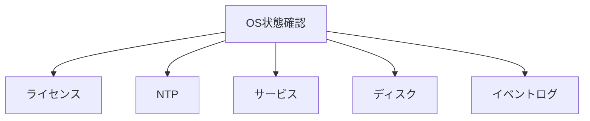
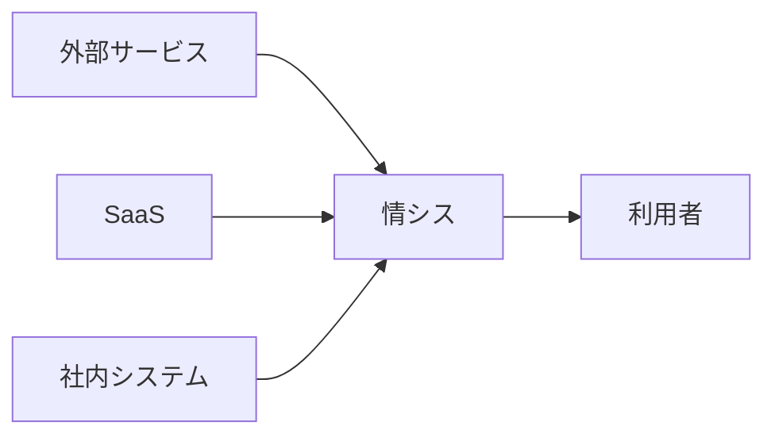

# IT民俗学：なぜ情シスはREADMEを書かないのか

以前WindowsServerのの共有フォルダを眺めていると、前任の情シス担当者が残したと思われるバッチファイルを目にすることがありました。

```text
OS_Report.bat
Backup.bat
MonthlyJob.bat
```

README.md は見当たらない。

設計書もない。

Wikiへのリンクもない。

普通のエンジニアなら少し不安になるかもしれません。

「このスクリプト、どうやって使うんだろう」「不親切だなあ」

ところがファイルを開いてみると、少し様子が違います。

```bat
echo 【定期保守】OS設定情報リストを作成します
echo.
echo 作成されたリストは output フォルダに作成されます
echo.
SET /P ANSWER="処理を実行しますか？ (y/n)"
```

READMEはない。

でも説明はある。

むしろREADMEより親切かもしれない。

かく言うかつての私も、サーバーを建てるたびにこんなファイルを作っていました。
そして作成した処理に対してReadmeファイルは作成した記憶があまりないのです。

そういえばかつての私はなぜあの頃READMEを書かなかったのだろう。

この目の前にあるスクリプトを作成した情シス担当者はなぜReadmeを作成しなかったのだろう。

こうして私はかつての自分の心情を振り返りつつ、このReadmeのない「親切なスクリプト」の成り立ちについて思いを馳せることにしました。

## READMEはどこへ行ったのか

通常、エンジニアによる開発の世界では、

```text
README.md
docs/
Wiki
Issue
Git履歴
```

のように、コードの外側に説明が存在することが多いです。

コードはコード。

説明は説明。

できるだけ分離する。

それが自然な設計です。

ところが情シスのスクリプトは少し違います。

- 処理概要を書く。
- 実行前に確認を求める。
- 進捗を表示する。
- エラー内容を説明する。
- 運用上の注意を書く。
- コメントに変更履歴を残す。

READMEが無いのではなく、READMEがスクリプトの中へ溶け込んでいるのです。

## スクリプトの中には何が書かれているのか

昔自分で作ったOSログ情報収集ツールを見返していて気付きました。

このバッチファイルは、OS情報を収集する処理そのものよりも、「何をしているのか」の説明の方が多いのです。

例えば、

```bat
echo OSイベントログ情報収集レポートを作成します
```

これはREADMEです。

```bat
SET /P ANSWER="処理を実行しますか？ (y/n)"
```

これは利用者向けUIです。

```bat
echo ログ解析処理にはOpenAI API使用による従量課金が発生します
```

これは注意事項です。

さらにバッチ処理から呼び出すPowerShell側を見ると、

* ライセンス状態
* NTP同期状態
* サービス状態
* ディスク使用量
* イベントログ

などを順番に取得しています。



これはコードというより、

「情シスがOSを見るときに何を確認するか」

という調査手順書そのものです。

README。

操作マニュアル。

利用者向けUI。

変更履歴。

障害調査手順。

それらが一つのファイルに同居している。

私はここにエンジニアとは少し異なる、情シス独特な風土があることを感じます。

## 付箋紙はREADMEになれなかった

かつての自分がバッチファイルを作っていた時の空気感を手繰りよせる。
かつてこのサーバーの前でバッチファイルを叩いていた情シス担当者に思いを巡らす。
ふと思い出したのは、昔のデスクトップに貼られた付箋紙です。

```text
月末だけ実行

終わったら○○さんへ連絡

VPN接続後に実施

絶対に削除しないこと
```

本来ならマニュアルに書くべきこと。

でも実際には、**一番見てほしい場所** へ貼られていた。

なぜならマニュアルは読まれないからです。

このスクリプトたちも同じなのでは？

```bat
echo 月末以外は実行しないこと
pause
```

これはシステムに指示を伝えるコードではありません。

人に指示を伝える付箋紙です。

未来の自分への伝言。

利用者への注意書き。

運用担当者への申し送り。

READMEが無かったのではない。

READMEは付箋紙となって、必要な人の目に必要な情報をつたえるためにスクリプトに貼りこまれていたのかもしれません。

READMEは探しに行かなければ見つからない。

でも付箋紙は、そこに立てば必ず目に入る。

情シスが残した説明は、読まれることよりも、**見落とされないこと** を優先していたのかもしれません。

## 情シスは何を作っていたのだろう

ここで私は別の疑問を持ちました。

そもそも、なぜ情シスはこんなスクリプトを作る必要があったのでしょうか。

開発者はシステムを作ります。

利用者はシステムを使います。

でも情シスは少し違います。

例えば会社には、

* Active Directory
* Microsoft 365
* Google Workspace
* 会計システム
* 勤怠システム
* NAS
* 利用者PC

など、様々な仕組みが存在しています。

それぞれベンダーが違う。

設計思想も違う。

更新タイミングも違う。

しかし利用者から見れば、全部まとめて「会社のシステム」です。

すると、その間を繋ぐ人が必要になります。



情シスはシステムを作るというより、

異なる世界を接続するための変換アダプタを作っていたのかもしれません。

- CSVを変換する。
- レポートを集約する。
- アカウントを同期する。
- ログを収集する。

本来ならシステム同士が連携してくれるはずの部分を、人間の知恵で繋いでいた。

だからスクリプトにはコードだけでなく、運用の前提条件や利用者への説明まで書き込まれていく。

## 情シスは翻訳者だったのかもしれない

以前、Excel方眼紙の記事を書いたとき、

私はExcel方眼紙を「人間とシステムの翻訳者」と捉えました。

情シスのスクリプトも少し似ています。


情シスはシステムを理解している。

でも利用者の事情も理解している。

だからスクリプトは機械への命令だけでは終わらない。

利用者への説明も背負う。

- README。
- 操作マニュアル。
- 確認画面。
- 進捗表示。
- 変更履歴。
- 障害調査手順。

それらがすべて一つのファイルへ押し込められていく。

結果としてREADMEは消えたのではなく、スクリプト自身になったのかもしれません。

## AI時代、READMEはどうなるのだろう

AI時代になると、こうしたバッチファイルは減っていくのかもしれません。

スケジュール実行はクラウドサービスが行う。

レポート生成はAIエージェントが行う。

システム連携もノーコードツールが担う。

では、情シスがスクリプトへ書き込んでいた説明は不要になるのでしょうか。

私は少し違う気がしています。

バッチファイルのコメントや echo 文に残されていたものは、単なる処理説明ではありませんでした。

- VPNに接続してから実行すること
- 月末だけ実行すること
- 実行後は担当者へ連絡すること

そこに書かれていたのは、システムそのものではなく、システムとシステムの間に存在する境界条件だったのだと思います。

AIがコードを書くようになっても、異なるサービスや組織を接続する境界は残り続ける。

むしろサービスが増え、AIエージェントが増えるほど、その境界は複雑になるのかもしれません。

そう考えると、情シスのREADMEが記録していたものはスクリプトの使い方ではなく、「**異なる世界をどう接続していたか**」という知識だったのではないか。

もしそうなら、READMEは消えるのではなく、これからも別の形で書き続けられるのだと思います。

## READMEは書かれていた

「なぜ情シスはREADMEを書かないのか」

そう考えながら古いスクリプトを眺めていたのですが、少し考えが変わりました。

情シスはREADMEを書いていなかったわけではない。

むしろ、READMEという名前で管理するには収まりきらないものを書いていたのかもしれません。

- 利用者への説明。
- 実行時の注意事項。
- 障害の記録。
- 運用の前提条件。
- 未来の担当者への申し送り。

それらはスクリプトの使い方というより、異なるシステムや組織を接続するための知識でした。

- Active Directory と利用者PC。
- SaaS と社内業務。
- システムと運用。

情シスはその境界に立ち続けています。

だからスクリプトの中には、コードだけでなく、その境界を安全に渡るための知識も一緒に書き込まれていったのでしょう。

最近はAIエージェントやワークフローサービスによって、昔のバッチファイルが担っていた役割の一部が置き換えられ始めています。

それでも、サービス同士の境界や組織の事情が消えることはありません。

むしろ利用するサービスが増えるほど、その境界は複雑になっていくのかもしれません。

そう考えると、古いスクリプトに残されたコメントや echo 文は、単なる処理説明には見えなくなってきます。

そこに書かれていたのはコードの意味ではなく、その時代の情シスがどのように世界と世界を接続していたのか、その記録だったのではないでしょうか。

あらためてスクリプトを見直してみると、スクリプトの中に、境界線上に立つ情シスが問題を解決するたびに一枚一枚貼り重ねていく付箋紙、その歴史の積み重ねを感じられて非常に興味深いです。


