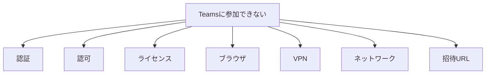
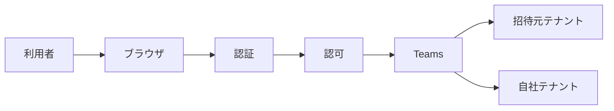

# IT民俗学：なぜ我々はまずスクリーンショットを求めるのか

ある日、「**Teams会議に参加できない**」という相談がありました。

話を聞くと、取引先から送られてきたTeams会議招待URLを開くと、

> Microsoft Teamsを使用するには、有料サブスクリプションが必要です

というエラーが表示されるらしい。

対象者には Microsoft 365 ライセンスは付与していない。

ただし外部テナントからのゲスト参加であれば、本来ライセンス無しでも参加できるはず。

利用者から話を聞く。

設定を確認する。

これまでの利用実績を確認する。

発生条件を整理する。

わからない。

無力感にさいなまれながら、切り分け情報をもとに Microsoft サポートへ問い合わせを行います。

状況を説明する。

利用者環境を説明する。

こちらの見立ても説明する。

そして返ってきたのは、

> 発生時のスクリーンショットをご提供ください

という依頼でした。

あれ？

私の説明、信用されてない？

---

でも冷静に考えると、これはTeamsだけの話ではありません。

- 利用者に問い合わせるとき
- ベンダーへ問い合わせるとき
- サポートへ問い合わせるとき

私たちは驚くほど頻繁にこう言っています。

> スクリーンショットを送ってください。

本来なら、

- ログ
- エラーコード
- 操作履歴

の方が重要そうに見えます。

それなのに、なぜ我々はまずスクリーンショットを求めるのでしょうか。

## 利用者は「何もしていない」

情シスへのご相談で、よく聞く言葉があります。

> 何もしてないのに壊れました

もちろん大抵の場合は何かが起きています。

でも利用者からすると、

- 何が起きたのか分からない
- 何をしたのか分からない
- 何が重要なのか分からない

だから説明できない。

そんなとき、情シスはこう言います。

> スクリーンショットありますか？

すると話が進み始める。

利用者は説明できない。

でも見たものは残せる。

スクリーンショットは、利用者の説明能力に依存しない記録手段なのです。

## 情シスが欲しいのは原因ではなく切り分け


では、情シスはスクリーンショットだけで原因を特定できるでしょうか。

解決実績のあるFAQに該当しない限り、多くの場合 NO です。

- ログを読んで詳細を調べたい
- 違う環境で再現確認したい
- 類似ケースのワークアラウンドで解決できるか試したい など

でも困っている利用者を前に、初動でもっとも大事なことは、 **どこから調べればよいか** を知ることです。

例えば今回の問い合わせ「Teamsに参加できない」に対しては、



問い合わせが来た瞬間は、全部ありえる。

でもスクリーンショットを見ると、

> Microsoft Teamsを使用するには有料サブスクリプションが必要です

という表示が見える。

すると、

- ネットワーク （認証は通っているから通信経路に問題はなさそう）
- VPN （同上）
- Teams起動失敗（スクリーンショットはブラウザだったから、アプリ起動状況は関係ない）

あたりの優先度は一気に下がる。

つまりスクリーンショットは、原因特定ではなく、**探索空間を削減する** ための道具なのです。

## サポートもスクリーンショットを欲しがる

スクリーンショットを必要とするのはベンダーやSaaS事業者も同じです。

サービス側にはログがある。

利用者より遥かに多くの情報を持っている。

それでもスクリーンショットを要求する。

でも考えてみると、サービス側から見えないものは意外と多いのです。

- ブラウザ状態
- サインイン中アカウント
- VPN
- 拡張機能
- OS言語設定
- URL など

こうした情報はサービスログには残らないことがあります。

しかしスクリーンショットには映る。

だからサポート担当者が見ているのは、

エラーメッセージそのものではなく、その周辺情報なのかもしれません。

## 同じスクリーンショットを見ても、みんな見ているものが違う

あらためて整理してみると、全員がスクリーンショットを欲しがるのに、期待していることは少しずつ違うことに気づきます。

|立場	|心の声|
|---|---|
|利用者	|何が重要かわからないので全部見てください|
|情シス	|どこから調べればいいか知りたい|
|ベンダー	|本当にうちの製品の問題ですか？|
|SaaS事業者	|サーバーから見えない情報を見たい|

みんな違う。

でも共通していることがあります。

それは、**ファーストコール時点では何が重要かまだ分からない** ということです。

だからまず、

> その瞬間の確かな情報を全部持ってきてください

となる。

## ログは事実を、スクリーンショットは状況を残す

ここで少し整理してみます。

ログは非常に正確です。

- 時刻
- エラーコード
- 通信内容

事実を記録することに向いています。

一方、スクリーンショットは曖昧です。

検索できない。

集計できない。

表示されたメッセージのコピペもできない。

それでも私たちはスクリーンショットを求める。

なぜなら、そこには発生した確実な状況が残るからです。

ログが残すのは事実。

スクリーンショットが残すのは状況。

私たちは無意識のうちに、この二つを使い分けているのかもしれません。

複雑化した現代のシステムで起きたトラブルに対して、
これらの行為は医療の診断にしていると思います。

患者が来院して、

> 頭が痛いです

と言う。

この段階では、

- 内科
- 耳鼻科
- 神経内科
- 脳神経外科

どこへ行くべきか分からない。

だからまず問診を行う。

スクリーンショットも同じです。

- 利用者
- 情シス
- ベンダー
- SaaS事業者

全員が最初に知りたいのは、 **原因ではなく、どこを見るべきか** です。

スクリーンショットは、ITシステムにおける問診票のような存在なのかもしれません。

## スクリーンショット文化は、いつ生まれたのだろう

ここまで考えていて、別の疑問が湧きました。

スクリーンショットを送るという行為は、昔からこんなに一般的だったのでしょうか。

少なくとも私がシステム運用に関わり始めた頃は、もう少し単純な世界だった気がします。

アプリケーションが動かない。

サービスが起動しない。

イベントログを見る。

エラーコードを調べる。

もちろん難しい障害もありましたが、多くの場合は「どこが悪いか」を比較的素直に追うことができました。

しかし今は違います。

Teams会議に参加するだけでも、



のように、利用者からは見えない複数のレイヤーを経由しています。

今回の事例でも、

- 利用者は **Teamsに入れない** と思っている
- 私は **ライセンスの問題だろうか** と考えている
- Microsoftサポートは **認可先テナントがおかしい** と言っている

同じ現象を見ているはずなのに、全員が違う世界を見ているのです。

現代の障害対応では原因を追う前に **今どのレイヤーで問題が起きているのか** を特定しなければなりません。

スクリーンショット文化は、そんな複雑化したシステムが生んだ観測技法ととらえることもできそうです。

## AI時代、問診は自動化されるのだろうか

現在、利用者も情シスもファーストコールはAIになりつつあります。

エラー画面を貼り付ける。

スクリーンショットを渡す。

するとAIは、

* 原因候補
* 関連する設定
* 類似事例
* 対処方法

を提案してくれます。

以前であれば、

```text
利用者
↓
情シス
↓
ベンダー
↓
サポート
```

と段階的に行われていた切り分けの一部を、AIが代行できるようになり始めています。

情シスよりもAI方が身近で、気軽に相談できる相手として認知されてきたのでしょう。

今回の記事では、スクリーンショットを「ITシステムにおける問診票」と表現しました。

考えてみれば、スクリーンショット文化の本質は原因究明ではありません。

利用者が知りたいのは、

> 今すぐ使えること

情シスが知りたいのは、

> どこから調べればよいか

サポートが知りたいのは、

> どの担当領域の問題か

でした。

つまり全員が最初に行っていたのは、診断ではなく問診です。

スクリーンショットは、そのための共通言語だった。

そしてAIは今、その問診票を読む役割を引き受け始めています。

そう考えると、AIは原因究明者というより、まずは非常に優秀な総合診療医として地位を獲得しつつあるのかもしれません。

## スクリーンショットには、現在地が残っている

スクリーンショットは単なる画像ではありません。

そこには、

- 利用者が何を見たか
- どこで困ったか
- どの画面まで到達したか

が残っています。

ログはシステムの記録です。

スクリーンショットは人間が見ていた世界の記録です。

だから私たちは、ログがあるのにスクリーンショットを撮る。

説明できるのにスクリーンショットを送る。

サポートもスクリーンショットを求める。

複雑化した現代のシステムでは、原因を調べる前に、 **今どのレイヤーにいるのか** を共有しなければならないからです。

- 利用者
- 情シス
- ベンダー
- SaaS事業者

みんな違う世界を見ている。

だからまず、同じ地図を見る必要がある。

スクリーンショットは、そのための地図だったのかもしれません。

そしてAI時代になった今、その地図は人間だけでなくAIも読むようになり始めています。

そう考えると、

> 「スクリーンショットを送ってください」
 
という言葉は、障害対応の定型句というより、**複雑なシステムの中で、自分たちの現在地を確認するための合言葉** のようにも見えてくるのです。
