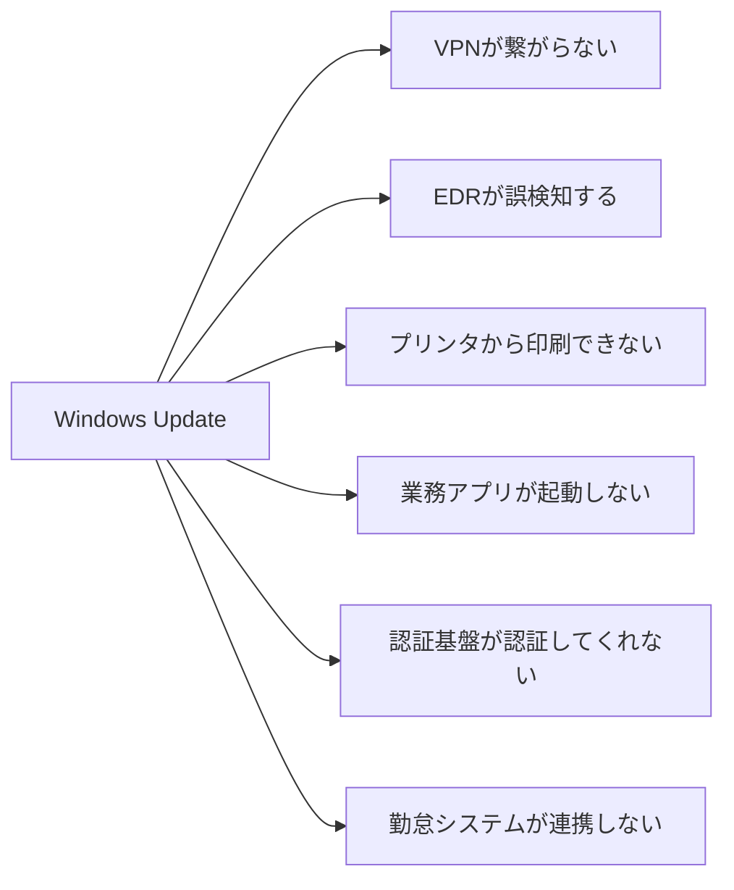
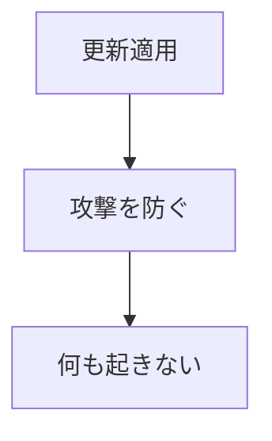
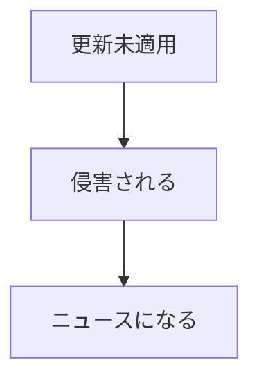
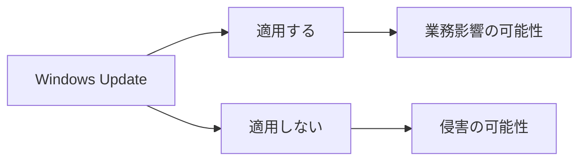

# IT民俗学：なぜ管理者たちはWindows Updateを恐れるのか

毎月第二火曜日はWindows Updateの日です。（Patch Tuesday）

かつてシステムの信頼性が重要視される現場では、社内PCのWindowsUpdateの更新を厳密に管理するためWSUSを導入していました。

社内PCが勝手に更新されないように。

社内PCに更新がいきわたるように。　

まずテストPC数台だけに適用する。

数日様子を見る。

問題がなければ徐々に広げていく。

ルーチンワークに成り果てた確認作業は形骸化し、受け継がれていく。

何もない日々に、ふと思います。

「この作業、要る？」

---

生成AIの発展によって、ソフトウェアの更新速度がさらに加速しています。

脆弱性の発見。

コード生成。

テスト自動化。

修正プログラムの作成。

これまで数週間から数か月かかっていた対応が、数日、あるいは数時間単位で行われるようになりつつあります。

利用者から見ると歓迎すべき変化かもしれません。

新機能は早く試したい。

脆弱性は早く直る方が良い。

不具合は早く解消される方が良い。

その通りだと思います。

しかし管理者の立場では、その適用に対して常に不安を抱えているのです。

Windows Updateは本来、安全になるための仕組みです。

それなのに、なぜ管理者たちは更新を恐れるのでしょうか。

## 利用者にとっての更新、PainとGain

利用者から見たWindows Updateは、とても単純です。

```text
更新する
↓
再起動する
↓
使う
```

時々再起動を要求される。

作業が中断される。

それが利用者にとってのPainです。

一方でGainはわかりにくいことが多いです。

もちろん「新機能が提供されました」「UIを変更しました」といった、UXの変更を伴うものは実感しやすいです。

しかし、毎月の更新の本来の目的はセキュリティアップデートです。

これが利用者には認知されにくい。

脆弱性が修正された。

内部品質が改善された。

そう言われても実感は湧きません。

つまり利用者にとって更新とは、

**見えない利益（Gain）と、見える不便さ（Pain）**

の組み合わせなのです。

## 管理者が見ている世界

しかし管理者が見ている世界は少し違います。

管理者は「未来の利用者のPainになりうる可能性」を見ています。



のように見えています。

更新されるのはWindowsだけ。

しかし影響を受けるかもしれないのは、その先にぶら下がるすべてです。

情シスが恐れているのはWindowsUpdateそのものではありません。

WindowsUpdateによる変化の先にある、数多の依存関係なのです。

## 恐怖は経験から生まれる

管理者に、「**なぜそんなに更新を怖がるのですか？**」と聞くと、理論より先に経験談が出てくることがあります。

- テレワークしてるのに突然VPN接続できなくなったことがある
- 突如共有プリンタに繋がらなくなったことがある
- 業務アプリが突如異常終了するようになった

どれも「ある日突然」「利用者は何もしてないのに」報告されるのです。

因習村の老人が、「**あの森には入るな**」と言うように。

管理者も、「**更新前にバックアップを取っておけ**」「**人柱（テストPCでの検証）を忘れるな**」と言う。

なぜか。

昔そこで痛い目を見たからです。

恐怖とは、過去の痛みの記憶。

かつての痛みを繰り返さないために編み出された防衛策としての作業。

如何ともしがたい外来の災害から利用者を守るために、それらは継承されるのです。

## 見えるPainと見えないGain

ただし、ここで忘れてはいけないことがあります。

更新によるPainは確かに存在します。

それも管理者の妄想ではなく、実際に起きた出来事として。

例えば2021年の PrintNightmare 問題です。

Windows印刷スプーラーに存在した脆弱性への対応では、多くの組織がセキュリティ対策と業務継続の両立に苦慮しました。

参考（一次情報）：

Microsoft Security Response Center
https://msrc.microsoft.com/update-guide/vulnerability/CVE-2021-34527

---

さらに2024年には CrowdStrike Falcon センサー更新に起因する大規模障害が発生しました。

航空会社。

病院。

金融機関。

世界中の組織が影響を受けました。

この出来事は、

> 更新は安全になるための行為

という前提を、多くの技術者に改めて考えさせる出来事だったように思います。

参考（一次情報）：

CrowdStrike Root Cause Analysis
https://www.crowdstrike.com/blog/falcon-content-update-preliminary-post-incident-report/

---

利用者から見ると、

```text
昨日まで動いていた
↓
更新した
↓
動かなくなった
```

です。

Painは非常によく見える。

だから記憶に残る。

---

しかし逆もあります。

例えば2017年の WannaCry ランサムウェアです。

世界150か国以上で被害が発生し、病院や企業、公共機関の業務が停止しました。

しかし攻撃で悪用された脆弱性に対する更新プログラムは、その数か月前に公開されていました。

更新を適用していた組織の多くは被害を回避できたとされています。

参考（一次情報）：

Microsoft Security Blog
Customer Guidance for WannaCrypt attacks
https://blogs.microsoft.com/blog/2017/05/12/customer-guidance-wannacrypt-attacks/

---




これは本来理想としたPainを最小化した更新の在り方です。

しかし、皮肉にも理想的であるがゆえに **認知されない** のです


被害を受けなかった組織はニュースになりません。

何も起きなかったからです。

しかし、



この場合、大きく報道される。

もちろんすでに公開されていた更新に対して、 **更新が遅れていた組織の運用課題** として。

つまり、

更新による本来のGainとは、多くの場合 **起きなかった事故** なのです。

## 管理者は二つの未来を見ている

利用者は、「**更新したら壊れた**」を覚えています。

管理者は、「**更新しなかったから侵害された**」も認知しています。




どちらを選んでも利用者のPainは存在する。

だから管理者に「更新しない」という選択肢は存在しません。

代わりに、

* テスト環境
* パイロットユーザー
* 段階展開
* メンテナンス告知

といった仕組みを作ります。

これは技術というより、

不確実性を管理するために編み出した儀式なのかもしれません。

## AI時代、更新はもっと速くなる

そして今、その変化はさらに加速しようとしています。

AIによって脆弱性発見は速くなる。

修正も速くなる。

配布も速くなる。

おそらく今後、更新頻度はさらに増えていくでしょう。

しかし興味深いことに、AIがどれだけ優秀になっても、依存関係そのものは消えません。

むしろサービスが増えるほど、誰も把握できない依存関係は増えていくでしょう。

そう考えると、AI時代に必要になるのは更新作業そのものではなく、

> **どこまで信頼し、どこまで疑うか**

という判断なのかもしれません。

## 管理者は更新を恐れているのではない

「なぜ管理者はWindows Updateを恐れるのか」

管理者はWindows Updateを恐れているのではありません。

変化そのものを恐れているわけでもありません。

恐れているのは、

自分たちが把握しきれていない依存関係の中へ、変化が持ち込まれることなのです。

だから検証環境を作る。

だから段階展開をする。

だから毎月第二火曜日が近づくと、少しだけ落ち着かない気持ちになる。

**何も起きない未来を守るために。**

そのための儀式が、今日も静かに繰り返されているのかもしれません。

何も起きないからこそ、その価値は見えにくい。

そして見えないからこそ、管理者は時々こう思ってしまうのです。

「この作業、本当に要るのだろうか」と。