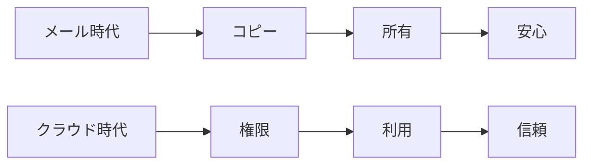

# IT民俗学：なぜ人は自分にメールを送るのか

ある日届いたメールを眺めていて、少し気になるものがありました。

送信元には取引先。

CCには関係者。

そして、なぜか送信者自身のメールアドレスが入っている。

私は普段、自分自身を宛先に入れません。

なので「なんでこんなことするの？」と思います。

しかも、一定以上の世代ではたまに見かける気がします。

そこに年代的な傾向があるのならば、この小さな習慣にはきっと意図があって、当時の情報システムの記憶が残っているのではないか。

そう思い立ち、思索を巡らせてみることにしました。

## 自分にメールを送る理由

実際にそういった運用をしている方に聞くと、いろいろ理由を伺えました。

* 後で探しやすいから（受信トレイだけで検索が完結する）
* 送信した証跡を残したいから
* 案件管理を受信トレイで行っているから

どれも自分の仕事スタイルに対して最適化された、合理的な運用です。

特に昔のメールシステムでは、現在のスレッドといった概念がなく、メールはそれぞれが独立した文書でした。

さらに、格納先も

```text
送信済みフォルダ
≠
受信トレイ
```

と区別されていました。

個々のメールに対して、各々の関係性はタイトルと時系列で識別する必要がありました。

容れ物が分かれていると、検索性も悪い。

返信を重ねたメールの「Re:Re:・・・」でタイトルの視認性も悪化する

すると、

```text
自分を宛先に入れる
↓
時系列に沿って送信したメールも受信トレイにも残る
↓
後で見つけやすい
```

という運用が生まれます。

昔の制約に対する、非常に合理的な適応だったのでしょう。

## 受信トレイは仕事台帳だった

今の私たちは、

```text
メール = コミュニケーション手段
```

と考えています。

でも、少し前までは違いました。

メールは、

```text
コミュニケーション
＋
保管庫
＋
案件管理
＋
証跡
```

でもありました。

中でも受信トレイには、

- 未返信メール
- 対応待ちメール
- 完了した案件

が時系列に並んでいました。

つまり受信トレイ自体が、簡易的なタスク管理ツールでもあったのです。

だから、

```text
自分にも送る
```

という行為には、**未来の自分へのタスク発行**や、**今の自分からのタスク完了報告**といった意味合いも含まれていたのかもしれません。

## ファイルは「自分のもの」だった

メール時代の特徴を一言で表すなら、

```text
コピー = 所有
```

です。

添付ファイルを受け取る。

デスクトップへ保存する。

編集する。

また添付して送る。

すると、

```text
そのファイルは自分のもの
```

という感覚が生まれます。

もちろん、法律上の所有権や著作権が移転したわけではありません。

でも、感覚としては確かに「持っている」。

だから安心できた。

だからローカルへ保存する。

だから自分にもメールを送る。

## コピーは、時に取り返しがつかない

しかし、メールのコピーは便利である一方、一度相手へ渡ると回収が困難です。

2024年には、オーストラリア政府機関が機密情報を含む添付ファイルを誤って236の組織へ送信する事故を起こしました。

受信者へ削除依頼を行いましたが、完全な回収は保証できませんでした。

参考：Second accidental data leak in four months ‘regrettable’, finance department says

https://www.theguardian.com/technology/2024/feb/22/second-accidental-sharing-of-confidential-information-regrettable-finance-department-says

メールの特徴は、

```text
共有
↓
コピー生成
↓
相手の所有下へ移動
```

してしまうことです。

一旦メールで送信したものに、送信者の手は届かない。

だからこそ、宛先確認や誤送信対策が重要になります。

## クラウドは世界を変えた

しかし今は違います。

- Slack
- Teams
- Box
- Google Drive
- SharePoint

そこでは、「**各々がファイルを持つ**」のではなく、「**単一のファイルへのアクセス権が各々に付与される**」ようになりました。

でも考えてみると、この変化には一つ大きな前提があります。

それは、

> いつでもそのデータへアクセスできること

です。

## コピーは「所有」であると同時に「可用性」でもあった

昔の組織間連携は、今ほど自由ではありませんでした。

- 社内LAN
- VPN
- 閉域網
- メール
- ファイルサーバー

必要な資料があっても、

* 相手が退勤している
* VPNが繋がらない
* 社外からアクセスできない

そんなことは珍しくありませんでした。

だから、

```text
ファイルを送ってもらう
↓
自分のPCへ保存する
↓
いつでも見られる
```

という運用が生まれます。

つまり、

```text
コピー = 所有
```

であると同時に、

```text
コピー = 業務の可用性
```

でもあったのです。

手元にある。

だから見られる。

だから安心できる。

自分を宛先に入れる文化も、その延長線上にあったのかもしれません。

## PoLPは「いつでも繋がる」ことを信頼している

現代のクラウドでは、

> 必要な人へ。
>
> 必要な期間だけ。
>
> 必要な範囲だけ。

という最小権限の原則（PoLP）が重視されています。

参考：

NIST SP 800-207 Zero Trust Architecture
https://csrc.nist.gov/pubs/sp/800/207/final

仕事が終われば権限を削除する。

プロジェクトが終われば資料は見えなくなる。

とても合理的です。

でも、この考え方は、

* 常時接続
* クラウド
* 認証基盤
* ID管理

が正常に動いていることを前提にしています。

言い換えると、

```text
必要な時に、
必要な情報へ、
いつでもアクセスできる
```

ということを約束し、信頼しているのです。

しかし現実的には「完全に止まらない」ことを信頼しているわけではありません。

一定の停止があり得ることを理解した上で、「十分に高い確率で、必要な時にアクセスできる」ことを契約として受け入れているのです。

この契約がService Level Agreement（SLA）です。

SLAが守られる限り、コピーを持たなくても大丈夫。

SLAが守られる限り、リンク共有だけで仕事ができる。

## それでも私たちは、時々昔へ戻る

しかし、SLA100％は実現が難しい目標です。
計画的であれ、突発的なものであれ、システムの停止は誰にも起こりえます。

- SharePointが落ちる
- Teamsが障害を起こす
- 認証基盤が止まる

すると、「業務継続のため、資料をメールで送ります」といったクラウドを介さない代替策が復権します。

平時には、

```text
共有
↓
権限
↓
利用
```

という世界で仕事をしているのに、

有事になると、

```text
コピー
↓
所有
↓
手元で保持
```

へ戻っていく。

私たちは、二つの時代の価値観を行き来しながら仕事をしているのかもしれません。



## 「自分が作った資料だから使っていい」は本当だろうか

実際には、業務で作成した資料の権利関係はもっと複雑です。

元従業員が「**自分が作った資料だから**」という認識で、資料を個人クラウドへコピーしたり、転職先へ持ち出したりして問題になる事例は少なくありません。

「**手元にあること**」と「**利用する権利があること**」は同じではありません。

業務を通じて作成した資料は、雇用契約や業務委託契約、職務著作の考え方にもよりますが、原則会社側に著作権や利用権が帰属することになります。

また、クライアントから提供された資料は、当然ながらクライアントの権利や契約上の利用条件に従います。

これは本来メールやSlackといった共有手段によらず、法の保護下にあるものです。

しかし、メールというファイルが手元に保存される仕組みによって、所有権や利用権、著作権などがあいまいなまま運用されやすい状況にあったのではないかと思います。

```text
持っている
↓
自分のもの
```

という感覚は、現代のPoLPを前提とした情報共有における所有権と権限付与の考え方との乖離していると言えるでしょう。

## SFの未来へ近づいているのかもしれない

ふと思い出したのが、フィリップ・K・ディックの『[ペイチェック](https://ja.wikipedia.org/wiki/%E3%83%9A%E3%82%A4%E3%83%81%E3%82%A7%E3%83%83%E3%82%AF_%E6%B6%88%E3%81%95%E3%82%8C%E3%81%9F%E8%A8%98%E6%86%B6)』でした。

主人公は機密プロジェクトへ従事した後、その期間の記憶を消去されます。

当時は極端なSFに思えました。

「仕事の経験や達成感も失うなんて！」

でも今は少し違って見えます。

クラウドの世界では、

```text
プロジェクトへ参加する
↓
大量の情報へアクセスする
↓
プロジェクト終了
↓
権限が消える
```

ということが普通に起きています。

もちろん記憶そのものが消えるわけではありません。

でも、

- 具体的な資料
- 具体的な顧客情報
- 具体的な設計書

契約が終われば、それらは手元に残らない。

少しだけ、『ペイチェック』の世界に近づいているようにも思えるのです。

## 私たちは情報の所有感覚を作り直している

自分にメールを送る。

添付ファイルをローカルへ保存する。

念のためUSBにもコピーする。

それらは、かつて合理的だった習慣です。

しかし今、私たちが信頼しているのは、

中央集権的に管理される単一ファイルとそこに至るまでの経路。

- ネットワーク
- 認証基盤
- 権限管理

そして「**必要な時には、いつでもアクセスできる**」という約束です。

私たちはファイルを所有しているのではなく、ネットワークと認証基盤を信頼して借りているだけなのです。

私たちは今、

```text
情報を所有する
```

という感覚そのものを、静かに作り替えている最中なのかもしれません。

かつて私たちは「**手元にあること**」によって安心を得ていました。

今は「**いつでも取りに行けること**」を信頼して仕事をしています。

自分にメールを送るという小さな習慣は、その二つの時代の境目に残された、小さな化石なのかもしれません。