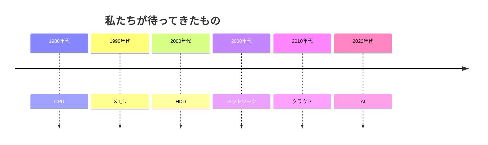

# IT民俗学：PCは速くなったのに、なぜ私たちは待ち続けるのか

[macbookの大幅な値上げ](https://www.itmedia.co.jp/news/articles/2606/25/news138.html)を眺めながら「高いなあ」「でもSpec高くしたいなあ」とため息をつきながら、ぼんやりと考えます。

でも今のPCも使い始め当時は新しかったし、早かったよな。

GoogleMeetが落ちることがあるし、エージェントで実行しているPythonの処理も時間かかるし。

もう替え時なのかな。

---

思えば、昔のPCは遅かった。

CPUは数十MHz、メモリは数MB。

HDDはガリガリと音を立てながら回っていましたし、ISDNに接続する際には謎の接続音を耳にしていました。

それに比べれば、今のPCは驚くほど高速です。

SSDになり、CPUは何十コアにもなり、回線も高速・常時接続になりました。

それなのに私は、相変わらず待っています。

- Windows Update
- Slack
- Googleドライブ
- ChatGPT
- Claude Code
- Cursor

なんだかいつも待ち時間を気にしている気がします。

PCは確かに早くなっているのはずなのに。

## 昔、私たちは「待って」いた

コンピュータの歴史を振り返ると、待ち時間の理由は時代ごとに違っていました。

そのたびに技術は進歩しました。

CPUは速くなる。

SSDが登場する。

光回線が普及する。

クラウドが生まれる。

AIが仕事を肩代わりする。

つまり、**待ち時間そのものは確かに減ってきた**のです。

## では、なぜ「遅い」と感じるのだろう

「遅い」という感覚は、比較によって生じます。

HDDしか知らなかった頃、HDDは「普通」でした。

SSDを知った途端、HDDは急に遅くなります。

もちろんHDDが劣化したわけではありません。

変わったのは、**私たちの期待**です。

チャットも同じです。

メールしかなかった頃、返信は翌日でも普通でした。

チャットが普及すると、数時間のタイムラグでも少し長く感じます。

技術は速くなりました。

でも同時に、「これくらいで終わるはずだ」という**同じ環境を利用する共同体の時間感覚も更新され続けてきた**のです。

## 技術は、確かに私たちを楽にしてきた

新しい技術が登場するたび、私たちは期待します。

「もっと楽になる。」

「もっと早く終わる。」

実際、その期待は何度も実現されてきました。

CPUは高速になりました。

SSDで起動時間は短くなりました。

クラウドでファイルを持ち歩く必要はなくなりました。

AIは調査や実装まで手伝ってくれるようになりました。

技術は約束を守ってきたのです。

## では、空いた時間はどこへ行ったのだろう

削減された時間は、そのまま私たちの余暇にはなりませんでした。

PCの起動が速くなれば、もっと多くの仕事ができるようになります。

メールがすぐ届けば、返信も早く期待されます。

クラウドで共同編集できれば、「最新版を待つ」という時間はなくなります。

AIが議事録を書けば、その間に別の会議へ参加できます。

技術は確かに私たちを楽にしました。

でも、その余裕は長く続きません。

市場は、より速いサービスを競い合います。

共同体は、「これくらいで終わるはずだ」という新しい普通を作ります。

そして私たち自身も、空いた時間を前にすると「もう一つできること」を探してしまいます。

少し前まで、多くの仕事は「どれだけ時間をかけたか」という尺度で語られることが少なくありませんでした。

「一日かけて終えた。」

「一週間かけて作った。」

「一か月常駐した。」

そんな時間の積み重ねが、そのまま仕事の価値を表していた時代です。

ところが、PCが速くなり、ネットワークが速くなり、AIまで仕事を手伝うようになると、私たちが意識するものは少しずつ変わっていきます。

PCやネットワークが速くなると、「時間をかけたこと」そのものは価値になりにくくなります。

同じ成果なら、早く届けられる方が歓迎される。

「どれだけ時間をかけたか」よりも、「どれだけ早く価値を届けられたか」。

技術が生み出した余裕は、自由時間ではなく、「もっと価値を生み出せる余地」として見えるようになってきました。

もちろん、それは市場だけが求めたものではありません。

共同体もまた、その速度を「普通」と感じるようになります。

そして私たち自身も、その新しい普通へ自然と適応していきます。

余裕は消えたのではありません。

私たちが、**その余裕へ新しい期待を書き込み続けてきた**のです。

## 私たちは待っているのではなく、急かされている

だから最近感じる息苦しさは、PCが遅いからではないのかもしれません。

技術が速くなるたび、「これくらいはすぐ終わる」という期待も更新され続けます。

昨日まで十分だった速度が、今日には「少し遅い」になります。

私たちは、本当に待ち時間をなくしたかったのでしょうか。

それとも、技術が生み出した余裕へ、新しい期待を書き込み続けてきただけなのでしょうか。

気が付けば、「何もしない時間」は、「次にできることを探す時間」へ変わっていました。

私たちは待っているのではありません。

**共同体が更新し続ける期待値に、少しずつ急かされるようになったのかもしれません**。

**「待つことが許されない共同体」を、少しずつ作り上げてきたのかもしれません。**

## 急かされると、人は委ねる

一人で処理できる仕事には限界があります。

だから私たちは、

CPUへ計算を任せました。

OSへメモリ管理を任せました。

クラウドへデータ管理を任せました。

そして今、AIへ調査や実装まで任せ始めています。

委任は、楽をするための選択だったのでしょうか。

あるいは、共同体が求める速度についていくための選択だったのでしょうか。

一度委ねてしまうと、今度は、それなしでは追いつけなくなる。

AIを使えば仕事は速くなります。

それだけなら、便利な道具です。

でも、共同体がその速度を「普通」と感じ始めたなら。

AIは便利な道具ではなく、**仕事へ参加するための前提**になっていくのかもしれません。

そしてAIが十全に働けるように、今日も私はストアの値段を眺めます。

「Spec高いmacbook欲しいなあ」

## 次の違和感

CPUへ仕事を任せることに、不安はありません。

クラウドへ任せることにも、もう慣れました。

では、AIはどうでしょう。

コードを書かせる。

調査を任せる。

設計を考えさせる。

まだ少しだけ、不安になります。

それは性能の問題なのでしょうか。

技術が進歩するたび、私たちは仕事を委ねる相手を増やしてきました。

CPUへ。

OSへ。

クラウドへ。

そして今は、AIへ。

委ねる相手が増えるほど、一つの問いだけが残ります。

**私たちは何を根拠に「安心して委ねられる」と判断しているのでしょうか。**

次に向き合う違和感は、

> 「私たちは、いつから知らないものを信じるようになったのか」

なのかもしれません。